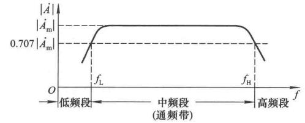

# 小信号的放大

## 放大的概念

放大的对象为**变化量**（信号），而非直流电源。

放大的本质是**能量的控制**。放大电路要把直流电源的能量转化为与输入信号相关的能量。负载获得功率远大于信号源的功率。

放大的基本要求是不失真。

## 放大的性能指标

### 放大倍数

在评价一个放大电路好坏的时候，可以把这个电路看作一个黑盒，看成二端口网络

    

只关注输入输出的时候，物理量由电压、电流，这不同的组合就有好几种。

电压放大倍数：
$$ \dot A_u = \frac{\dot U_o}{\dot U_i} $$

电流放大倍数：
$$ \dot A_i = \frac{\dot I_o}{\dot I_i} $$

互阻放大倍数：
$$ \dot A_{ui} = \frac{\dot U_o}{\dot I_i} $$

互导放大倍数
$$ \dot A_{iu} = \frac{\dot I_o}{\dot U_i} $$

这些放大倍数不是数学游戏，要看输出量需要什么，输入是什么，以此来决定对应的描述方式。

### 输入输出电阻

输入电阻定义为输入**电压有效值**和**电流有效值**之比：

$$ R_i = \frac{U_i}{I_i} $$

相应的，对于放大电路来说，这是个输出源，测一个空载输出电压，然后来个带载输出电压，可以知道输出电阻

$$ U_o = \frac{R_L}{R_o + R_L} U_o' $$

知道了输入电阻输出电阻，很容易可以将前面的放大倍数进行转换。

### 通频带

用来描述放大电路对不同频率信号的放大能力。在频率较高或较低时，放大倍数的数值会下降并移相。

    

同频段两端对应下限截止频率和上限截止频率。

一个典型的，人耳能听到的声音频率为$$ 20\mathrm{Hz} \sim 20\mathrm{kHz} $$，音响最好能覆盖这个范围。

### 最大不失真电压

测量放大倍数，用中频小信号合适；测通频带，用小信号宽频来测。

最大不失真电压$$ U_{om} $$，为有效值，使用大一点的信号测。

