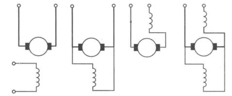
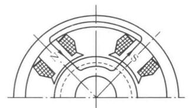
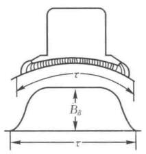

# 直流电机结构

工作原理

机械结构

绕组理论

额定值

## 直流电机工作原理

### 发电机

### 电动机

## 机械结构

## 绕组初步

## 额定值

额定值会卸载电机外壳的铭牌上，或者买电机的时候都给给出来。

直流电机的额定参数与符号及单位

|              |     符号     |        单位        |
| :----------: | :----------: | :----------------:|
|   额定功率   |  $$ P_N $$   |  $$ \text{kW} $$   |
|   额定电压   |  $$ U_N $$   |   $$ \text{V} $$   |
|   额定电流   |  $$ I_N $$   |   $$ \text{A} $$   |
|   额定转速   |  $$ n_N $$   | $$ \text{r/min} $$ |
| 额定励磁电压 | $$ U_{fN} $$ |   $$ \text{V} $$   |

要注意的是，**额定功率指的是输出功率**。对于直流发电机有$$ P_N = U_N I_N $$，对于电动机指的是转轴上输出的机械功率$$ P_N = \eta_N U_N I_N = T_N \omega$$

电机运行时各个量都达到额定值，此时就是额定运行状态；超过额定值，就是过载运行状态；远小于额定值，是轻载运行状态，此时效率较低。

# 直流电机基本理论

## 励磁方式

流经电枢回路的电流为电枢电流$$ I_a $$，流经励磁回路的电流为励磁电流$$ I_f $$，当然小型直流电机也有直接用永磁体的。

励磁方式有这几种

<figure>
    
</figure>

从左到右依次为他励、并励、串励、复励。

在直流电机控制系统里面，使用他励方式。或者直接用永磁体电机，这样两个量之间就是独立的，方便控制。

## 电枢反应

### 空载气隙磁场

空载时，电枢电流很小，可以忽略不计，认为电机内磁场完全由励磁电流的磁势产生。

空载时主磁极磁势产生主磁通和漏磁通，主磁通经过气隙。按照磁路的分析思路，除了气隙的磁路各段都是铁磁材料（电路中的导线），磁阻很小，认为总磁势大部分消耗在气隙中。磁路不太饱和时，忽略铁心磁阻，认为磁势全部降落在气隙里。

<figure>
    
</figure>

认为电枢表面时光滑的，则气隙大小决定了磁通密度，那么空载时气隙磁场分布情况如下图

<figure>
    
</figure>

漏磁通不经过电枢，通过其他地方闭合，漏磁通不会再电枢绕组里产生感应电势。

### 负载磁场

有负载以后，电枢电流不为0了，电枢电流也会产生电枢磁势，这时候气隙磁场又励磁磁势和电枢磁势共同决定。电枢磁势使气隙磁场与空载相比发生变化，这个现象叫**电枢反应**。

分析电枢反应时，可以把电枢电流产生的磁场和励磁电流产生的磁场分开来讨论，然后叠加。

电枢反应对电机运行时不利的，有些电机为了克服电枢反应的影响，采用了补偿绕组。

## 电枢绕组感应电势

电枢绕组是在切割磁感线运动的，因此会产生感应电势。反电势的来源，其表达式为

$$ E_a = C_e \Phi n $$

其中$$ C_e = \frac{pN}{60a} $$，这个表达式很符合直觉。

## 电势平衡

- 直流发电机

$$ E_a = U + I_a R_a + 2\Delta U_s $$

这个考虑的比较细致了，电刷的接触压降也考虑进去了，一般取$$ 2\Delta U_s = 2\text{V} $$

- 直流电动机

$$ U = E_a + I_a R_a + 2\Delta U_s $$

## 电磁转矩

$$ T = C_T \Phi I_a $$

其中$$ C_T = \frac{pN}{2\pi a} $$

## 功率平衡

功率平衡需要取考虑损耗，主要有：机械损耗、铁心损耗、励磁损耗、负载损耗、附加损耗。

本质上是能量守恒问题，涉及到一个输出效率，理解上并不困难，就是输入功率-所有损耗=输出功率。

# 直流电动机

## 起动

大容量的直流电动机是不允许直接启动的，启动一瞬间，转速为0，反电势为0，直接启动电流为

$$ I_{st} = \frac{U}{R_a} $$

这时候启动电流将达到额定电流的$$ 10 \sim 20 $$倍，因此需要一些适当的方法限制一下。主要有电枢回路串电阻启动、降压启动。

## 工作特性

## 机械特性

## 负载机械特性

## 稳定运行条件

## 调速方法

## 制动方法

