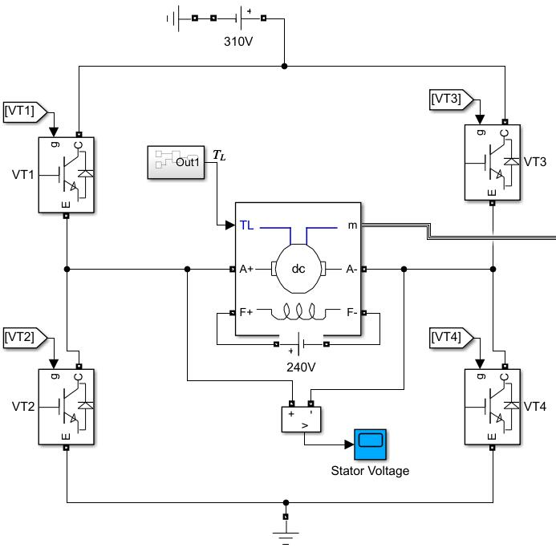
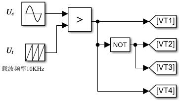
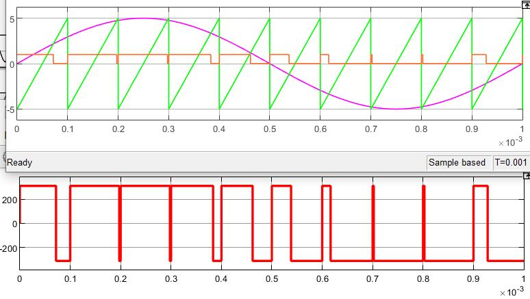
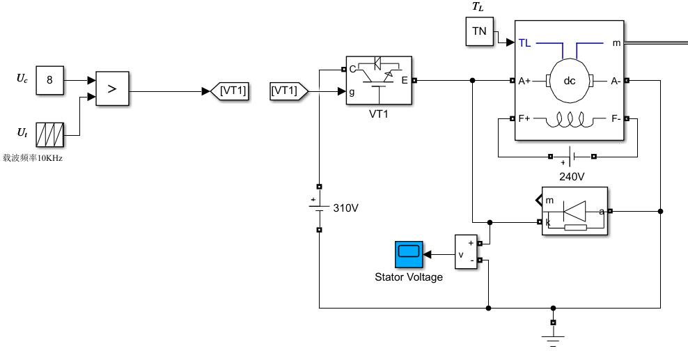

# 直流电机控制

按照电机种类的不同，由直流调速系统和交流调速系统两个大类。

直流电机由良好的控制性能，启动、制动方便，可以在很宽的范围内平滑调速。随机技术的发展，原来的高性能直流调速系统基本上都被交流调速系统取代了。

但是，直流电机控制系统是基础，高性能交流调速技术是在直流调速理论上发展起来的，而且一些小功率的直流电机控制系统还在使用，因此还要学。

交流电机的控制就是使用一些手段把交流电机直流化，所以直流电机控制是基础，这里理解到位了，到后面各种Clark、Park变换的目的也就很明确，就是使用直流电机的思想来控制交流电机。

直流电动机的稳态运行表达式

$$ C_e \Phi n = U - IR $$

因此可以看出调节转速的方法有三种

- 改变电枢电压$$ U $$
- 改变磁通$$ \Phi $$
- 改变电枢回路电阻$$ R $$

这就是对直流电机做转速控制的三个出发方向。其中调节电枢电压方式又最好。

这一部分内容主要介绍直流电机转速开环的电机控制系统并建立系统数学模型、基于数学模型进行转速闭环控制（两种控制方法对比：比例控制、PI控制）、转速电流双闭环控制。

# 转速开环、转速闭环

前面讲了电机控制主要是调节电枢电压，即调压调速的方法。因此需要可控直流电源。这一部分和电力电子技术、开关电源的知识有重叠。

可控直流电源，早些年是*晶闸管相控整流器*，现在是**PWM变换器**。

*晶闸管相控整流器*直接把交流电源转化为可控的直流电源，但是这是一种比较落后的方式，晶闸管也是属于比较落后的元件了。

**PWM变换器**先用不可控整流器把交流电整流为直流电，然后进行DC-DC变换。

用这两种电源组成的系统就被叫成了**晶闸管整流器-电动机系统**，**PWM变换器-电动机系统**。

这里要详细建立可孔直流电源的数学模型，分析开环电机控制的运行情况，熟悉电机控制的基本思想，为后面闭环控制打好基础。

前面说到开环不能满足对转速更高的要求，解决的方法是使用转速闭环控制。

自动控制最常用的PID控制器，对于要高频开关的电机控制系统，微分项就不用了。在使用PID控制器前，要建立直流电机的数学模型，不仅仅调参就完事了，这里要直接计算出来合适的参数，分析转速比例控制和转速PI控制的运行规律，对比系统性能。

懂原理才好在后面的实践中游刃有余，做系统改进也会有一个方向，而不是盯着PI两个参数硬搞。

# 转速开环控制

## 远古时期DCM控制

**晶闸管整流器-直流电动机系统**，简称V-M系统。现在我好像都没见过这样的了，现在都是用的全控型器件，淘宝卖的基本上都是MOSFET的。

### 晶闸管整流器

晶闸管确实不先进，但是这个东西很皮实。2019年电赛的时候，我和队友选了电磁炮赛题，原理大概电容充满电对发射线圈放电，使用了晶闸管作为开关。发射瞬间电流可能都快500A了，当时挑的晶闸管型号是70TPS16，稳定运行最大电流70A，最大瞬时电流1100A，耐压1600V，特别狠。

晶闸管整流器属于上古时代的东西，输入是个模拟电压，触发脉冲的相位$$\alpha$$由模拟电压值$$U_c$$来决定。

波形，参考电力电子技术各种整理波形。

### V-M系统结构

电流断续问题

### 晶闸管整流器与触发装置传递函数

这里整个系统都是模拟的，不含数字部分（上古时期模拟电路实现PID控制也很猛）。

晶闸管只能控制开通，在等效成传递函数时，把晶闸管触发和整流装置当作一个环节来看，输入是触发电压，输出是直流电压，用线性控制理论分析时，在一个范围内就可以看成线性环节了。

传递函数就是比例环节

$$ G(s) = K_s $$

比如晶闸管触发电路控制电压为0~10V，整流后的输出电压为0~200V，那么$$ G(s) = 20 $$，这也是很好理解的。

如果细致一点去考虑动态过程，可以把晶闸管触发与整流装置看成是一个纯滞后环节。滞后效应由晶闸管的失控时间引起。最大失控时间就是两个相邻的自然换相点。实际分析就采用平均失控时间，这是个近似分析手段。

用单位阶跃来表达晶闸管关断时间上的滞后，这时候这部分的传递函数就多了个纯延时环节

$$ G(s) = K_s e^{-T_a s} $$

这也和自动控制原理里的理论一致。但是实际工程上连指数也不想要，因此用一个一阶惯性环节来代替，其数学上的原理就是指数泰勒展开保留常数项和一阶项（$$ T_a \to 0 $$）。

$$ G(s) \approx \frac{K_s}{1 + T_as} $$

因此，在一定条件下，把晶闸管触发和整流装置当作一阶观性环节来处理，就可以应用线性系统控制理论来分析和设计了。

### V-M系统机械特性

运行曲线。

### 可逆运行

可以，但是很复杂。知道可以就好了。

## 现代DCM控制

现在常见的，各种本科的机器人竞赛，如果是自己从底层一路往上做的话，绕不开直流电机控制，尤其是“恩智浦”杯智能汽车竞赛，对电机控制的要求也是很高的，而且是基础。

直流PWM调速系统的优越性：
- 主电路简单，对于可逆运行来说。
- 开关频率高，比晶闸管高太多了。
- 低速性能好稳态精度高，调速范围宽，
- 开通状态，电阻相当小，有的管子只有几个毫欧。

总之全是好处。所以淘汰掉V-M系统也合情合理。

PWM调速系统总体上分为可逆和不可逆两类。相比于V-M，PWM调速可逆系统的结构要简单太多了。

### 不可逆PWM变换器-电动机系统

改变占空比，就可以改变直流电动机的平均电枢电压。实际上就是一个最简单的buck变换器，还是用上古时期的模拟系统来研究

一些物理符号：
|$$U_g$$|$$U_s$$|$$U_d$$|
|-|-|-|
|占空比控制电压|电源电压|电机电枢电压

对于buck变换器，由$$ U_d = \frac{t_{on}}{T}U_s = \rho U_s $$

控制电压都很低，比如0-5V去对应占空比0-100%，因此占空比和控制电压也是个比例关系，这个关系是基于上古时期模拟调制推出来的，锯齿波+比较器可以参考模拟电路信号章节。总之电机电压和控制电压是个比例关系：

$$ U_d = K_s U_c $$

这也很符合直觉。

buck变换器后面接个电动机，只能一个方向转，没法反转。续流二极管只是为电枢电流提供一个通道，因此也没有制动能力。

有一种方案是单独增加一个制动通道。

看起来像是个半桥电路，实际有区别，但是没法控制电机反转，因此仍然是不可逆的。电压是无法反向的，其制动是因为电机两端电枢电压小于反电势电压

波形就不细致分析了，毕竟有更好的方案：
### 可逆PWM变换器-电动机系统

如果要求电动机正转反转，需要可逆PWM变换器。

这也是现在多数直流电机使用的方案。可逆PWM变换器主电路有很多，其中最常用的又是H桥电路。

电机电压的极性随MOSFET的开关状态改变，其控制方式有双极式、单极式、受限单极式。

#### 系统结构与H桥双极式控制

这里详细分析双极式可逆PWM变换器的工作原理。其基本结构如图

<figure>
    
</figure>

单侧桥臂上下管不可同时导通，因此对侧上下桥臂的导通状态是相同的。暂时不考虑MCU控制，用模拟电路的方法去实现一下这个系统。首先需要搞到控制脉冲，需要用三角波进行调制，其实思路也很简单，使用一个比较器就可以了，没有思维上的难度，原理实现如下

<figure>
    
</figure>

注意VT1-4的导通逻辑。来看看$$U_c, U_t, U_d$$的波形：

<figure>
    
</figure>

电源电压是$$ U_s $$，在双极式控制方式下，加在电机两端的电压是$$ +U_s $$或$$ -U_s $$，一个周期内有正有负，双极式的名字就是这么来的。

如果电机两端平均电压为0时，PWM波占空比为50%，$$U_c=0$$
>此时电压系数$$\gamma = 0$$，占空比$$\rho=50%$$

这里在工程上定义了**电压系数**$$\gamma$$，前面有个**占空比**$$\rho$$。电压系数的取值为$$ -1 \sim +1 $$，$$\gamma=+1$$时，可以认为此时为电机为最大转速（不严谨），电压系数的正负表达了电机的正反转情况。

对于这个系统有$$ \gamma = 2\rho - 1 $$。对于前面用buck变换器的不可逆系统，有$$ \gamma = \rho $$，也即只能正转。

当电压系数$$\gamma = 0$$，占空比$$\rho=50%$$，电动机是停止的，但是电枢瞬时电压不是0，是正负脉宽相等的交变电压，电流也是交变的，平均值为0不产生转矩。这增加了电机损耗，是双极式控股的缺点，但是消除了静摩擦死区，起着“动力润滑”的作用。

总结，双极式控制的H桥可逆变换器的优点：电流连续，课四象限运行，能消除静摩擦死区，低速性能好调速范围大。

缺点：四个管子都在不停开关，要设置死区时间，损耗大（主要是电能损耗），。

为了克服缺点，可以使用单极式控制，使得有管子处在常通或者常断状态。

#### PWM调速系统机械特性

严格的讲在这种控制方式下，稳态时转矩和转速也是脉动的。

>稳态的含义：是平均电磁转矩与负载转矩平衡。
>机械特性：平均转速与平均转矩（电流）的关系
>>转矩和电流只是查了个系数$$ T_e = C_T\varPhi I $$

对于带制动通路的不可逆电路，在开通和关断有两个电压方程

$$ U_s = Ri_d + L \frac{ \rm{d}{i_d}}{\rm{d} t} + E $$
$$ 0 = Ri_d + L \frac{ \rm{d}{i_d}}{\rm{d} t} + E $$

小写字母表示瞬态，大写表示稳态或者平均值。可以算出一个周期内的平均值来处理，电机两端平均电压$$ U_d = \gamma U_s $$，电感压降的平均值是0，这一项就不要了。

平均值方程

$$ \gamma U_s = RI_d + C_e \varPhi n $$

导出机械特性为

$$ n = \frac{\gamma U_s}{C_e \varPhi} - \frac{RI_d}{C_e \varPhi} $$

其中电机平均电压又是由PWM控制器的输入电压$$U_c$$控制的，差了个系数有$$ \gamma U_s = K_s U_c $$。电枢电流和电磁转矩也是差个系数的关系$$ T_e = C_T \varPhi I_d $$，整理一下就有了转速和转矩的关系

$$ n = \frac{K_c U_s}{C_e \varPhi} - \frac{R}{C_e C_T \varPhi^2}T_e = n_0 - KT_e $$

对于带制动作用的不可逆电路，电压系数$$ 0 \le \gamma \le 1 $$，机械特性曲线在I、II象限，调节$$ U_c $$（占空比），上下平移曲线。

对于双极式控制可逆直流电源供电时，机械特性曲线也是平行线，只不过扩展到了四个象限。

四象限运行这个词就是从这里来的。

#### PWM控制器和变换器的动态数学模型

PWM控制器是弱电信号，PWM变换器是把信号放大成功率，电路上看就是H桥。

对于模拟PWM控制器，电路表现是一堆运放，最后输出方波信号。对于数字式PWM控制器，一般MCU的一个引脚，内部是定时器计时器比较，然后翻转引脚。

H桥的作用是功率放大，因此一帮把前面的信号电路和放大电路放在一起当作一个环节来看待，整体的传递函数表现的也是前面运算电路的特性，毕竟MOSFET的开关速度特别快。

来看模拟的，我们要求出PWM控制器的放大系数和传递函数。大体上看，当控制电压$$ U_c $$改变时，H桥的输出平均电压跟着变化，但是响应会有延迟，最大延迟时间是一个开关周期$$T$$，因此有滞后环节，其传递函数的形式为

$$ W_s(s) = \frac{U_d(s)}{U_c(s)} = K_s e^{-T_ss} $$

实际上$$ T_s \le T $$，工程上保守一点就取成$$T$$，这样设计出来的控制系统相位统裕度会大一点。还有一个事情，开关频率（调制的三角波频率）很高，10KHz时，$$T=0.1 \rm{ms}$$，时间常数这么小，那么也可以指数展开取一阶项，近似成一阶惯性环节

$$ W_s(s) \approx \frac{K_s}{T_ss+1}  $$

这就是典型的工程近似思想，实际上PWM变换器不是一个线性环节，是具有继电特性的非线性环节，这都不知道近似了多少次了😂😂，但是没关系，这种操作是有理有据的。

## 电机系统指标及优化思路

### 转速控制要求与性能指标

需要控制运动的设备，都应该有一些数字指标，概括为这几个方面
- 调速：在最高转速和最低转速之间，有级调速或无级调速
- 稳速：在干扰下保持速度的能力
- 加减速：比较快的过度过程

具体的描述指标

调速范围$$D$$，额定负载下，同向最高转速$$n_{max}$$和最低转速$$n_{min}$$之比

$$ D = \frac{n_{\max}}{n_{\min}} $$

静差率$$ s $$，某一转速下，由理想空载到额定负载的转速降落$$ \Delta n_N $$与空载转速$$n_0$$之比。

$$ s = \frac{\Delta n_N}{n_0} $$

衡量机械特性的硬度的，但是和硬度有区别，硬度指机械特性斜率，但是静差率和空载转速也有关系。因此静差率要和调速范围一起考虑，**静差率指标应该以最低速是的指数为准**。

### 开环性能

对于下图这种的开环控制系统，调节$$U_c$$来改变转速，对转速要求不高的，都可以做到无极调速。

<figure>
    
</figure>

然而许多系统要求高精度的速度控制，开环控制对负载变化引起的转速波动没有抑制能力，也就说负载变了，转速几乎都会跟着变化。

后面就要着手解决这个问题，其核心思想就是反馈控制，利用误差，消除误差。

所以这电机控制也是自动控制原理深入运用的一项技术。

