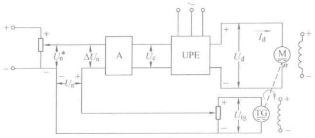
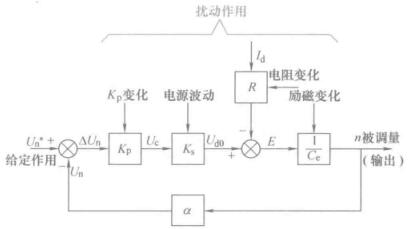
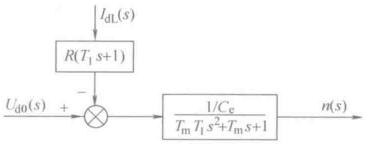
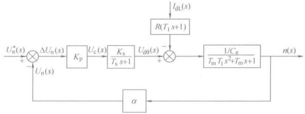

# 转速闭环控制

## 转速比例控制

根据自动控制原理，将被控量作为反馈量引入系统，与给定量比较，取得偏差进行控制，可以有效抑制扰动造成的影响。

在直流电机控制里，被控量是转速，转速降落是由负载引起的，那么转速反馈闭环可以减小转速降落，从而降低静差率。

### 比例控制系统结构和静特性

这里把前面的H桥封装起来，输入为VT1和VT4的正脉冲，输出为电机电压

<figure>
    
</figure>

先按照书上这个纯模拟系统分析清楚了，运算放大器前面这两个回路压降相同有

$$ U_n^* = \Delta U_n + U_n $$

这就实现了计算误差的关系即

$$ \Delta U_n = U_n^* - U_n $$

比例调节器有

$$ U_c = K_P \cdot \Delta U_n $$

对后面的PWM变换器，前面开环的时候已经建模过了，有

$$ U_d = K_sU_c $$

对于电动机，有

$$ n = \frac{U_d - I_dR}{C_e \varPhi} $$

对于测速发电机

$$ U_n = \alpha \cdot n $$

>数字编码器测速也差不多是这个表达式，所以物理实现不同，但是数学抽象出来是一样的，很猛。
 
画出来稳态结构框图(a)，有两个输入，线性系统叠加原理。用梅森增益公式可以得到总的输出关系式，即为**静特性方程式**：

$$ n = \frac{K_P K_s}{C_e(1+K)}U_n^* - \frac{RI_d}{C_e(1+K)} $$
>其中$$ K = \frac{K_P K_s \alpha}{C_e} $$，实际上是系统的开环增益。

<figure>
    
</figure>

静特性为闭环系统稳定时候电机转速和负载电流（转矩）的关系，形式上和开环机械特性相近，但本质不同。

下面比比哪里不同

### 开环机械特性和闭环静特性比较

断开反馈回路就是开环系统，开环机械特性就是电压决定转速

$$ n = \frac{U_d - I_d R}{ C_e } - \frac{R I_d}{C_e} $$

依照前面的，就有了开环理想空载转速$$ n_{0open} = \frac{U_d - I_d R}{ C_e } $$，开环稳态降速$$ \Delta n_{\text{open}} = \frac{R I_d}{C_e} $$

闭环静特性前面已经有了

$$ n = \frac{K_P K_s}{C_e(1+K)}U_n^* - \frac{RI_d}{C_e(1+K)} $$

同样的，有闭环理想空载转速$$ n_{0close} = \frac{K_P K_s}{C_e(1+K)}U_n^* $$和闭环稳态速降$$ \Delta n_{\text{close}} = \frac{RI_d}{C_e(1+K)} $$。

同样负载下对比稳态速降，闭环分母多了个$$ (1+K) $$

$$ \Delta n_{\text{open}} = \frac{R I_d}{C_e} $$

$$ \Delta n_{\text{close}} = \frac{RI_d}{C_e(1+K)} $$

K越大，闭环系统的特性越硬。

再来看静差率，按照理想空载转速相同$$ n_{0open} = n_{0close} $$来比较，

$$ s_{\text{close}} = \frac{\Delta n_{\text{close}}}{n_{0close}} $$

很简单的带入，可以发现也是多了个$$ (1+K) $$

$$ s_{\text{close}} = \frac{s_{\text{open}}}{1+K} $$

由此简单的量化比较，可以看出闭环系统有更硬的稳态特性，在静差率不变的情况下有更大的调速范围。

闭环系统里，直流电机的额定速降仍然是$$ \Delta n_N = \frac{RI_N}{C_e} $$，与开环系统的一样，那么闭环系统稳态速降减小的实质是什么呢？

当负载电流增大，电枢压降增大，转速下降，反馈装置感受到了，就提高了PWM变换器输出电压，补偿电阻降落部分影响，电机工作在了一个新的机械特性曲线上，转速又有所回升。**闭环系统的静特性是许多开环机械特性各取一个工作点连接而成的**。

实质在于自动调节作用，随着负载变化而改变电枢电压，补偿电阻压降。

### 闭环直流调速系统的反馈控制规律

比例控制的闭环直流调速系统是一种基本的反馈控制系统。反馈控制的基本规律：

- 比例控制开环放大系数$$K$$越大，稳态误差越小，但无法消除
- 反馈控制系统的作用是抵抗扰动（不仅仅负载扰动），除了反馈通道上的都可以
- 系统精度依赖于给定和反馈精度

<figure>
    
</figure>

控制系统的作用就是使得输出紧紧跟随给定，并且避免反馈包围内前向通道的干扰。理论讨论的时候只考虑了负载扰动，实际上每个模块都有扰动，但是没关系，反馈系统都可以抑制。在设计闭环系统时，可以只考虑负载扰动，设计好其他扰动也是可以抑制的。

给定作用的微小变化都会使得输出跟随，反馈检测装置的误差也无法通过反馈来克服。因此系统需要有高精度的给定和高精度的反馈。

### 转速闭环控制的动态性能

比例系数越大，稳态误差越小，这是稳态分析。但是肯定不是越大越好，动态性能制约着比例系数。

#### 动态数学模型

>机理分析，写处环节微分方程；求出传奇函数；根据结构画出动态结构框图，求出传奇函数。

前面分析过PWM变换器的近似传递

$$ W_s(s) \approx \frac{K_s}{T_s s + 1} $$

对于不同的变换器形式都一样，参数有差别。

对于电机

$$ U_d = R I_d + L \frac{\text{d} I_d}{\text{d}t} + E $$

$$ T_e - T_L = \frac{\text{d}\omega}{\text{d}t} = \frac{GD^2}{375} \cdot \frac{\text{d}n}{\text{d}t} $$

$$ E = C_e n $$

$$ T_e = C_T I_d $$

输入为电压，输出转速，很简单的数学推导有

$$ \frac{I_d(s)}{U_d(s) - E(s)} = \frac{1/R}{T_ls + 1} $$

$$ \frac{E(s)}{I_d(s) - I_{dL}(s)} = \frac{R}{T_ms} $$

这里把一些常数性质的参数拿出来用字母简化了，这个简化也是有依据的，不是说为了好看随便搞得。电枢回路时间常数$$ T_l = \frac{L}{R} $$，机电时间常数$$ T_m = \frac{GD^2R}{375C_eC_m} $$

画出来以后，最终目的是得到直流电机的动态传递函数

<figure>
    
</figure>

可以看出，额定励磁下的直流电机是一个典型二阶环节，当$$ T_m > 4T_l $$，过阻尼，如果小于，就是欠阻尼，二阶震荡环节，机械和电磁能量互相转换，电机运动有震荡性质。

点击前面是PWM变换器，一阶系统，此外还有比例控制器，以及测速反馈环节，也是个比例环节，组合起来，就是整个控制系统的结构框图

<figure>
    
</figure>

至此，开环传递函数

$$ W(s) = \frac{ U_n(s) }{ U_n^*(s) } =  \frac{ K }{ (T_s + 1)( T_m T_ls^2 + T_m s + 1 ) } $$

闭环函数也可以写出来，但是挺复杂，懒得敲了，很容易写的

$$ W_{\text{close}} = \frac{ \frac{K_p K_s}{ C_e(1+K) } }{ \frac{T_m T_l T_s}{1+K}s^3 + \frac{T_m (T_l+ T_s)}{1+K}s^2 + \frac{T_m + T_s}{1+K}s + 1 } $$

#### 动态性能的分析

有了传递函数才好做理论分析，$$ W_{\text{close}} $$的分母，即特征方程，由劳斯判据，可以知道系统稳定的参数取值

$$ K < \frac{T_m}{T_s} + \frac{T_m}{T_l} + \frac{T_s}{T_l} $$

## 转速PI控制

前面的比例控制可以看出，有静差，这里要研究PID控制器，三种作用，先讨论积分控制的作用。

### 积分控制规律

积分调节器，当输入是转速误差$$ \Delta U_n $$时，积分调节器的输入输出关系为

$$ U_c = \frac{1}{\tau} \int_0^t \Delta U_n \text{d}t $$

传递函数为

$$ W_I(s) = \frac{1}{\tau s} $$

比例控制是只要电机在工作，就必须有偏差电压，因此这也是有静差的原因。积分调节器只有在静差为0的时候，才停止使输出到一个终值。

比例调节器的输出只取决于输入偏差量的现状，而积分调节器的出书包含了输入偏差量的全部历史。

单独积分控制肯定是不行的，一般都是用**比例-积分控制**（PI控制）。

传递函数为

$$ W_{PI}(s) = K_P + \frac{1}{\tau s} = \frac{K_P \tau s + 1}{\tau s} $$

设计PI调节器时候，选择参数也是一个新的问题，在自动控制理论里，有许多方法比如根轨迹法、频域校正等。

## 转速闭环的小问题

转速反馈把转速作为调节量，检测转速误差，但是如果有个阶跃输入，误差过大，输出拉满，电枢电压过高，这时候相当于全压启动，会造成电机过流。

此外当电机堵转时，也会出现过流问题，反馈控制并不知道堵转了，只是察觉到转速误差一直存在。

这种情况，电流会远远超过允许值，会跳闸或者触发熔断器保护。

因此需要对电流进行一定控制，使得在启动或者堵转时，电流不超过允许值，但是正常运行下又让电流随着负载的增减而变化。

这要求电流负反馈只在制动和堵转时存在，正常运行时消失，这种叫作**电流截止负反馈**。

模拟实现需要用二极管或者稳压管实现，但是MCU控制简单的`if`语句就能实现，要简单很多。

有实现方案，这里就不放出来了。因为有更好的方法解决这个问题，就是下一部分内容。

