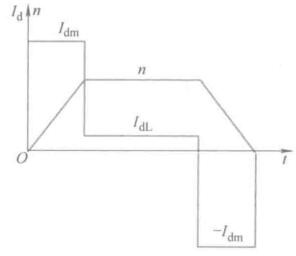
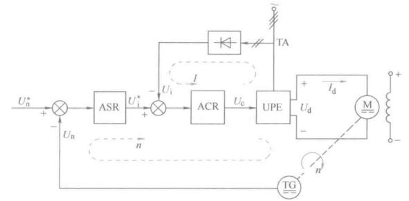
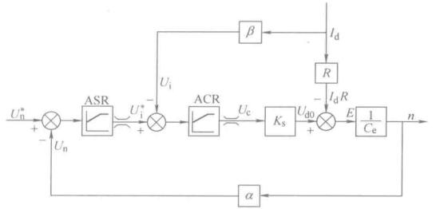
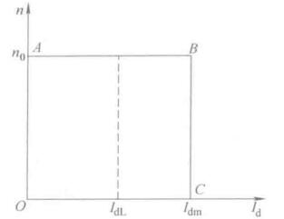
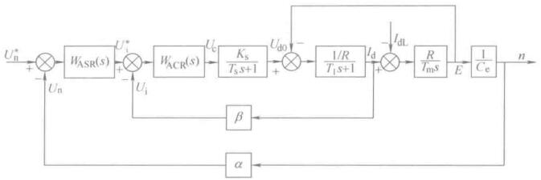
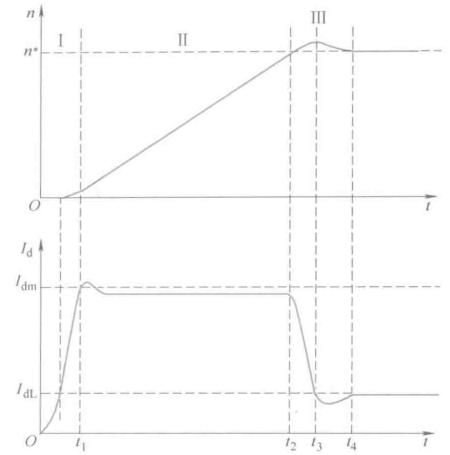
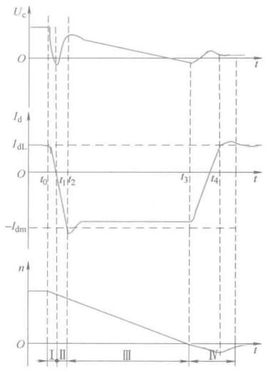
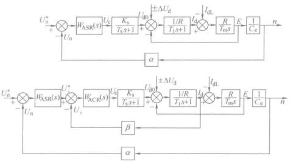

# 转速、电流双闭环控制

转速、电流双闭环控制的直流系统时静动态性能都不错的系统，也是应用最广泛的直流电机控制方案。

# 结构与稳态、动态分析

## 系统结构

转速单闭环PI控制系统存在过流问题，前面提出了一种方案**电流截止负反馈**。但是转速但闭环无法按照要求充分控制电流，更理想的电流（转矩）控制方式：

启动时，启动电流为允许的最大值，转速最快上升；到给定转速，电流下降，稳态转矩与负载转矩平衡；制动时，为反向最大允许电流。

<figure>
    
</figure>

理想是这样的，但是电感电流是不能突变的，尽管如此，我们还是要尽可能地往这个方向靠。

电流负反馈可以控制电流，启动时要控制电流，在达到稳态转速后要控制转速并且电流控制不要起阻碍作用。显然需要用两个控制器，这两个控制器使用串联的方式，这也就是常说的**串级PID**。

<figure>
    
</figure>

转速调节器ASR的输出作为电流调节器ACR的输入，用ACR去控制电力电子变换器。电流环为内环，转速转为外环，这两个控制器一般都用PI控制器。这两个控制器输出都是带限幅的。

上图这个$$ U_i $$是电流负反馈，从变换器前面引出来的，和从电机引出来差了个系数。能量守恒，所以这里的电流也是可以反映电机电枢电流的。

## 稳态分析

上面给出的是原理图，进行数量的分析的时候，就要转化成数学模型了，很容易可以给出稳态结构框图

<figure>
    
</figure>

稳态下扰动是负载电流，调节器饱和时，输出会做限幅处理，输入对输出就没影响了，需要反向输入使控制器退出饱和。

转速调节器不饱和时，两个调节器都不饱和，到达稳态时偏差为0，有

$$ U_n^* = U_n = \alpha n = \alpha n^* $$

$$ U_i^* = U_i = \beta I_d = \beta I_{dL} $$

也即稳态时，$$ n = \frac{U_n^*}{\alpha} = n^* $$，ASR输出小于限幅值，$$ I_d $$也小于其限幅值$$ I_{dm} $$，$$ I_{dm} $$肯定是大于负载电流的。因此其调节器不饱和时静特性就是下图AB段：

<figure>
    
</figure>

当ASR饱和，其输出到达限幅$$ U_{im}^* $$，实际上相当于外环开环，转速变化对转速控制已经没影响了。双闭环系统这时候就是个无静差的电流闭环控制系统。稳态时$$ I_d = \frac{U_{im}^*}{\beta} = I_{dm} $$

因此，ASR的输出限幅值$$ U_{im}^* $$取决于最大电流$$ I_{dm} $$，这个值是设计者选的，兼顾最大加速度和电动机允许的最大过载能力。

双闭环闭环系统的静态特性在负载电流小于$$ I_{dm} $$时，是一个无静差的转速控制控制系统，当负载电流达到$$ I_{dm} $$以后，ASR为饱和输出限幅值，ACR起作用，系统表现为电流无静差，起到了过流保护的作用。电动机以最大允许加速度进行加速减速，这就很接近理想的控制过程了。

稳态工作点参数的计算。都不饱和时，有

$$ U_n^* = U_n = \alpha n = \alpha n^* $$

$$ U_i^* = U_i = \beta I_d = \beta I_{dL} $$

$$ U_c = \frac{U_{d0}}{K_s} = \frac{C_e n + I_d R}{K_s} = \frac{C_e U_n^* / \alpha + I_{dL}R}{K_s} $$

可以看出在稳态工作点，转速$$ n $$由给定电压$$ U_n^* $$决定的，ASR的输出量$$ U_i^* $$是由负载电流$$ I_{dL} $$决定的，而ACR的输出量控制电压$$ U_c $$的大小则同时取决于$$ n $$和$$ I_d $$（$$ U_n^* $$和$$ I_{dL} $$）。

饱和后，应为最大控制电压$$ U_{cm} $$，该值作为ACR的最小输出限幅，同时也要考虑电力电子变换器的输出电压。

PI调节器和P调节器的输出不同体现：P调节器输出总是正比于输入；PI的饱和输出为限幅值，非饱和输出在动态过程取决于输入的积分，稳态后输入为0，输出的稳定值是由后面环节的需要决定的，后面需要PI调节器提供多大的输出值都能做到，直到饱和为止。

基于稳态工作点，可以很容易找到反馈参数$$ \alpha $$和$$ \beta $$，给定的最大值也可以自己选。

## 动态数学模型

在前面单闭环的基础上，考虑双闭环控制系统的结构图，为了引出电枢电流，原来写成二阶系统的电动机得拆开来，最后结构图就是下面这样子

<figure>
    
</figure>

## 动态过程分析

### 启动分析

<figure>
    
</figure>

电机控制系统的被控对象是转速，其跟随性能可以用阶跃响应来描述。在恒定负载下，转速的变换是由转矩（电流）决定的，因此这两个状态量要放在一起对比研究。上图是一个带负载下启动的电流波形和转速波形。

I阶段，调节电流到最大允许值，在大于负载电流后，合转矩大于0，转速开始增加。$$ t_1 $$时刻达到最大允许电流值。ASR很快饱和，ACR不饱和。

II阶段，电流控制在最大允许值，合转矩恒定，转速稳定上升。这里有个小问题是电流并不是被PI控制器控制在$$ I_{dm} $$，是有误差的。ASR饱和，转速环相当于开环，$$ U_{im}^* $$入，$$ I_d $$出，有了PI控制器以后实际上是个I型系统，只能无静差跟随阶跃信号，但是要注意产生静差的原因是扰动反电势$$ E = C_e n $$，斜坡信号的“档次”比较高，I型系统无法无静差跟随。

III阶段为转速调节，因为ASR有积分饱和，所以转速还会上升一点需要退饱和。在电流大于负载电流前，转速还要上升的，合转矩和转速同向。电磁转矩和负载转矩平衡以后，转速稳定。如果参数调不好，这里会震荡。这个阶段ASR和ACR都不饱和，ASR主导调节，ACR力图使得$$I_d$$尽快跟随给定值$$ U_i^* $$

可以看出双闭环电机控制的特点：
- 饱和非线性控制。随着ASR饱和与不饱和，系统处于两种状态，并不是线性的，不可以简单的用线性控制理论来分析启动过程，也无法用线性控制里来粗略设计，只能分段线性来分析。
- 转速有超调。ASR采用PI控制器时，必然有超调。如果不允许有超调，还得用其他办法。
- 准时间最优。在物理设备允许的条件下实现最短时间的控制。

### 制动分析

<figure>
    
</figure>

带负载运行时，突然收到停车指令。先衰减到0，然后反向增加到最大允许值，并且维持住，有静差的原因和前面一样，

### 动态抗扰性能分析

对于电机控制，重要的抗扰性能时靠负载扰动和电源电压波动扰动。

由控制框图，负载电流扰动影响在电流环之后，因此只能靠ASR来抵抗负载扰动，在设计ASR时，应该有比较好的抗扰性能指标，

对于电网电压扰动，与转速单闭环做个比较，这里重新画一下单闭环的结构框图做一个对比

<figure>
    
</figure>

两个系统的反馈都包围了电源电压波动和负载扰动，从稳态来说效果一样的。但是动态性能不同，有了电流环，电压波动通过电流反馈可以及时得到调节，不需要等到电压波动影响转速后才反馈回来调节。

## ASR、ACR作用

ASR
- 系统的主导调节器，使转速$$ n $$跟随给定$$ U_n^* $$，如果使用PI控制器，可以无静差
- 对负载变化抗扰
- 输出限幅决定电机最大电流

ACR
- 内环，使电流紧紧跟随给定电压$$ U_i^* $$
- 对电源电压波动起及时抗扰的作用
- 转速动态过程中，保证电动机为最大允许电流，使得加速度最大
- 电机过载或者堵转时，限制电枢电流最大值，起快速的自动保护作用。

