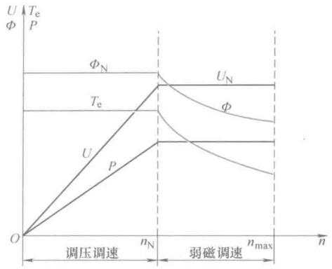
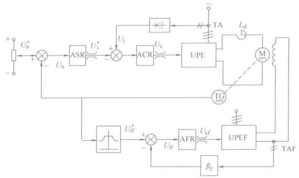
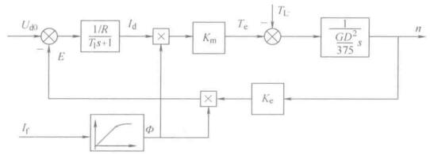

# 双闭环系统弱磁调速

## 弱磁调速与调压调速

前面的调压方式为从额定转速向下调速，减小励磁电流是从额定转速向上调速。

调压调速时，励磁电流恒定，磁通不变，电磁转矩为$$ T_e = C_T \varPhi I_d $$，因此其最大电磁转矩也是不变的，称作“恒转矩调速方式”，在弱磁调速范围内，转速越高，此通越弱，容许的转矩减小，是“恒功率调速”。

更多的，调压调速可以和弱磁调速配合起来，额定转速下，调压调速，额定转速上，弱磁调速，这样可以获得更大的调速范围。

<figure>
    
</figure>

弱磁和调压配合的控制特性。在额定转速下，应该满磁调压，在额定转速上应该额定电压调节磁通。

这就新出现了控制磁通的问题，产生磁通的原因是励磁电流，因此需要控制励磁电流。

## 励磁电流控制

在额定转速上进行弱磁控制时，调压和调磁通的**给定装置**不应该是独立的，而是有关联的。

额定转速下，满磁通下调电压；额定转速上，额定电压调励磁。因此存在恒转矩的变压调速和恒功率的弱磁调速两个不同区段，需要找个方法控制系统在这两个区段切换。

下图就是一种方法的原理图

<figure>
    
</figure>

在转速较低时，磁通量给定恒定，系统就是一个普通的双闭环调速系统，当速度到了额定转速上时，励磁电流给定会变小，电动机工作在弱磁状态。

前面讨论的数学模型时恒定磁通下建立的，当磁通为变量时，$$ C_e $$和$$ C_m $$都不是常数了，使用$$ K_e \varPhi $$和$$ K_m \varPhi $$来表示，这时候，这两重要物理量

$$ E = K_e \varPhi n $$

$$ T_e = K_m \varPhi I_d $$

一些列参数都会跟着变化，除此之外，励磁电流和磁通之间也是饱和个非线性关系，因此弱磁控制过程的动态结构图为

<figure>
    
</figure>

在磁通变化时，直流电动机是一个含有乘法器的非线性对象，如果ASR还是采用线性的PI调节器，无法保证在整个弱磁调速范围内都有良好性能。

```note
实际上，这一部分内容并不是电机控制的重点。对于直流电机来说，选择额定转速更高的电机向下调速更简单容易。

但是这部分已经有异步电机的一些影子出现了，这里作为一个思想，后面异步电机里会遇到类似的情况，再见到不会显得太陌生。
```


