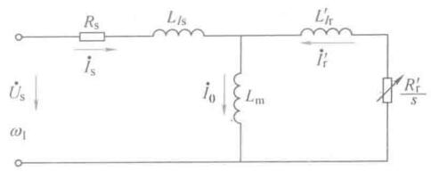
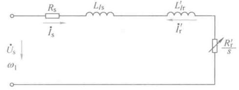
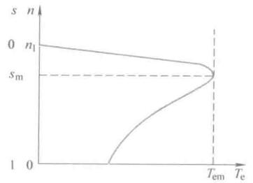

# 异步电机稳态数学模型


## 稳态数学模型


### 稳态等效电路

稳态数学模型：稳态等效电路，机械特性。

稳态等效电路描述了一定转差率下电动机的稳态电气特性；机械特性描述了转矩与转差率（转速）的稳态关系。

根据电机学原理，稳定模型可以用T形等效电路表示

<figure>
    
</figure>

按照定义，转差率和转速的关系

$$ s = \frac{n_1 - n}{n_1} $$

其中，同步转速$$ n_1 = \frac{60f_1}{n_p} $$，电源频率$$ f_1 $$，电动机极对数$$ n_p $$

等效电路图里，$$ R_s, R_r' $$定子每相绕组电阻、折合到定子侧的转子每相绕组电阻；$$ L_{ls}, L_{lr}' $$定子每相漏感、折合到定子侧的每相转子漏感；$$ L_m $$定子每相绕组产生的气隙主磁通等效电感，励磁电感；定子相电压$$ \dot U_s $$；对于电流，箭头为规定方向。

由等效图可以导出转子相电流幅值，表达式挺复杂，但是就是一个简单的复阻抗计算。一般情况下，$$ L_m >> L_{ls} $$，从表达式上来看，相当于没有$$ L_m $$


<figure>
    
</figure>

由此简化等效电路，可以得出电流幅值公式（计算机械特性会用到）：

$$ I_s \approx I_r' = \frac{U_s}{ \sqrt{ \left( R_s + \frac{R_r'}{s} \right)^2 + \omega_1^2 (L_{ls} + L_{lr}')^2 } } $$


```note
这里实际上是电机学要解决的问题，可以参考前面电机学内容。

电机内部的理论是电磁场问题。本质是场，但是可以使用路来分析。磁场的分析也可以简化为磁路的分析。然后把电路和磁路又简化为单一电路问题，即归算后的等效电路、方程式和相量图。

整个研究思路：

**电机电磁场问题👉电路、磁路👉归算为电路，方程式，相量图👉归算到定子侧单一电路**


因此可以看到，等效电路都是连起来的，而实际电机我们知道，转子和定子并无电上的直接联系，通过气隙磁场传递能量。
```


### 机械特性

和前面直流电机机械特性一样，指的是机械量之间的关系，即转速$$ n $$和转矩$$ T_e $$之间的关系。对于异步电动机来讲，转速和转差率是等价的。

三相异步电机传递的电磁功率为

$$ P_m = 3\cdot I_r'^2 \frac{ R_r'}{ s } $$

机械同步角速度为

$$ \omega_{m1} = \frac{\omega_1}{n_p} $$

则异步电机的电磁转矩为

$$ T_e = \frac{P_m}{\omega_{m1} } = \frac{ 3n_p U_s^2 R_r'/s }{\omega_1 \left[ \left( R_s + \frac{R_r'}{s} \right)^2 + \omega_1^2 ( L_{ls} + L_{lr}' )^2 \right]} $$

进一步整理的好看一点就是机械特性方程，表征了转矩和转差率的关系：

$$ T_e = \frac{ 3n_p U_s^2 R_r's }{\omega_1 \left[ \left( s R_s + R_r' \right)^2 + s^2 \omega_1^2 ( L_{ls} + L_{lr}' )^2 \right]} $$

虽说好看，但是还是有点难看的😂，倒是思路并不困难。和直流电机一样，我们想得到$$ T_e -s $$曲线，这就是一个数学上已知表达式画图的问题了，求极值、增减性、凹凸性、拐点、渐近线等等方法都可以用上了（从会的工具里挑几个能在这里用上的）。

对变量$$s$$求导，$$ \frac{\text{d}T_e}{\text{d}s} = 0 $$，可以找到最大转矩$$ T_{em} $$对应的转差率$$ s_m $$，机械特性是有这个特殊点存在的。

临界转差率

$$ s_m = \frac{R_r'}{\sqrt{R_s^2 + \omega_1^2( L_{ls} + L_{lr}' )^2}} $$

临界转矩

$$ T_{em} = \frac{3n_p U_s^2}{2\omega_1[R_s + \sqrt{R_s^2 + \omega_1^2( L_{ls} + L_{lr}' )^2} ]} $$

这里用近似分析思想，分母展开，s比较小时（同步转速附近），忽略分母含s的各项有

$$ T_e \approx \frac{3n_p U_s^2 R_r's}{ \omega_1 R_r'} $$

这段为直线。

在s较大时，分母中$$s^2$$对函数值起主导作用，有

$$ T_e \approx \frac{3n_p U_s^2 R_r's}{\omega_1 s [ R_s^2 + \omega_1^2( L_{ls} + L_{lr}' )^2 ]} $$

转差率比较大时候，接近反比例关系。

<figure>
    
</figure>

由额定电压$$ U_{sN} $$、额定频率$$ f_{1N} $$供电，时候的机械特性方程为**固有特性**或**自然特性**：

$$ T_e = \frac{ 3n_p U_{sN}^2 R_r's }{\omega_{1N} \left[ \left( s R_s + R_r' \right)^2 + s^2 \omega_{1N}^2 ( L_{ls} + L_{lr}' )^2 \right]} $$

## 调速方法

调速就是认为改变机械特性参数，使电机的稳定工作点偏离固有机械特性，工作在人为机械特性上。

由机械特性方程可知可以改变的参数有电机参数、电源电压$$ U_s $$、电源频率$$ f_1 $$。

这里着重研究改变**电压调速**和**改变频率**调速。

三相异步电动机定子每相电动势的有效值为

$$ E_g = 4.44 f_1 N_s k_{N_s} \varPhi_m $$

其中，$$ E_g $$气隙磁通在定子侧每相感应电动势的有效值；$$ N_s $$定子绕组串联匝数；$$ k_{N_s} $$定子基波绕组系数；$$ \varPhi_m $$每极气隙磁通量。

如果忽略定子绕组电阻和漏磁感抗压降，可认为定子相电压$$ U_s \approx E_g = 4.44 f_1 N_s k_{N_s} \varPhi_m $$

则气隙磁通$$ \varPhi_m $$是由$$ U_s $$决定的，**在调速的过程中，应当保持气隙磁通不变化**，即

$$ \frac{E_g}{f_1} = \text{Constant} $$

或者近似认为

$$ \frac{U_s}{f_1} = \text{Constant} $$

