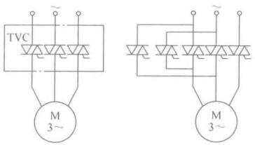
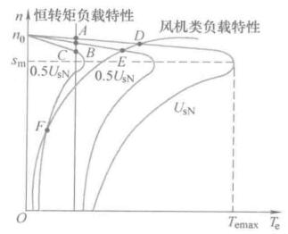
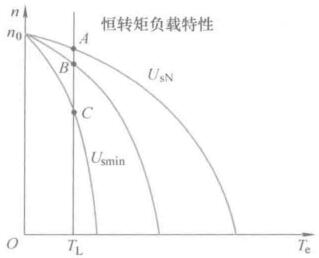
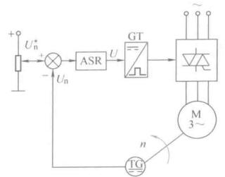
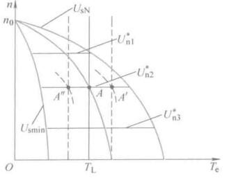

# 异步电机调压调速

保持电源频率为额定频率$$ f_{1N} $$，只改变定子电压$$U_s$$的方法称作调压调速。由于点击绝缘和磁路饱和，定子电压只能降低，不可升高，因此又叫降压调速。

调压调速的特征是同步转速保持为额定值不变，即

$$ n_1 = n_{1N} = \frac{60 f_{1N}}{n_p} $$

而气隙磁通

$$ \varPhi_m \approx \frac{U_s}{4.44f_1 N_s k_{N_s}} $$

因此，只调节电压的调速为弱磁调速。

## 调压调速主电路

以前改变交流电压的方式用自耦变压器，后来比较笨重的调压器就用晶闸管交流调压器取代了（也比较古老了）。

晶闸管调压器一般用三个双向晶闸管串在三相电路里，用相位控制改变输出电压。如果要求可逆，还需要再多两个交换一下相序。

<figure>
    
</figure>

## 调压调速机械特性

上一节有了机械特性表达式

$$ T_e = \frac{ 3n_p U_s^2 R_r's }{\omega_1 \left[ \left( s R_s + R_r' \right)^2 + s^2 \omega_1^2 ( L_{ls} + L_{lr}' )^2 \right]} $$

调压调速时，$$ U_s $$可调，电磁转矩与定子电压的二次方成正比。

当$$ T_e = 0 $$时，$$ s=0 $$，则调压的时候理想空载转速就是同步转速。

临界转差率还是原来的那个定值，调压时也保持不变。临界转矩会随着$$ U_s $$下降而下降。

当异步电机带恒转矩负载工作时，可以稳定工作的转差范围为$$ 0 < s < s_m $$

<figure>
    
</figure>

分析调速范围实际上是分析机械特性曲线和负载特性曲线的交点是否稳定的问题，依照当前转速的合转矩与转速方向即可判断交点的稳定性。图上标字母的工作点都是稳定的。

带恒转矩负载$$ T_L $$工作时，定子侧的输入电磁功率为

$$ P_m = T_L \omega_{m1} = \frac{T_L \omega_1}{n_p}$$

同步转速和转矩都不变，因此输入电磁功率恒定，与转速无关。然而输出的机械功率随速度是再变化的

$$ P_{\text{mech}} = \omega_m T_L = (1-s)\frac{T_L \omega_1}{n_p} $$

转差率越大，定子转速越小，输出机械功率越少，然而输入功率却恒定，也就是说，有一部分能量

$$ P_s = sP_m = sT_L \omega_{m1} = s\frac{T_L \omega_1}{n_p} $$

带恒转矩负载的降压调速就是靠增大转差功率、减小输出功率来换取转速的降低，转差功率全部消耗在转子电阻上，这就是**转差功率消耗型**的由来。

如果增加转子电阻值，可以使得临界转差率加大，可以增加恒转矩负载下的调速范围，也可以使电动机在较低速下运行不至于过热。

这种高转自电阻电动机又称作交流力矩电机，机械特性如图，缺点是比较软

<figure>
    
</figure>

## 闭环调压调速

普通异步电机降压调速的范围很窄，高转子电阻电机范围大但是特性软，因此可以使用转速闭环的方法解决这个问题。

异步电机转速闭环控制系统和直流电机结构类似，只不过电源是三相交流电。

<figure>
    
</figure>

静特性的分析与直流电机相同，将电压补偿后的稳定工作点连起来就是闭环系统的静特性。

<figure>
    
</figure>

异步电机闭环调压调速系统不同于直流电机闭环调压调速系统的地方：静特性左右由极限，极限为额定电压下的机械特性和最小输出电压下的机械特性。

