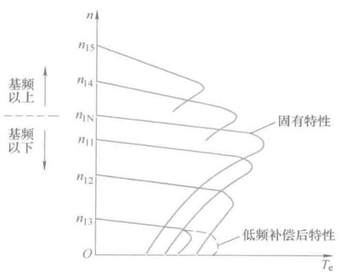
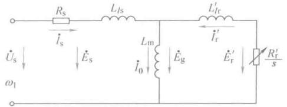

# 异步电机变压变频调速

## 变压变频基本原理

变压变频调速是改变异步电动机同步转速的一种调速方法，在极对数一定时，同步转速$$ n_1 $$随供电频率变化，即

$$ n_1 = \frac{60f_1}{n_p} $$

异步电动机的实际转速为

$$ n = (1-s)n_1 = n_1 - \Delta n $$

稳态速降$$ \Delta n $$与负载大小有关。

又

$$ E_g = 4.44f_1 N_s k_{N_s} \varPhi_m $$

$$ U_s \approx E_g = 4.44f_1 N_s k_{N_s} \varPhi_m $$

只要控制好$$ U_s $$和$$ f_1 $$就可以控制好气隙磁通$$ \varPhi $$。

当异步电机在基频（额定频率）以下运行时，如果磁通太弱，没有充分利用铁心，如果磁通太大，又使铁心饱和，导致励磁电流太大。因此最好好吃每极磁通量恒为$$ \varPhi_{mN} $$不变。在降低频率时，就要同时降低$$ E_g $$

$$ \frac{E_g}{f_1} = 4.44 N_s k_{N_s} \varPhi_m = \text{Constant} $$

即在**基频以下恒压频比控制**。

异步电动机绕组的电势很难直接检测控制，就退而求其次，忽略一些影响不大的，认为定子相电压$$ U_s \approx E_g $$，则得到

$$ \frac{U_s}{f_1} = \text{Constant} $$

这是实际的恒压频比控制方式。在频率较低时，就不能再忽略定子电阻和漏感了，可以认为把定子电压抬高一点，做一个近似补偿，称为**低频补偿**，也可叫低频转矩提升。

在基频以上调速时，频率上升，但是电压不可以，最高也只能是额定电压，这将导致磁通与频率成反比降低，这时候成了弱磁状态。

异步电动机在不同转速下允许长期运行的电流为额定电流（允许温升下长期运行），额定电流不变时，电动机输出转矩随磁通变化。

## 变压变频调速机械特性

前面导出的异步电机机械特性表达式为：

$$ T_e = \frac{ 3 n_p U_s^2 R_r's }{\omega_1 \left[ \left( s R_s + R_r' \right)^2 + s^2 \omega_1^2 ( L_{ls} + L_{lr}' )^2 \right]} $$

在基频以下恒压频比控制时，写成恒压频比的形式

$$ T_e = 3 n_p \left( \frac{U_s}{\omega_1} \right)^2 \frac{ \omega_1  R_r's }{ \left( s R_s + R_r' \right)^2 + s^2 \omega_1^2 ( L_{ls} + L_{lr}' )^2 } $$

当$$ s $$比较小时，忽略分母含有s的各项，有

$$ T_e \approx 3 n_p \left( \frac{U_s}{\omega_1} \right)^2 \frac{s \omega_1}{R_r'} $$

带负载时的转速降落为

$$ \Delta n = sn_1 \propto T_e $$

表达式里$$ \omega_1 $$和$$ n_1 $$是一个意思，单位不一样而已。因此可以看出，恒压频比对于统一转矩，$$ \Delta n $$基本不变，也即频率下降时，机械特性曲线基本上是平行上下移的。

临界转矩随着同步转速降低而减小，为了获得更大的带载能力，需要低频定子电压补偿。补偿后气隙磁场基本上也是不变的，故允许输出转矩也基本不变，所以恒压频比调速属于恒转矩调速（最大转矩恒定）。

基频下恒压频比调速时，转差功率为

$$ P_s = s P_m = s T_e \frac{\omega_1}{n_p} =  $$

与转速时无关的，因此属于转差功率不变型调速。

<figure>
    
</figure>

## 基频以下的电压补偿方式

基频以下恒压频比来保持磁通不变，前面的磁通讲的时气隙磁通，而且忽略了好多东西后认为$$ U_s = E_g $$，低频补偿也是一个定性的讲法，现在要看看如何补偿效果最好。

再来看异步电动机等效电路，这里要区分清楚定子磁通$$ \varPhi_{ms} $$、气隙磁通$$ \varPhi_{m} $$、转子磁通$$ \varPhi_{mr} $$以及对应磁通的感应电势，还有之间数值差异的原因。

<figure>
    
</figure>

定子全磁通以及定子每相绕组的感应电势

$$ E_s = 4.44 f_1 N_s k_{N_s} \varPhi_{ms}  $$

气隙磁通以及在定子每相绕组的感应电势（前面一直讨论的）

$$ E_g = 4.44 f_1 N_s k_{N_s} \varPhi_{s} $$

转子全磁通在转子绕组中的感应电势（折合到定子边）

$$ E_r' = 4.44 f_1 N_s k_{N_s} \varPhi_{mr} $$

### 恒定子磁通控制

保持定子磁通$$ \varPhi_{ms} $$恒定，只需要

$$ \frac{E_s}{f_1} = \text{Constant} $$

定子电动势$$ E_s $$不太容易直接控制，可以直接控制的是定子电压$$ U_s $$，这两个物理量之间的关系

$$ \dot U_s = \dot I_s \dot R_s + \dot E_s $$

恰当的提高定子电压，按照上面这个关系补偿定子电阻压降，就能得到恒定定子磁通。

### 恒气隙磁通控制

保持气隙磁通$$ \varPhi_{m} $$恒定，只需要

$$ \frac{E_g}{f_1} = \text{Constant} $$

定子电压$$ U_s $$和气隙磁通在定子每相绕组的感应电动势$$ E_g $$，这两个物理量之间的关系

$$ \dot U_s = ( R_s + j\omega_1L_{ls} ) \dot I_s + \dot E_g $$

除了补偿定子电阻压降外，还应补偿定子漏抗压降。

### 恒转子磁通控制

保持转子磁通$$ \varPhi_{mr} $$恒定，只需要

$$ \frac{E_r}{f_1} = \text{Constant} $$

折合到定子侧也是一样的。定子电压$$ U_s $$和转子磁通在定子每相绕组的感应电动势$$ E_g $$，这两个物理量之间的关系

$$ \dot U_s = [ R_s + j\omega_1(L_{ls} + L_{lr}') ] \dot I_s + \dot E_r' $$

转子电流的幅值为

$$ I_r' = \frac{ E_r' }{ R_r'/s } $$

电磁功率为$$ P_m = 3 I_r'^2 \cdot \frac{R_r'}{s} $$，

$$ T_e \propto s $$

机械特性是一条直线。这时候交流异步电机就有点直流电机的意思了。有点磁场和负载电流分开的感觉了，直流电机就是磁场由励磁电流决定，电枢电流由负载决定，所以特性很好。现在我们使得转子磁通恒定（如果可以完美的做到的话），那么机械特性和直流电机相仿了。

