# 异步电机原始动态模型

## 异步电动机动态数学模型的性质

电磁耦合是机电能量转换的必要条件，**电流与磁通的乘积产生转矩，转速与磁通的乘积得到感应电动势**，直流电机、交流电机都是这样，但是因为结构不同，两者的表达式区别挺大。


他励式直流电动机的励磁绕组和电枢绕组互相独立，励磁电流和电枢电流可以分开单独控制，如果忽略电枢反应或者用补偿绕组，则励磁和电枢绕组各自产生的磁动势在空间差90度，没有交叉耦合。气隙磁通由励磁绕组产生，保持励磁电流恒定，就可以认为磁通不参与系统动态过程，因此可以只通过电枢电流来控制转矩。

在这种条件下，直流电动机的动态数学模型只有一个输入量：电枢电压，一个输出量：转速，可以用线性系统来描述，使用线性控制理论来分析和设计。

交流电机的数学模型不一样，主要原因：
- 异步电机变压变频调速需要恒压频比控制，电压频率两个输入量，输出量由转速和磁通（磁链）。因为异步电动机输入三相电源，磁通建立和转速变化同时进行，为了获得好的性能，磁通也要被控制才行。这就是个MIMO系统。
- DCM在基速下运行时，容易保持磁通恒定，可视为常数。异步电动机无法单独控制磁通，电流矢量和磁链矢量叉积产生转矩，转速与磁链矢量乘积产生感应电动势，这就有两个变量的乘积，这还没考虑磁路饱和，就已经是一个非线性系统了。
- 三相异步电动机定子三相绕组在空间互差120度，转自也可等效为互差120度的三相绕组，各绕组存在交叉耦合，存在电磁惯性，再考虑上机电惯性，转速转角积分关系，动态模型是一个高阶系统

综上，异步电动机是一个**高阶、非线性、强耦合**系统。

## 异步电动机的三相数学模型

作如下假设：
- 忽略空间谐波，三相绕组对称，空间互差120度，产生磁动势沿气隙按正弦规律分布
- 忽略磁路饱和，绕组自感互感恒定
- 忽略铁心损耗
- 不考虑频率变化和温度变化对绕组电阻的影响

绕线型和笼型都可以等效成三相绕线转子，并折算到定子侧。折算后定子和转子绕组匝数相等，电动机三相绕组联结方式可以是 $$ \triangle $$或$$ \text{Y} $$，最终等效为$$ \text{Y} $$联结进行分析和设计。


三相异步电机的物理模型如下图，定子三相绕组为轴线ABC在空间上是固定的，转子绕组轴线abc以角速度$$ \omega $$随转子旋转。

<figure>
    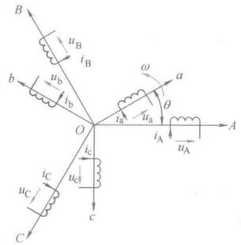
</figure>

以A轴作为参考坐标轴，转子a轴和定子A轴的电角度$$ \theta $$为空间角位移变量，规定各绕组电压、电流、磁链的正方向符合电动机惯例和右手螺旋定则，建立动态模型。

异步电动机的动态模型由**磁链方程**、**电压方程**、**转矩方程**、**运动方程**组成，磁链和转矩为代数方程，电压和运动为微分方程。

### 磁链方程

磁链方程，异步电动机每个绕组的磁链是它本身的自感磁链和其他绕组对它的互感磁链之和，六个绕组的磁链表达式

$$ 
\begin{bmatrix}
\varPsi_A  \\
\varPsi_B  \\
\varPsi_C  \\
\varPsi_a  \\
\varPsi_b  \\
\varPsi_c  \\
\end{bmatrix} = 
\begin{bmatrix}
L_{AA} & L_{AB} & L_{AC} & L_{Aa} & L_{Ab} & L_{Ac} \\
L_{BA} & L_{BB} & L_{BC} & L_{Ba} & L_{Bb} & L_{Bc} \\
L_{CA} & L_{CB} & L_{CC} & L_{Ca} & L_{Cb} & L_{Cc} \\
L_{aA} & L_{aB} & L_{aC} & L_{aa} & L_{ab} & L_{ac} \\
L_{bA} & L_{bB} & L_{bC} & L_{ba} & L_{bb} & L_{bc} \\
L_{cA} & L_{cB} & L_{cC} & L_{ca} & L_{cb} & L_{cc} \\
\end{bmatrix}
\begin{bmatrix}
i_A  \\
i_B  \\
i_C  \\
i_a  \\
i_b  \\
i_c  \\
\end{bmatrix}
$$

或者写成

$$ \boldsymbol{\Psi} = \boldsymbol{Li} $$

其中电感矩阵对角线是各绕组自感，其余各项为互感。定子各项漏磁通对应的定子漏感$$ L_{ls} $$，转子各相漏磁通对应的转子漏感$$ L_{lr} $$，由于绕组对称，漏感数值相等，还有互感$$ L_{ms} $$和$$ L_{mr} $$，总之全部考虑并且已经折算了，省略了'。

定子各相自感为

$$ L_{AA} = L_{BB} = L_{CC} = L_{ms} + L_{ls} $$

转子各项自感为

$$ L_{aa} = L_{bb} = L_{cc} = L_{mr} + L_{lr} $$

互感分为两类：定子三相之间的互感为定值；定子一相与转子一相之间的互感是角位移$$ \theta $$的函数

可以使用分块矩阵表示磁链方程

$$ 
\begin{bmatrix}
\boldsymbol{\Psi_s}  \\
\boldsymbol{\Psi_r}  \\
\end{bmatrix} = 
\begin{bmatrix}
\boldsymbol{L_{ss}} & \boldsymbol{L_{sr}} \\
\boldsymbol{L_{rs}} & \boldsymbol{L_{rr}} \\
\end{bmatrix}
\begin{bmatrix}
\boldsymbol{i_s}  \\
\boldsymbol{i_r}  \\
\end{bmatrix}
$$


### 电压方程

三相定子电压的平衡方程为

$$ 
\left .
\begin{matrix}
u_A = i_A R_s + \frac{\text{d}\psi_A}{\text{d}t}  \\
u_B = i_B R_s + \frac{\text{d}\psi_B}{\text{d}t}  \\
u_C = i_C R_s + \frac{\text{d}\psi_C}{\text{d}t} \\
\end{matrix} 
\right \}
$$

三相转子电压平衡方程为

$$ 
\left .
\begin{matrix}
u_a = i_a R_r + \frac{\text{d}\psi_a}{\text{d}t}  \\
u_b = i_b R_r + \frac{\text{d}\psi_b}{\text{d}t}  \\
u_c = i_c R_r + \frac{\text{d}\psi_c}{\text{d}t} \\
\end{matrix} 
\right \}
$$


写成矩阵形式


$$ 
\begin{bmatrix}
u_A \\ u_B \\ u_C \\ u_a \\ u_b \\ u_c \\
\end{bmatrix} = 
\begin{bmatrix}
R_s& 0 & 0 & 0 & 0 & 0 \\
0  &R_s& 0 & 0 & 0 & 0 \\
0  & 0 &R_s& 0 & 0 & 0 \\
0  & 0 & 0 &R_r& 0 & 0 \\
0  & 0 & 0 & 0 &R_r& 0 \\
0  & 0 & 0 & 0 & 0 &R_r\\
\end{bmatrix}
\begin{bmatrix}
i_A \\ i_B \\ i_C \\ i_a \\ i_b \\ i_c \\
\end{bmatrix} + \frac{\text{d}}{\text{d}t}
\begin{bmatrix}
\psi_A \\ \psi_B \\ \psi_C \\ \psi_a \\ \psi_b \\ \psi_c \\
\end{bmatrix}
$$

或者写成

$$ \boldsymbol{u} = \boldsymbol{Ri} + \frac{\text{d} \boldsymbol{\Psi}}{\text{d}t} $$

如果把磁链方程也放进去

$$ \boldsymbol{u} = \boldsymbol{Ri} + \frac{\text{d} (\boldsymbol{Li})}{\text{d}t} = \boldsymbol{Ri} + \boldsymbol{L}\frac{\text{d}\boldsymbol{i}}{\text{d}t} + \frac{\text{d}\boldsymbol{L}}{\text{d}t}\boldsymbol{i} = \boldsymbol{Ri} + \boldsymbol{L}\frac{\text{d}\boldsymbol{i}}{\text{d}t} + \frac{\text{d}\boldsymbol{L}}{\text{d}\theta}\omega\boldsymbol{i} $$

式中有两个随着时间变化的量，$$ \boldsymbol{L}\frac{\text{d}\boldsymbol{i}}{\text{d}t} $$是由于电流变化引起的脉变电动势；$$ \frac{\text{d}\boldsymbol{L}}{\text{d}\theta}\omega\boldsymbol{i} $$是由于定转子相对位置变化产生的旋转电动势。

### 转矩方程

根据机电能量转换原理，在线性电感条件下，磁场的储能$$ W_m $$

$$ W_m = \frac{1}{2}\boldsymbol{i}^T\boldsymbol{\psi} = \frac{1}{2}\boldsymbol{i}^T \boldsymbol{Li} \tag{1}$$

机械角位移$$ \theta_m = \frac{\theta}{n_p} $$，则电磁转矩

$$ T_e =  \frac{\partial W_m'}{\partial \theta_m} = n_p \frac{\partial W_m'}{\partial \theta} $$

把(1)式带进入有

$$ T_e =  \frac{1}{2} n_p \boldsymbol{i}^T \frac{\partial \boldsymbol{L} }{\partial \theta} \boldsymbol{i} = \frac{1}{2} n_p \boldsymbol{i}^T 
\begin{bmatrix}
0 & \frac{\partial \boldsymbol{L_{sr}}}{\partial \theta} \\ 
\frac{\partial \boldsymbol{L_{rs}}}{\partial \theta} & 0
\end{bmatrix}
\boldsymbol{i} $$


### 运动方程

运动控制系统的运动方程为

$$ \frac{J}{n_p} \frac{\mathrm{d}\omega}{\mathrm{d}t} = T_e - T_L $$

转角方程为

$$ \frac{\mathrm{d}\theta}{\mathrm{d}t} = \omega $$

### 模型性质

前面4个方程就是异步电动机的动态数学模型，是在线性磁路、磁动势在空间按照正弦分布的假设条件下得出来的，对定子、转子电压和电流没有做任何假设，因此模型可以用来分析又电压电流谐波的异步电机调速系统。

模型有的性质：非线性强耦合、不独立。

非线性强耦合在电压方程、磁链方程、转矩方程都有体现。存在定子和转子之间的耦合，也存在三相绕组之间的耦合。电机电动势和电磁转矩存在变量乘积，定转子的相对运动存在转角$$\theta$$使得互感矩阵为变参数，这些都使异步电动机成为高阶、非线性、强耦合的多变量系统。

不独立指的是定子三相物理量关系：

$$ 
\left .
\begin{matrix}
\psi_A + \psi_B + \psi_C &= 0 \\
i_A + i_B + i_C &= 0 \\ 
u_A + u_B + u_C &= 0
\end{matrix} 
\right \}
$$

转子物理量关系

$$ 
\left .
\begin{matrix}
\psi_a + \psi_b + \psi_c &= 0 \\
i_a + i_b + i_c &= 0 \\
u_a + u_b + u_c &= 0
\end{matrix} 
\right \}
$$

这是数学模型里的约束条件，三相变量中只有两相是独立的，因此原始模型并不是物理对象最简单的描述，**可以使用两相模型等价表示出来**。


## 坐标变换

异步电动机三相原始动态模型很复杂，分析和求解这组非线性方程组十分困难，要简化。简化的方法就是坐标变换，异步电机复杂是因为有一个复杂的电感矩阵和转矩方程，他们体现了异步电机的电磁耦合和能量转换关系，如果要简化模型，就要从电磁耦合关系入手。


```note
思路问题，找到复杂的原因，从根本原因上找解决方法。

为什么会有坐标变换这个想法呢？

```

直流电动机数学模型简单，要对比分析简单的根本原因。

主磁通沿着d轴，电枢本身是旋转的，但是因为换向器的存在，电刷两侧每个支路电流方向总是相同，效果好像q轴上的一个静止绕组。但是实际旋转还会产生感应电动势。电枢磁势可以用补偿绕组抵消，所以主磁通基本上由励磁绕组的励磁电流决定，这是直流电动机数学模型简单根本原因。

<figure>
    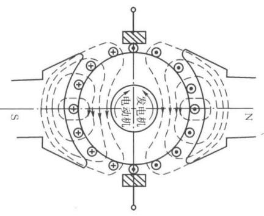
    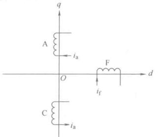
</figure>

如果能将交流电机的物理模型等效变换成类似直流电动机的模型，那么会大大简化，这就是坐标变换的思路。不同坐标系中电动机等效的原则是：**不同坐标系下绕组产生的合磁动势相等**。

三相对称静止绕组ABC中，通三相电，合成磁场为旋转磁场，因此磁动势也是个旋转磁动势F，以同步转速$$ \omega_1 $$顺着A-B-C相序旋转

<figure>
    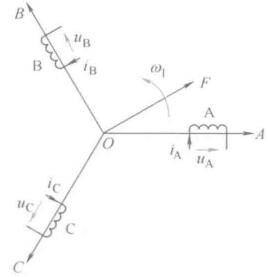
</figure>

<figure>
    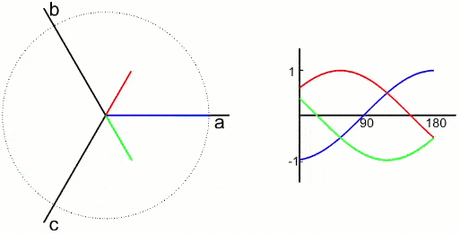
</figure>

没有零线时，三相电压并非独立的。**三相绕组可以用相互独立的两相正交对称绕组等效代替，等效原则为产生的磁动势相等**。

独立指两相绕组间无约束条件，正交指空间上差90度，对称指两相绕组匝数和电阻值相等。

<figure>
    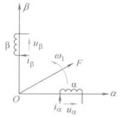
</figure>

<figure>
    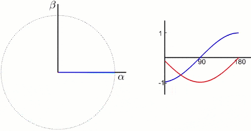
</figure>

上图中的两相绕组$$ \alpha,\beta $$通上合适的两相交流电以产生和原三相绕组相同频率和大小的磁动势，认为两相绕组和三相绕组等效，这就是**3/2变换**。


更进一步，两个匝数相等互相正交的绕组dq，同上**直流电**，产生合成磁动势F，绕组和磁动势相对位置不动，我们让整个铁心以同步转速转起来，磁动势也就转起来了。这堆东西就和最前面的固定三相交流绕组产生的磁动势等效了，观察者站在铁心上和绕组一起转的时候，在他看来dq就是和直流电机一样的，这就是**2s/2r变换**。

<figure>
    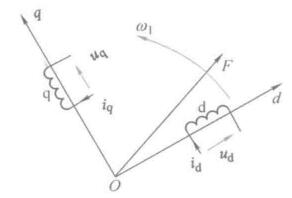
</figure>

<figure>
    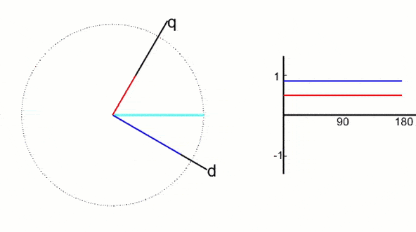
</figure>

通过坐标变换就把交流电机和一个直流模型联系在一起了，接下来是找个数学的准确关系。

### 3/2变换(Clarke变换)

由静止三相坐标系$$ ABC $$到静止坐标系$$ \alpha\beta $$的变换称为Clarke变换。

<figure>
    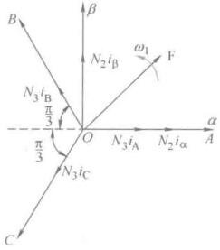
</figure>

根据变换磁动势不变的原则，两套绕组磁动势在$$ \alpha\beta $$轴上的投影应该相等，有

$$ N_2 i_{\alpha} = N_3 i_A - N_3 i_B\cos\frac{\pi}{3} - N_3 i_C \cos\frac{\pi}{3} = N_3 \left( i_A - \frac{1}{2}i_B - \frac{1}{2}i_C \right) $$

$$ N_2 i_\beta = N_3i_B\sin\frac{\pi}{3} - N_3i_C\sin\frac{\pi}{3} = \frac{\sqrt{3}}{2}N_3(i_B - i_C) $$

写成矩阵形式

$$ 
\begin{bmatrix}
i_\alpha \\ i_\beta \\
\end{bmatrix} = N
\begin{bmatrix}
1 & -\frac{1}{2} & -\frac{1}{2} \\
0 & \frac{\sqrt{3}}{2} & -\frac{\sqrt{3}}{2}\\
\end{bmatrix}
\begin{bmatrix}
i_A \\ i_B \\ i_C \\
\end{bmatrix}
$$

其中N为匝数比$$ N_3/N_2 $$，做等幅值变换时$$ N = \frac{2}{3} $$，做等功率变换时$$ N=\sqrt{\frac{2}{3}} $$

正变换有了，找出反变换，先扩展成三维向量，矩阵元素挑的合适一点就是个正交矩阵，转置就是逆，很容易可以找到反变换矩阵。

$$ 
\begin{bmatrix}
i_A \\ i_B \\ i_C \\
\end{bmatrix} = N
\begin{bmatrix}
1 & 0 \\
-\frac{1}{2} & \frac{\sqrt{3}}{2} \\
-\frac{1}{2} & -\frac{\sqrt{3}}{2}\\
\end{bmatrix}
\begin{bmatrix}
i_\alpha \\ i_\beta \\
\end{bmatrix}
$$

考虑到还有一相多余，正反变换更简单的用一个二阶矩阵就可以表示出来

$$ 
\begin{bmatrix}
i_\alpha \\ i_\beta \\
\end{bmatrix} = 
\begin{bmatrix}
\frac{\sqrt{3}}{2} & 0 \\
\frac{1}{\sqrt{2}} & \sqrt{2} \\
\end{bmatrix}
\begin{bmatrix}
i_A \\ i_B \\
\end{bmatrix}
$$

$$ 
\begin{bmatrix}
i_A \\ i_B \\
\end{bmatrix} =
\begin{bmatrix}
\sqrt{\frac{2}{3}} & 0 \\
-\frac{1}{\sqrt{6}} & \frac{1}{\sqrt{2}} \\
\end{bmatrix}
\begin{bmatrix}
i_\alpha \\ i_\beta \\
\end{bmatrix}
$$

且有$$ i_A + i_B + i_C = 0 $$

### 2s/2r变换(Park变换)

<figure>
    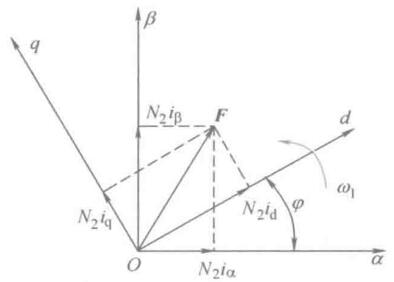
</figure>

静止两相坐标系$$ \alpha\beta $$到旋转正交坐标系$$ dq $$的变换，原则也是磁动势相等，根据简单的投影关系

$$
\left .
\begin{array}{ll}
i_d = i_\alpha \cos\varphi + i_\beta\sin\varphi \\ i_q = -i_\alpha \sin\varphi + i_\beta\cos\varphi \\
\end{array}
\right \}
$$

写成矩阵形式

$$ 
\begin{bmatrix}
i_d \\ i_q \\
\end{bmatrix} =
\begin{bmatrix}
\cos\varphi & \sin\varphi \\
-\sin\varphi & \cos\varphi \\
\end{bmatrix}
\begin{bmatrix}
i_\alpha \\ i_\beta \\
\end{bmatrix}
$$

反变换为
$$ 
\begin{bmatrix}
i_\alpha \\ i_\beta \\
\end{bmatrix} =
\begin{bmatrix}
\cos\varphi & -\sin\varphi \\
\sin\varphi & \cos\varphi \\
\end{bmatrix}
\begin{bmatrix}
i_d \\ i_q \\
\end{bmatrix}
$$


坐标变换使得异步电动机有了点直流电机的感觉了，但是这些东西该怎么使用起来呢？看下一节异步电动机在正交坐标系上的动态数学模型。


## 参考资料


gif动图：[FOC中的Clarke变换和Park变换详解（动图+推导+仿真+附件代码） - 小麦大叔的文章 - 知乎](https://zhuanlan.zhihu.com/p/172484981)


