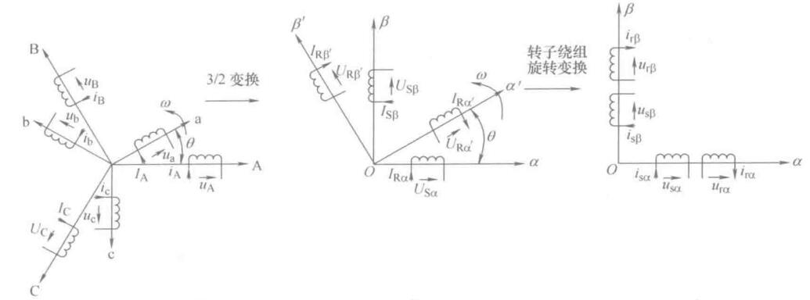

# 异步电动机正交坐标系上的动态模型

前面准备工作做好了，左边变换的思路已经有了。

坐标变换可以把三相原始模型简化，按照从特殊到一半，先推导静止两相正交坐标系$$ \alpha\beta $$，然后推广到旋转正交坐标系$$dq$$，运动方程和坐标系没有关系，因此就讨论电压方程、磁链方程、转矩方程。

## 静止两相坐标系下的动态模型

异步电动机定子绕组是静止的，只需要进行3/2变换，转子绕组是旋转的，需要通过3/2变换和旋转到静止的变化，才能变换到静止两相正交坐标系。

### 定子和转子的3/2变换

对定子三相绕组和旋转的转子三相绕组进行相同的3/2变换，变换后的定子两相正交坐标系$$ \alpha\beta $$静止，而转子两相正交坐标系$$ \alpha'\beta' $$以角速度$$ \omega $$逆时针旋转

<figure>
    
</figure>

原始电压方程

$$ 
\begin{bmatrix}
u_A \\ u_B \\ u_C \\ u_a \\ u_b \\ u_c \\
\end{bmatrix} = 
\begin{bmatrix}
R_s& 0 & 0 & 0 & 0 & 0 \\
0  &R_s& 0 & 0 & 0 & 0 \\
0  & 0 &R_s& 0 & 0 & 0 \\
0  & 0 & 0 &R_r& 0 & 0 \\
0  & 0 & 0 & 0 &R_r& 0 \\
0  & 0 & 0 & 0 & 0 &R_r\\
\end{bmatrix}
\begin{bmatrix}
i_A \\ i_B \\ i_C \\ i_a \\ i_b \\ i_c \\
\end{bmatrix} + \frac{\text{d}}{\text{d}t}
\begin{bmatrix}
\psi_A \\ \psi_B \\ \psi_C \\ \psi_a \\ \psi_b \\ \psi_c \\
\end{bmatrix}
$$

变换后的电压方程

$$ 
\begin{bmatrix}
u_{s\alpha} \\ u_{s\beta} \\ u_{r\alpha'} \\ u_{r\beta'} \\
\end{bmatrix} = 
\begin{bmatrix}
R_s& 0 &  0 & 0 \\
0  &R_s&  0 & 0 \\
0  & 0 & R_r& 0 \\
0  & 0 &  0 &R_r\\
\end{bmatrix}
\begin{bmatrix}
i_{s\alpha} \\ i_{s\beta} \\ i_{r\alpha'} \\ i_{r\beta'} \\
\end{bmatrix} + \frac{\text{d}}{\text{d}t}
\begin{bmatrix}
\psi_{s\alpha} \\ \psi_{s\beta} \\ \psi_{r\alpha'} \\ \psi_{r\beta'} \\
\end{bmatrix}
$$

原始磁链方程

$$ 
\begin{bmatrix}
\varPsi_A  \\ \varPsi_B  \\ \varPsi_C  \\ \varPsi_a  \\ \varPsi_b  \\ \varPsi_c  \\
\end{bmatrix} = 
\begin{bmatrix}
L_{AA} & L_{AB} & L_{AC} & L_{Aa} & L_{Ab} & L_{Ac} \\
L_{BA} & L_{BB} & L_{BC} & L_{Ba} & L_{Bb} & L_{Bc} \\
L_{CA} & L_{CB} & L_{CC} & L_{Ca} & L_{Cb} & L_{Cc} \\
L_{aA} & L_{aB} & L_{aC} & L_{aa} & L_{ab} & L_{ac} \\
L_{bA} & L_{bB} & L_{bC} & L_{ba} & L_{bb} & L_{bc} \\
L_{cA} & L_{cB} & L_{cC} & L_{ca} & L_{cb} & L_{cc} \\
\end{bmatrix}
\begin{bmatrix}
i_A  \\ i_B  \\ i_C  \\ i_a  \\ i_b  \\ i_c  \\
\end{bmatrix}
$$

变换后磁链方程

$$ 
\begin{bmatrix}
\psi_{s\alpha}  \\ \psi_{s\beta}   \\ \psi_{r\alpha'} \\ \psi_{r\beta'}  \\
\end{bmatrix} = 
\begin{bmatrix}
L_{s} & 0 & L_{m}\cos \theta & -L_{m}\sin\theta \\
0 & L_{s} & L_{m}\sin \theta & L_{m}\cos \theta \\
L_{m}\cos \theta & L_{m}\sin\theta & L_{r} & 0 \\
-L_{m}\sin \theta & L_{m}\cos \theta & 0 & L_{r} \\
\end{bmatrix}
\begin{bmatrix}
i_{s\alpha} \\ i_{s\beta} \\ i_{r\alpha'} \\ i_{r\beta'} \\
\end{bmatrix}
$$

变换后的转矩方程：

$$ T_e = -n_p L_m [ (i_{s\alpha} i_{r\alpha'} + i_{s\beta} i_{r\beta'})\sin\theta + ( i_{s\alpha} i_{r\beta'} - i_{s\beta} i_{r\alpha'} )\cos\theta ] $$

3/2变换把120°分布的三相绕组等效为互相垂直的两相绕组，**消除了定子三相绕组之间、转子三相绕组之间的耦合**。但是定子绕组和转子绕组之间仍然存在相对运动，因此互感矩阵仍然是一个变参数的非线性矩阵，输出转矩仍然是定转子电流及家教的函数。

**3/2变换减少了状态变量的维数**，简化了定子和转子的自感矩阵。

### 静止两相正交坐标系中的矩阵方程

<figure>
    
</figure>

对转子坐标系$$ \alpha'\beta' $$做旋转变换（旋转正交坐标系到静止两相正交坐标系的变换），即将$$ \alpha'\beta' $$坐标系顺时针旋转$$ \theta $$，是其与定子$$ \alpha\beta $$重合，且保持静止，用静止的两相转子绕组等效代替转动两相绕组。

旋转变换矩阵为

$$ \boldsymbol{C_{2r/2s}}(\theta) = 
\begin{bmatrix}
\cos\theta & -\sin\theta \\ 
\sin\theta & \cos\theta \\
\end{bmatrix}
$$

变换后的电压方程为

$$ 
\begin{bmatrix}
u_{s\alpha} \\ u_{s\beta} \\ u_{r\alpha} \\ u_{r\beta} \\
\end{bmatrix} = 
\begin{bmatrix}
R_s& 0 &  0 & 0 \\
0  &R_s&  0 & 0 \\
0  & 0 & R_r& 0 \\
0  & 0 &  0 &R_r\\
\end{bmatrix}
\begin{bmatrix}
i_{s\alpha} \\ i_{s\beta} \\ i_{r\alpha} \\ i_{r\beta} \\
\end{bmatrix} + \frac{\text{d}}{\text{d}t}
\begin{bmatrix}
\psi_{s\alpha} \\ \psi_{s\beta} \\ \psi_{r\alpha} \\ \psi_{r\beta} \\
\end{bmatrix} + 
\begin{bmatrix}
0 \\ 0 \\ \omega\psi_{r\beta} \\ -\omega\psi_{r\alpha} \\
\end{bmatrix}
$$

磁链方程

$$ 
\begin{bmatrix}
\psi_{s\alpha}  \\ \psi_{s\beta}   \\ \psi_{r\alpha} \\ \psi_{r\beta}  \\
\end{bmatrix} = 
\begin{bmatrix}
L_s & 0 & L_m & 0  \\
0 & L_s & 0 & L_m\ \\
L_m & 0 & L_r & 0  \\
0 & L_m & 0 & L_r  \\
\end{bmatrix}
\begin{bmatrix}
i_{s\alpha} \\ i_{s\beta} \\ i_{r\alpha} \\ i_{r\beta} \\
\end{bmatrix}
$$

转矩方程：

$$ T_e = n_p L_m ( i_{s\beta}i_{r\alpha} - i_{s\alpha}i_{r\beta} ) $$

旋转变换改变了定转子之间的耦合关系，消除了定转子绕组夹角对磁链和转矩的影响。

磁链方程是线性定常的方程，但是电压方程中引入了新的非线性因素，还没有改变非线性耦合的性质。

### 旋转正交坐标系中的动态数学模型

前面是将相对于定子旋转的转子坐标系$$ \alpha'\beta' $$做旋转变换，得到了统一的坐标系$$ \alpha'\beta' $$，这是旋转变换的一个特例。更广义的坐标旋转变换时对定子坐标系$$ \alpha\beta $$和转子坐标系同时进行旋转变换，把他们变换到同一个旋转正交坐标系$$ dq $$上，$$dq$$坐标系相对于定子的旋转角速度为$$ \omega_1 $$。

<figure>
    
</figure>

定子的变换矩阵为

$$
\boldsymbol{C_{2s/2r}}(\varphi) = 
\begin{bmatrix}
\cos\varphi & \sin\varphi \\ 
-\sin\varphi & \cos\varphi \\
\end{bmatrix}
$$

转子的变换矩阵为

$$
\boldsymbol{C_{2s/2r}}(\varphi-\theta) = 
\begin{bmatrix}
\cos(\varphi-\theta) & \sin(\varphi-\theta) \\ 
-\sin(\varphi-\theta) & \cos(\varphi-\theta) \\
\end{bmatrix}
$$

在$$dq$$坐标系的电压方程为

$$ 
\begin{bmatrix}
u_{sd} \\ u_{sq} \\ u_{rd} \\ u_{rq} \\
\end{bmatrix} = 
\begin{bmatrix}
R_s& 0 &  0 & 0 \\
0  &R_s&  0 & 0 \\
0  & 0 & R_r& 0 \\
0  & 0 &  0 &R_r\\
\end{bmatrix}
\begin{bmatrix}
i_{sd} \\ i_{sq} \\ i_{rd} \\ i_{rq} \\
\end{bmatrix} + \frac{\text{d}}{\text{d}t}
\begin{bmatrix}
\psi_{sd} \\ \psi_{sq} \\ \psi_{rd} \\ \psi_{rq} \\
\end{bmatrix} + 
\begin{bmatrix}
-\omega_1 \psi_{sq} \\ \omega_1 \psi_{sd} \\ - (\omega_1 - \omega)\psi_{rq} \\ (\omega_1 - \omega)\psi_{rq} \\
\end{bmatrix}
$$

磁链方程

$$ 
\begin{bmatrix}
\psi_{sd}  \\ \psi_{sq}   \\ \psi_{rd} \\ \psi_{rq}  \\
\end{bmatrix} = 
\begin{bmatrix}
L_s & 0 & L_m & 0  \\
0 & L_s & 0 & L_m\ \\
L_m & 0 & L_r & 0  \\
0 & L_m & 0 & L_r  \\
\end{bmatrix}
\begin{bmatrix}
i_{sd} \\ i_{sq} \\ i_{rd} \\ i_{rq} \\
\end{bmatrix}
$$

转矩方程为

$$ T_e = n_p L_m ( i_{sq}i_{rd} - i_{sd}i_{rq} ) $$

旋转变换用旋转绕组代替原来静止的定子绕组，并使等效定子绕组和等效转子绕组重合，并且严格同步，等效后定转子绕组不存在相对运动，所以dq坐标系中的磁链方程和转矩方程与$$ \alpha\beta $$坐标系中一样，但是电压方程的非线性耦合更严重了。

表面上看dq坐标系的数学模型还不如$$ \alpha\beta $$的，但是其优点是增加了一个输入量$$ \omega_1 $$，为系统控制提供了可能性。磁场定向控制就是通过选择$$ \omega_1 $$实现的。

旋转速度任意的正交坐标系无实际实用意义，常用的是同步旋转坐标系，将绕组中的交流量变为直流量，模拟直流电动机进行控制。

## 状态方程

经典控制理论里对于单入单出可以使用传递函数来描述一个系统，前面直流电机控制是基于传递函数在分析。对于交流电机，需要使用现代一点的控制理论了，需要基于状态空间的控制系统分析和设计。首先要已经上述微分和代数方程写处状态空间表达式。

写状态空间表达式的第一个问题是状态变量的选取。旋转正交坐标系($$dq$$坐标系)上的异步电机有四阶电压方程和一阶运动方程，因此需要选择5个状态变量来描述系统。

可选的状态变量有9个，分为五种：
- 1.转速$$ \omega $$
- 2.定子电流$$ i_{sd} $$和$$ i_{sq} $$
- 3.转子电流$$ i_{rd} $$和$$ i_{rq} $$
- 4.转子磁链$$ \psi_{sd} $$和$$ \psi_{sq} $$
- 5.定子磁链$$ \psi_{rd} $$和$$ \psi_{rq} $$

转速作为输出量必须得选，定子电流可以直接检测到也选。剩下的三组检测就很困难，考虑到磁通恒定一直是我们控制电机很关心的问题，可以在定子磁链和转子磁链任选一组。

这样状态变量的选取就有两种方式

$$ \boldsymbol{X} = \begin{bmatrix}
\omega  \\ \psi_{rd}   \\ \psi_{rq} \\ i_{sd}  \\ i_{sq} \\
\end{bmatrix} $$

或者

$$ \boldsymbol{X} = \begin{bmatrix}
\omega  \\ \psi_{sd}   \\ \psi_{sq} \\ i_{sd}  \\ i_{sq} \\
\end{bmatrix} $$

### 以$$ \omega,i_s,\psi_r $$为状态变量

状态变量

$$ \boldsymbol{X} = \begin{bmatrix}
\omega  \\ \psi_{rd}   \\ \psi_{rq} \\ i_{sd}  \\ i_{sq} \\
\end{bmatrix} $$

输入变量

$$ \boldsymbol{U} = \begin{bmatrix}
u_{sd} \\ u_{sq} \\ \omega_1 \\ T_L  \\
\end{bmatrix} $$

输出变量

$$ \boldsymbol{Y} = \begin{bmatrix}
\omega \\ \psi_r
\end{bmatrix} $$

经过一系列的操作，整理以后的状态方程为

$$
\left.\begin{array}{l}
\frac{\mathrm{d} \omega}{\mathrm{d} t}=\frac{n_{\mathrm{p}}^{2} L_{\mathrm{m}}}{J L_{\mathrm{r}}}\left(i_{\mathrm{sq}} \psi_{\mathrm{rd}}-i_{\mathrm{sd}} \psi_{\mathrm{rq}}\right)-\frac{n_{\mathrm{p}}}{J} T_{\mathrm{L}} \\
\frac{\mathrm{d} \psi_{\mathrm{rd}}}{\mathrm{d} t}=-\frac{1}{T_{\mathrm{r}}} \psi_{\mathrm{rd}}+\left(\omega_{1}-\omega\right) \psi_{\mathrm{rq}}+\frac{L_{\mathrm{m}}}{T_{\mathrm{r}}} i_{\mathrm{sd}} \\
\frac{\mathrm{d} \psi_{\mathrm{rq}}}{\mathrm{d} t}=-\frac{1}{T_{\mathrm{r}}} \psi_{\mathrm{rq}}-\left(\omega_{1}-\omega\right) \psi_{\mathrm{rd}}+\frac{L_{\mathrm{m}}}{T_{\mathrm{r}}} i_{\mathrm{sq}} \\
\frac{\mathrm{d} i_{\mathrm{sd}}}{\mathrm{d} t}=\frac{L_{\mathrm{m}}}{\sigma L_{\mathrm{s}} L_{\mathrm{r}} T_{\mathrm{r}}} \psi_{\mathrm{rd}}+\frac{L_{\mathrm{m}}}{\sigma L_{\mathrm{s}} L_{\mathrm{r}}} \omega \psi_{\mathrm{rq}}-\frac{R_{\mathrm{s}} L_{\mathrm{r}}^{2}+R_{\mathrm{r}} L_{\mathrm{m}}^{2}}{\sigma L_{\mathrm{s}} L_{\mathrm{r}}^{2}} i_{\mathrm{sd}}+\omega_{1} i_{\mathrm{sq}}+\frac{u_{\mathrm{sd}}}{\sigma L_{\mathrm{s}}} \\
\frac{\mathrm{d} i_{\mathrm{sq}}}{\mathrm{d} t}=\frac{L_{\mathrm{m}}}{\sigma L_{\mathrm{s}} L_{\mathrm{r}} T_{\mathrm{r}}} \psi_{\mathrm{rq}}-\frac{L_{\mathrm{m}}}{\sigma L_{\mathrm{s}} L_{\mathrm{r}}} \omega \psi_{\mathrm{rd}}-\frac{R_{\mathrm{s}} L_{\mathrm{r}}^{2}+R_{\mathrm{r}} L_{\mathrm{m}}^{2}}{\sigma L_{\mathrm{s}} L_{\mathrm{r}}^{2}} i_{\mathrm{sq}}-\omega_{1} i_{\mathrm{sd}}+\frac{u_{\mathrm{sq}}}{\sigma L_{\mathrm{s}}}
\end{array}\right\}
$$

其中，电动机漏磁系数$$ \sigma = 1 - \frac{L_m^2}{L_sL_r} $$，转子电磁时间常数$$ T_r = \frac{L_r}{R_r} $$

输出方程

$$ \boldsymbol{Y} = \begin{bmatrix}
\omega \\ \sqrt{\psi_{rd}^2 + \psi_{rq}^2}
\end{bmatrix} $$

### 以$$ \omega,i_s,\psi_s $$为状态变量

状态变量

$$ \boldsymbol{X} = \begin{bmatrix}
\omega  \\ \psi_{sd}   \\ \psi_{sq} \\ i_{sd}  \\ i_{sq} \\
\end{bmatrix} $$

输入变量

$$ \boldsymbol{U} = \begin{bmatrix}
u_{sd} \\ u_{sq} \\ \omega_1 \\ T_L  \\
\end{bmatrix} $$

输出变量

$$ \boldsymbol{Y} = \begin{bmatrix}
\omega \\ \psi_s
\end{bmatrix} $$

经过操作以后

$$
\left.\begin{array}{l}
\frac{\mathrm{d} \omega}{\mathrm{d} t}=\frac{n_{\mathrm{p}}^{2}}{J}\left(i_{\mathrm{sq}} \psi_{\mathrm{sd}}-i_{\mathrm{sd}} \psi_{\mathrm{sq}}\right)-\frac{n_{\mathrm{p}}}{J} T_{\mathrm{L}} \\
\frac{\mathrm{d} \psi_{\mathrm{sd}}}{\mathrm{d} t}=-R_{\mathrm{s}} i_{\mathrm{sd}}+\omega_{1} \psi_{\mathrm{sq}}+u_{\mathrm{sd}} \\
\frac{\mathrm{d} \psi_{\mathrm{sq}}}{\mathrm{d} t}=-R_{\mathrm{s}} i_{\mathrm{sq}}-\omega_{1} \psi_{\mathrm{sd}}+u_{\mathrm{sq}} \\
\frac{\mathrm{d} i_{\mathrm{sd}}}{\mathrm{d} t}=\frac{1}{\sigma L_{\mathrm{s}} T_{\mathrm{r}}} \psi_{\mathrm{sd}}+\frac{1}{\sigma L_{\mathrm{s}}} \omega \psi_{\mathrm{sq}}-\frac{R_{\mathrm{s}} L_{\mathrm{r}}+R_{\mathrm{r}} L_{\mathrm{s}}}{\sigma L_{\mathrm{s}} L_{\mathrm{r}}} i_{\mathrm{sd}}+\left(\omega_{1}-\omega\right) i_{\mathrm{sq}}+\frac{u_{\mathrm{sd}}}{\sigma L_{\mathrm{s}}} \\
\frac{\mathrm{d} i_{\mathrm{sq}}}{\mathrm{d} t}=\frac{1}{\sigma L_{\mathrm{s}} T_{\mathrm{r}}} \psi_{\mathrm{sq}}-\frac{1}{\sigma L_{\mathrm{s}}} \omega \psi_{\mathrm{sd}}-\frac{R_{\mathrm{s}} L_{\mathrm{r}}+R_{\mathrm{r}} L_{\mathrm{s}}}{\sigma L_{\mathrm{s}} L_{\mathrm{r}}} i_{\mathrm{sq}}-\left(\omega_{1}-\omega\right) i_{\mathrm{sd}}+\frac{u_{\mathrm{sq}}}{\sigma L_{\mathrm{s}}}
\end{array}\right\}
$$

输出方程

$$ \boldsymbol{Y} = \begin{bmatrix}
\omega \\ \sqrt{\psi_{sd}^2 + \psi_{sq}^2}
\end{bmatrix} $$

