# 异步电机矢量控制系统

矢量控制或者常说的FOC控制的全名：按转子磁链定向控制。

FOC控制的基本思想是通过坐标变化，在按转子磁链定向同步旋转正交坐标系中，得到等效的直流电动机模型，仿照直流电动机的控制方法控制电磁转矩和磁链，然后将转子磁链定向坐标系中的控制量反变换得到三项坐标系的对应量进行控制。

由于上述变换的是矢量，所以左边变换也可以称为矢量变换，对应的控制系统也常被叫作矢量控制或按转子磁链定向控制。

## 按转子磁链定向的同步旋转正交系下的状态方程

把静止$$ \alpha\beta $$坐标系中的转子磁链旋转矢量写成复数形式

$$ \boldsymbol{\psi_r} = \psi_{r\alpha} + \mathrm{j} \psi_{r\alpha} = \psi_r \mathrm{e} ^{\mathrm{j}\varphi}$$

转子磁链矢量旋转的空间角度为$$ \varphi $$，旋转角速度为$$ \omega_1 = \frac{\mathrm{d}\varphi}{\mathrm{d}t} $$

<figure>
    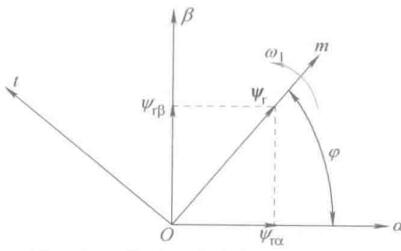
</figure>

旋转正交dq坐标系的一个特例是与转子磁链旋转矢量$$ \boldsymbol{\psi_r} $$同步旋转的坐标系，令d轴与转子磁链矢量重合，就称为**按照转子磁链矢量定向的同步旋转正交坐标系**。这个坐标系改下名就角$$ mt $$坐标系，d轴该叫m轴，q轴改叫t轴。

m轴与转子磁链矢量重合，因此

$$ \psi_{rm} = \psi_{r} $$

$$ \psi_{rt} = 0 $$

为了始终重合，还需要保持$$ \frac{\mathrm{d}\psi_{rt}}{\mathrm{d}t} = 0 $$。这也很好理解，矢量的两个分量，要想合矢量沿着坐标轴，另一矢量必须得一直为0。

由上述约束关系，得到mt坐标系下的状态方程

$$
\left.\begin{array}{l}
\frac{\mathrm{d} \omega}{\mathrm{d} t}=\frac{n_{\mathrm{p}}^{2} L_{\mathrm{m}}}{J L_{\mathrm{r}}} i_{\mathrm{st}} \psi_{\mathrm{r}}-\frac{n_{\mathrm{p}}}{J} T_{\mathrm{L}} \\
\frac{\mathrm{d} \psi_{\mathrm{r}}}{\mathrm{d} t}=-\frac{1}{T_{\mathrm{r}}} \psi_{\mathrm{r}}+\frac{L_{\mathrm{m}}}{T_{\mathrm{r}}} i_{\mathrm{sm}} \\
\frac{\mathrm{d} i_{\mathrm{sm}}}{\mathrm{d} t}=\frac{L_{\mathrm{m}}}{\sigma L_{\mathrm{s}} L_{\mathrm{r}} T_{\mathrm{r}}} \psi_{\mathrm{r}}-\frac{R_{\mathrm{s}} L_{\mathrm{r}}^{2}+R_{\mathrm{r}} L_{\mathrm{m}}^{2}}{\sigma L_{\mathrm{s}} L_{\mathrm{r}}^{2}} i_{\mathrm{sm}}+\omega_{1} i_{\mathrm{st}}+\frac{u_{\mathrm{sm}}}{\sigma L_{\mathrm{s}}} \\
\frac{\mathrm{d} i_{\mathrm{st}}}{\mathrm{d} t}=-\frac{L_{\mathrm{m}}}{\sigma L_{\mathrm{s}} L_{\mathrm{r}}} \omega \psi_{\mathrm{r}}-\frac{R_{\mathrm{s}} L_{\mathrm{r}}^{2}+R_{\mathrm{r}} L_{\mathrm{m}}^{2}}{\sigma L_{\mathrm{s}} L_{\mathrm{r}}^{2}} i_{\mathrm{st}}-\omega_{1} i_{\mathrm{sm}}+\frac{u_{\mathrm{st}}}{\sigma L_{\mathrm{s}}}
\end{array}\right\}
$$

mt坐标系的旋转角速度

$$ \omega_1 = \omega + \frac{L_m}{T_r\psi_r}i_{st} $$

mt坐标系的旋转角速度与转子转速之差定义为转差角频率

$$ \omega_s = \omega_1 - \omega = \frac{L_m}{T_r\psi_r}i_{st} $$

mt坐标系下电磁转矩表达式

$$ T_e = \frac{n_p L_m}{L_r} i_{st}\psi_r $$

按照转子磁链定向同步旋转正交坐标系上的数学模型是同步旋转正交坐标系模型的一个特例。通过按转子磁链定向，将定子电流分解为励磁分量$$ i_{sm} $$和转矩分量$$ i_{st} $$，转子磁链$$ \psi_r $$仅由定子电流励磁分量$$ i_{sm} $$产生，而电磁转矩正比于转子磁链和定子电流的乘积$$ i_{st} \psi_r $$，实现了解耦，降低了微分方程的阶次。

在按转子磁链定向同步旋转正交坐标系中的异步电动机数学模型与直流电动机动态模型相当。

## 按转子磁链定向矢量控制的基本思想

在三相坐标系$$ABC$$上的定子交流电流$$ i_A,i_B,i_C $$通过3/2变换可以等效成两相静止正交坐标系$$ \alpha\beta $$上的交流电流$$ i_{s\alpha},i_{s\beta} $$，再通过与转子磁链同步的旋转变换，可以等效成同步旋转正交坐标系上$$mt$$上的直流电流$$ i_{sm},i_{st} $$。

以$$ i_{sm},i_{st} $$为输入的电动机模型就是**等效直流电动机模型**。

<figure>
    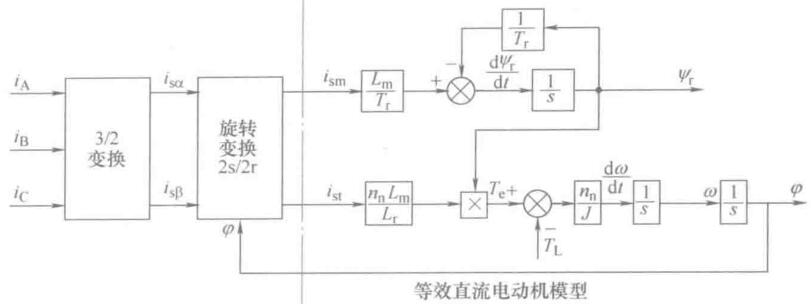
</figure>

从输入端口看，输入ABC为三相电流，输出为转速$$ \omega $$，这是台三相电机。从内部看，经过3/2变换和旋转变换，变成一台以$$ i_{sm},i_{st} $$为输入、$$ \omega $$为输出的直流电动机。

由上述mt坐标系状态方程可知，按转子磁链定向仅仅实现了定子电流两个分量的解耦，电流的微分方程中仍然存在非线性和交叉耦合。采用电流闭环控制可以有效抑制这一线性，使实际电流快速跟随给定值。

基于电流跟随控制变频器的矢量控制系统如图所示

<figure>
    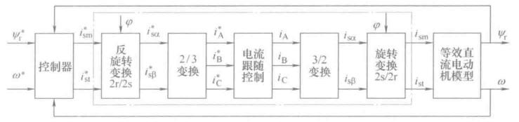
</figure>

首先在按转子磁链定向坐标系中计算定子电流励磁分量和转矩分量的给定$$ i_{sm}^*,i_{st}^* $$，经过反旋转变换得到$$ i_{s\alpha}^*,i_{s\beta}^* $$，再经过2/3变换得到$$ i_{A}^*,i_{B}^*, i_{C}^* $$，然后通过电流闭环跟随控制，输出异步电动机所需的三相定子电流。

忽略变频器产生的滞后，如果认为电流跟随控制做的比较好，传递函数近似为1，那么里面的变换都可以抵消，简化后的等效结构图如下

<figure>
    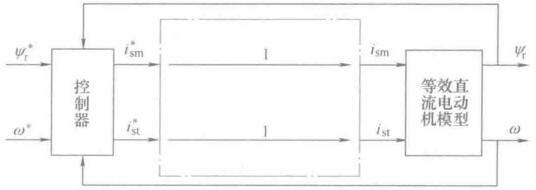
</figure>

可以想象，这样的矢量控制交流变压变频调速系统再静、动性能不比直流调速系统差。

## 按转子磁链定向矢量控制系统的电流闭环控制方式

根据异步电机在mt坐标系的数学模型，在电流闭环控制后，转子磁链是一个稳定的惯性环节，因此开环闭环控制都行，而转速通道存在对转矩的积分，是不稳定结构，因此必须要加转速外环才能稳定。

<figure>
    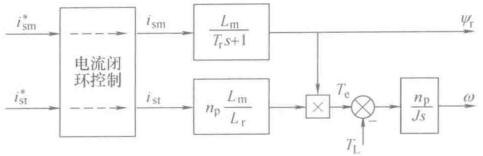
</figure>

常用的电流闭环控制有两种方法：①将定子电流两个分量的给定值$$ i_{sm}^*,i_{st}^* $$变换后得到三相电流给定值$$ i_{A}^*,i_{B}^*, i_{C}^* $$，使用电流滞环控制的PWM变频器。②将检测的三相电流进行3/2和旋转变换得到mt坐标系的$$ i_{sm},i_{st}$$使用PI控制器进行电流闭环控制，PI控制器输出为定子电压给定$$ u_{sm}^*,u_{st}^* $$，经过反变换得到静止两相坐标系的定子电压给定值$$ u_{s\alpha}^*, u_{s\beta}^* $$，在经过SVPWM控制逆变器输出三相电压。

<figure>
    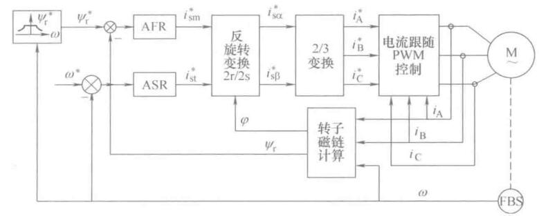
</figure>

<figure>
    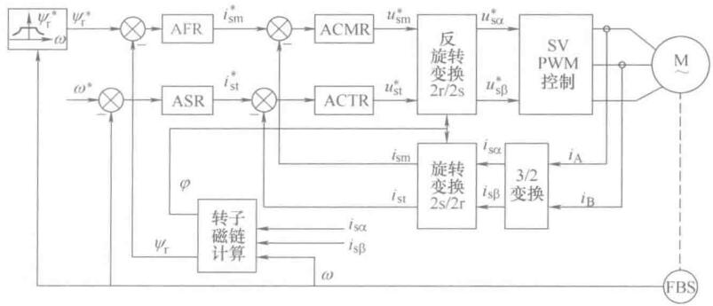
</figure>

理论上来讲，两种电流闭环控制的作用相同，上面采用电流的两点式控制，动态响应快，电流纹波大；下面用连续的PI控制，电流纹波小。

上面用纯硬件也能做，下面得用MCU来做了。

一些缩写的含义：
- ASR, 转速调节器
- AFR, Automatic Flux Linkage Regulator, 转子磁链调节器
- ACMR, Automatic Current/M Regulator, 定子电流励磁分量调节器
- ACTR, Automatic Current/T Regulator, 定子电流转矩分量调节器
- FBS, 转速传感器

对转子磁链和转速而言，都表现为双闭环控制系统的结构，内环电流环，外环转速换或转子磁链。转子磁链给定与转速有关，额定转速下为定值，额定转速上减小，若开环控制去掉AFR保留ACMR即可。

还有个转子磁链计算的问题，后面讨论。

## 按转子磁链定向矢量控制系统的转矩控制

在直流电机控制的时候，我们认为电流就是转矩，只不过查了个系数，因为磁通是个常数，所以控制了电流就等于控制了转矩。

在异步电机里，虽然我们也向着这个目标努力过，但是

<figure>
    
</figure>

可以看到，当转子磁链发生波动以后还是会影响到电磁转矩，进而影响电机转速。**转速闭环控制能够抑制磁链变化引起的转速变换，但只有在转速发生变化后才起作用**。为了改善动态性能，进一步减小磁链变化对转速变化的影响，可以增加一些转矩控制方式。

常用的两种方法：转矩闭环控制、ASR输出增加除法环节。

**转矩闭环控制的矢量控制系统**结构图：

<figure>
    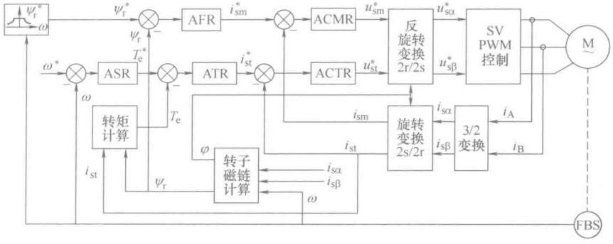
</figure>

在ASR和ACTR之间增设了转矩调节器ATR(Automatic Torque Regulator)，当转子磁链发生波动时，通过ATR及时调整电流转矩分量给定值，以抵消磁链变化影响。其原理图如下：

<figure>
    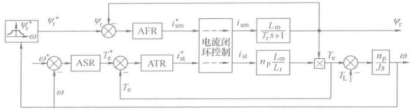
</figure>

转子磁链的扰动作用点是在转矩环之内的，可以通过转矩反馈控制来抑制此扰动，如果没有转矩闭环，只能通过转速外环来抑制转子磁链扰动，控制作用就比较落后了。显然使用转矩闭环可以有效改善动态性能。

实际系统较为复杂，电磁转矩测量也是个问题，更多情况下，电磁转矩是依据这个式子间接算出来的

$$ T_e = \frac{n_p L_m}{L_r}i_{st}\psi_r $$

**ASR输出增加除法环节**的矢量控制系统结构图：

<figure>
    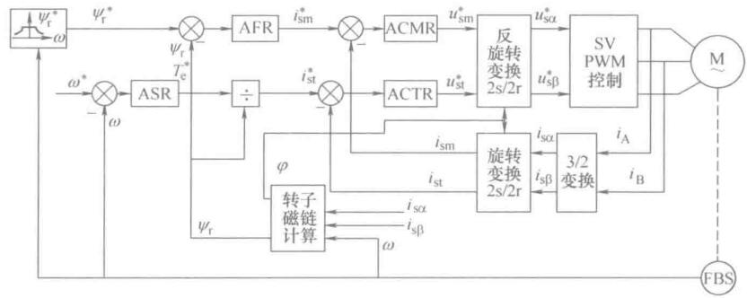
</figure>

ASR的输出为给定转矩$$ T_e^* $$，除以转子磁链$$ \psi_r^* $$，得到电流转矩分量，由下面的原理框图可知，先除后乘实现了转矩与转子磁链的动态解耦

<figure>
    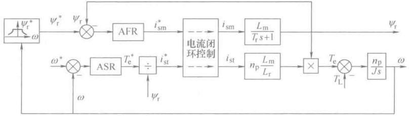
</figure>

## 转子磁链计算(直接定向)

按转子磁链定向的矢量控制系统的关键是转子磁链的定向。需要获得转子磁链的空间位置，在构成转子磁链反馈以及转矩控制时，转子磁链的幅值也是要知道的。

不幸的是，转子磁链这个东西直接检测比较苦难，实际系统多采用按照模型计算的方法，用容易测量的电压、电流、转速信号，根据转子磁链模型，实时计算磁链的幅值与空间位置。转子次梁模型可以从电动机数学模型推导出来，也可以使用状态观测器或状态估计的方法得到闭环观测模型。

在计算模型里，根据实测信号，分为电流模型和电压模型。

### 计算转子磁链的电流模型

根据描述磁链与电流关系的磁链方程来计算转子磁链，得出电流模型。电流模型可以在不同根坐标系上获得

在$$ \alpha\beta $$坐标系上计算转子磁链的电流模型

由实测的三相电流经过3/2变换得到静止两相正交坐标系上的电流$$ i_{s\alpha}, i_{s\beta} $$，再利用$$ \alpha\beta $$坐标系中的数学模型计算转子磁链在两个轴上的分量

$$
\left.\begin{array}{l}
\frac{\mathrm{d}\psi_{r\alpha}}{\mathrm{d}t} = -\frac{1}{T_r}\psi_{r\alpha} - \omega \psi_{r\beta} + \frac{L_m}{T_r} i_{s\alpha}   \\
\frac{\mathrm{d}\psi_{r\beta}}{\mathrm{d}t} = -\frac{1}{T_r}\psi_{r\beta} + \omega \psi_{r\alpha} + \frac{L_m}{T_r} i_{s\beta}   \\
\end{array}\right\}
$$

或者写成

$$
\left.\begin{array}{l}
\psi_{r\alpha} = \frac{1}{T_r s + 1} ( L_m i_{s\alpha} - \omega T_r \psi_{r\beta} )   \\
\psi_{r\beta} = \frac{1}{T_r s + 1} ( L_m i_{s\beta} + \omega T_r \psi_{r\alpha} )   \\
\end{array}\right\}
$$

然后采用直角坐标-极坐标变换，可以得到转子磁链矢量的幅值和空间位置

$$
\left.\begin{array}{l}
\psi_{r} = \sqrt{ \psi_{r\alpha}^2 + \psi_{r\beta}^2 }  \\
\sin \varphi = \frac{\psi_{r\beta}}{\psi_{r}}   \\
\cos \varphi = \frac{\psi_{r\alpha}}{\psi_{r}}   \\
\end{array}\right\}
$$

如图是在静止两相正交坐标系上计算转子磁链的电流模型结构图

<figure>
    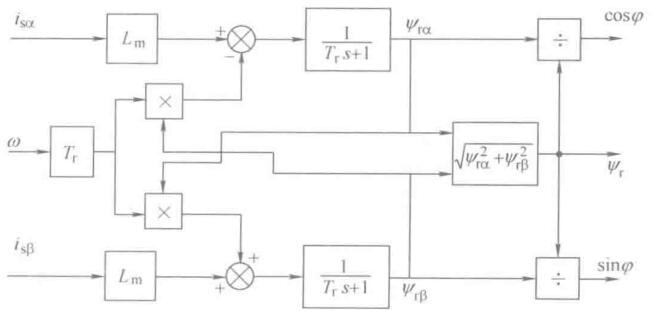
</figure>

在这个坐标系下即使系统达到稳态，电压电流磁链也都是正弦量，计算量还是比较大的，程序复杂，对计算步长敏感。

在$$ mt $$坐标系上计算转子磁链的电流模型

由前面推导

$$ \frac{\mathrm{d}\psi_r}{\mathrm{d}t} = - \frac{1}{T_r}\psi_{r} + \frac{L_m}{T_r} i_{sm} $$

$$ \omega_1 = \omega + \frac{L_m}{T_r \psi_r} i_{st} $$

三相定子电流经过3/2变换为两相，经过同步旋转变换并按转子磁链定向，得到mt坐标系上的电流$$ i_{sm}, i_{st} $$，求得$$ \psi_r, \omega_s $$，由$$ \omega $$与实测转速信号相加得到转子磁链旋转角速度$$ \omega_1 $$，积分后得到转子磁链的空间位置$$ \varphi $$，也就是同步旋转变换的变换角。

<figure>
    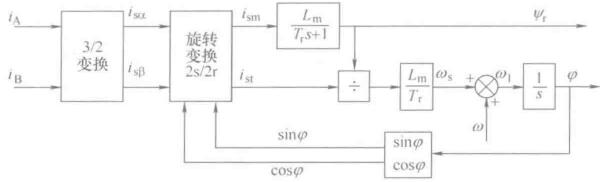
</figure>

当系统达到稳态时，电压电流磁链都是直流量，计算量就小多了。但在计算同步角速度前，需要将电压、电流、磁链变换到mt坐标系，定向不准误差会积累变大。

这两个电流模型都需要测量电流和转速信号，不论转速高低都可以用，但是受到电动机参数变化的影响，比如温升、频率变化都会影响转子电阻$$ R_r $$，磁饱和程度将影响电感$$ L_m $$和$$ L_r $$，这些影响都会导致磁链幅值和位置信号失真，而反馈信号的失真必然使控制系统的性能降低，这是电流模型的不足之处。

### 计算转子磁链的电压模型

根据电压方程中感应电动势等于磁链变化率的关系，取电动势的积分就有磁链了。

在$$ \alpha\beta $$坐标系上定子电压方程为

$$
\left.\begin{array}{l}
\frac{\mathrm{d}\psi_{s\alpha}}{\mathrm{d}t} = - R_s i_{s\alpha} + u_{s\alpha}  \\
\frac{\mathrm{d}\psi_{s\alpha}}{\mathrm{d}t} = - R_s i_{s\alpha} + u_{s\alpha}  \\
\end{array}\right\}
$$

磁链方程为

$$
\left.\begin{array}{l}
\psi_{s\alpha} = L_s i_{s\alpha} + L_m i_{r\alpha}  \\
\psi_{s\beta} = L_s i_{s\beta} + L_m i_{r\beta}  \\
\psi_{r\alpha} = L_m i_{s\alpha} + L_r i_{r\alpha}  \\
\psi_{r\beta} = L_m i_{s\beta} + L_r i_{r\beta}  \\
\end{array}\right\}
$$

处理一下有

$$ \psi_{r\alpha} = \frac{L_r}{L_m} ( \psi_{s\alpha} - \sigma L_s i_{s\alpha} ) $$

$$ \psi_{r\beta} = \frac{L_r}{L_m} ( \psi_{s\beta} - \sigma L_s i_{s\beta} ) $$

最终得到的转子磁链计算的电压模型

$$ \psi_{r\alpha} = \frac{L_r}{L_m} \left[ \int \left (u_{s\alpha - R_s i_{s\alpha}} \right) \mathrm{d}t - \sigma L_s i_{s\alpha} \right] $$

$$ \psi_{r\beta} = \frac{L_r}{L_m} \left[ \int \left (u_{s\beta - R_s i_{s\beta}} \right) \mathrm{d}t - \sigma L_s i_{s\beta} \right] $$

如图

<figure>
    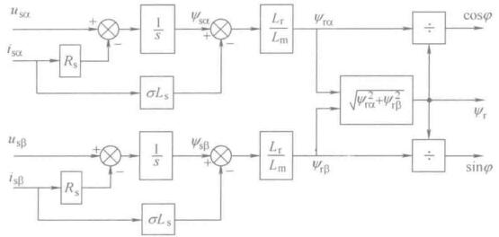
</figure>

其物理意义是：根据实测的电压和电流信号计算定子磁链，然后再计算转子磁链，算法与转子电阻$$ R_r $$无关，

## 磁链开环转差型矢量控制(间接定向)

## 矢量控制的特点与问题

特点：
- 按转子磁链定向，实现了定子电流励磁分量和转矩分量的解耦，需要电流闭环控制
- 转子磁链系统的控制对象是稳定的惯性环节，可以闭环，也可以开环
- 连续PI控制，转矩与磁链变化平稳，电流闭环可有效限制起、制动电流。控制器参数设计不容易。

问题：
- 转子磁链计算精度容易受到转子电阻的影响，转子磁链的角度精度影响定向的准确性。
- 需要进行矢量变换，系统结构复杂，运算量大。

## MATLAB仿真

仿真放在了我的个人主页文章里

[三相异步电动机矢量控制MATLAB仿真](https://xu.yumeng.website/categories/AsynchronousMotors)

