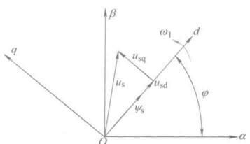

# 异步电机直接转矩控制系统

直接转矩控制系统(DTC, Direct Torque Control)，是在矢量控制之后发展起来的另一种高动态性能的交流电动机变压变频调速系统。

在它转速环里，利用转矩反馈直接控制之电动机的电磁转矩。DTC控制的基本思想是**根据定子磁链幅值偏差$$ \mathbf{\Delta \Psi_s} $$的正负符号和电磁转矩偏差$$ \Delta T_e $$的正负符号，再依据当前定子磁链矢量$$ \mathbf{\Psi_s} $$所在的位置，直接选取合适的电压空间矢量，减小定子磁链幅值的偏差和电磁转矩的偏差，实现电磁转矩与定子磁链的控制**。

## 定子电压矢量对定子磁链与电磁转矩的控制作用

前面定子磁链定向的控制方法，分析这个方法里电压空间矢量对定子磁链和电磁转矩的控制作用。

### 按定子磁链控制的磁链和转矩模型

把状态方程再写出来

$$
\left.\begin{array}{l}
\frac{\mathrm{d} \omega}{\mathrm{d} t}=\frac{n_{\mathrm{p}}^{2}}{J}\left(i_{\mathrm{sq}} \psi_{\mathrm{sd}}-i_{\mathrm{sd}} \psi_{\mathrm{sq}}\right)-\frac{n_{\mathrm{p}}}{J} T_{\mathrm{L}} \\
\frac{\mathrm{d} \psi_{\mathrm{sd}}}{\mathrm{d} t}=-R_{\mathrm{s}} i_{\mathrm{sd}}+\omega_{1} \psi_{\mathrm{sq}}+u_{\mathrm{sd}} \\
\frac{\mathrm{d} \psi_{\mathrm{sq}}}{\mathrm{d} t}=-R_{\mathrm{s}} i_{\mathrm{sq}}-\omega_{1} \psi_{\mathrm{sd}}+u_{\mathrm{sq}} \\
\frac{\mathrm{d} i_{\mathrm{sd}}}{\mathrm{d} t}=\frac{1}{\sigma L_{\mathrm{s}} T_{\mathrm{r}}} \psi_{\mathrm{sd}}+\frac{1}{\sigma L_{\mathrm{s}}} \omega \psi_{\mathrm{sq}}-\frac{R_{\mathrm{s}} L_{\mathrm{r}}+R_{\mathrm{r}} L_{\mathrm{s}}}{\sigma L_{\mathrm{s}} L_{\mathrm{r}}} i_{\mathrm{sd}}+\left(\omega_{1}-\omega\right) i_{\mathrm{sq}}+\frac{u_{\mathrm{sd}}}{\sigma L_{\mathrm{s}}} \\
\frac{\mathrm{d} i_{\mathrm{sq}}}{\mathrm{d} t}=\frac{1}{\sigma L_{\mathrm{s}} T_{\mathrm{r}}} \psi_{\mathrm{sq}}-\frac{1}{\sigma L_{\mathrm{s}}} \omega \psi_{\mathrm{sd}}-\frac{R_{\mathrm{s}} L_{\mathrm{r}}+R_{\mathrm{r}} L_{\mathrm{s}}}{\sigma L_{\mathrm{s}} L_{\mathrm{r}}} i_{\mathrm{sq}}-\left(\omega_{1}-\omega\right) i_{\mathrm{sd}}+\frac{u_{\mathrm{sq}}}{\sigma L_{\mathrm{s}}}
\end{array}\right\}
$$

<figure>
    
</figure>

d轴与定子磁链矢量重合，有$$ \psi_s = \psi_{sd} $$

