# 电力电子变压变频器

在异步电动机恒压频比控制时，需要电压与频率都可以调的交流电源，常用电力电子器件构成的静止式功率变换器（变频器）。按照变频器结构可分为**交-直-交变频器**和**交-交变频器**两种。

<figure>
    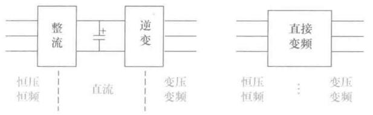
</figure>

交-直-交变频器（间接变频）的思路很简单粗暴，对于电动汽车或者本来就是直流电源的场合，只考虑逆变部分即可。

交-交变频器（直接变频）将恒压恒频的交流电（比如三相电）直接变成电压和频率都可调的交流电。

早期变频器有晶闸管（SCR）组成，半控器件，只能触发开通，需要强迫换流装置才能换相，并且开关速度慢。后来基本上也被全控器件淘汰了，比如电力场效应晶体管（Power-MOSFET）、绝缘栅双极型晶体管（IGBT）等。

现代变频器用的最多的控制技术是**脉冲宽度调制**（Pulse Width Modulation，PWM），模拟数字都能做。

模拟电路来实现是使用正弦波来调制等腰三角波，称为正弦脉冲宽度调制（SPWM）。

后来出现了电流跟踪PWM（CFPWM）控制技术和电压空间矢量PWM（SVPWM）控制技术

## 交直交PWM变频器主回路

<figure>
    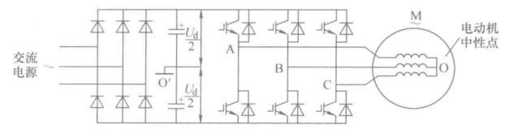
</figure>

不可控整流桥，结构简单，使用脉宽调制的方法输出谐波分量小。在回馈制动时，向电容充电，得注意这个事情。

要是直接电池供电，那倒是会稍稍容易一点。

## 正弦波脉宽调制技术(SPWM)

一些名词的准确解释：
- 调制波(Modulation Wave)：希望输出的正弦波，有频率和幅值两个参数
- 载波(Carrier Wave)：频率高的多的等腰三角波

调制波和载波相交时，交点时刻确定电力元件通断，可以获得脉冲序列。这种调制方法就是SPWM。

文字比较干枯，使用MATLAB可以很容易实现。实际使用模拟电路搭也并不困难，挺好玩的，当然现在都用单片机定时器做数字的了。但是，使用模拟的还是更能找到感觉，定时器里实际上也有模拟的影子在里面。


双极性控制的PWM方式，三相输出有8个状态，用1表示上臂开通，0表示下臂开通，波形仿真一下

<figure>
    
</figure>

通断由调制波和载波交点决定，称为**自然采样法**，模拟电路使用比较器实现很容易，但是用MCU实现运算比较复杂，简化后有了**规则采样法**。

SPWM三相分别调制，当调制度为1时，输出相电压的基波幅值为$$ \frac{U_d}{2} $$，输出线电压的基波幅值为$$ \frac{\sqrt{3}}{2}U_d $$，直流电压的利用率不高。如果调制度大于1，会失真。

为了提高电压利用率，有了电压空间矢量PWM调制(SVPWM)、三次谐波注入等方法。

```tip
调制度=调制波幅值/载波幅值

上面仿真图的调制度是1，三角波幅值为1，正弦波幅值也为1。

调制度为1的时候，运气好的话已经出现连续两个周期开通的情况了，比如黄色A相，在0.2-0.4秒之间。
```

## 电流跟踪PWM控制技术(CFPWM)

SPWM以输出电压接近正弦波为目标，电流的波形是负载性质和大小决定的。对于交流电动机来说，磁势是由电流决定的，应该保证电流为正弦波，才能使合成的电磁转矩为恒定值，因此以正弦电流作为目标更合适。

电流跟踪PWM(Current Follow PWM)的控制方法：在原来主回路的基础上，采用电流闭环控制，使实际电流快速跟随给定值，在稳态时，使实际电流更接近正弦波。这可以获得比SPWM更好的性能。

常用的一种电流闭环控制方式是**电流滞环跟踪PWM(Current Hysteresis Band PWM, CHBPWM)控制**，这是一种非线性的控制方式。（和本科时候玩的那个小车的方向控制方式挺像的）做一个单相的仿真，使用RL负载，时间常数给大一点，滞环宽度也给大一点，为了能清晰地揭示原理。原理图

<figure>
    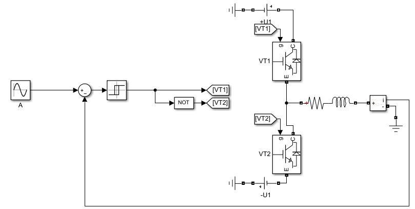
</figure>

其给定波形为正弦波，输出波形

<figure>
    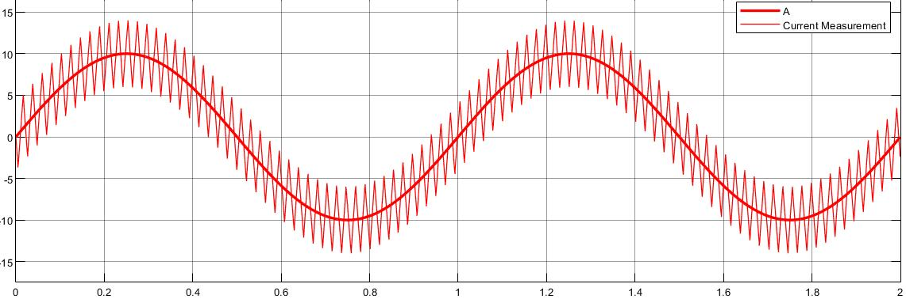
</figure>

仿真了两个周期，给定幅值为10，滞环宽度为4，这个开关频率比较低滞环宽度过宽，当然是为了揭示原理的。

也可以看出这种控制方式容易实现，跟的也不错。滞环宽度也会影响电流跟踪精度，要选择好滞环宽度，平衡好开关频率和波形失真的问题。

使用电流滞环跟踪控制的PWM型变频器时，只需要改变电流给定信号就可以了，不用去管电压了。这时候电流环是内环，外环应该有转速外环。

## 电压空间矢量PWM控制技术(SVPWM)

SVPWM，磁链跟踪控制技术。

SPWM控制着眼于使变压变频器输出电压接近正弦波，没管输出电流。CFPWM直接控制输出电流，这比正弦电压更进一步。SVPWM直接以磁场作为控制目标。

```note
这个逻辑还是很清晰的。异步电机控制的目标就是看能不能使得转子磁通恒定，这样可以获得像直流电机一样的机械特性。

磁通产生的原因是电流（磁势），电压是最表面的一个物理量。因此对于电机控制来说，调制技术也是逐渐从表面往深层次、根本原因上走的。
```

三相正弦电流在电动机空间形成圆形旋转磁场，把逆变器和交流电动机视为一体，直接把磁场作为控制目标，找到一种控制3组6个MOSFET开通关断的方法，这种控制方法称作“磁链跟踪控制”，磁链控制是通过使用不同的电压空间矢量实现的，因此又称**电压空间矢量PWM(Space Vector PWM, SVPWM)**。

这里出现的新东西还挺多，不慌，慢慢来。

### 空间矢量

交流电机的电压、电流、磁链等物理量都是随时间变化的。对于磁场来讲，本来就有方向，用向量描述也是一直习惯的事情，比如说对一相通一个正弦波的交流电，右手定则可以判断磁场方向，很容易想到磁场大小是一个正弦规律。

<figure>
    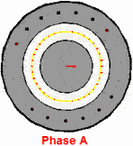
    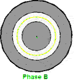
    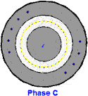
</figure>

当ABC三相同时通上标准的三相工业用电的时候，磁场作为一个矢量，也是可以求和运算的，合成磁场或者说合矢量随时间的规律

<figure>
    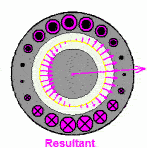
</figure>

这个磁场就转起来了，注意这个粉色的是等效的电流，并不是说真实存在的，上面红绿蓝色电流是真实存在的电流。这个事情也很好理解，比如说一根麻绳机械波向前传播，但是绳子还是在手里的，就这种感觉。

如果中间要是个永磁铁，这磁铁就跟着磁场转起来了，这不就永磁同步电机嘛，异步电机略微复杂一点，放在电机学里说。

上面这个东西更数学化的表示

<figure>
    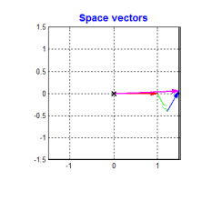
</figure>

电压、电流、磁链，考虑上绕组的空间位置，可以定义出空间矢量。A、B、C为在空间静止的电动机定子三相绕组的轴线，空间互差$$ \frac{2\pi}{3} $$，方向是固定的，当我们通上三相交流电的时候，取**绕组的空间方向**和**电压的幅值**定义三个电压空间矢量$$ \boldsymbol{u_{AO}} , \boldsymbol{u_{BO}} , \boldsymbol{u_{CO}}  $$，然后用向量的眼光去看待这三相电，发现他们会有一个巧妙的关系

<figure>
    
</figure>

没错合成电压空间矢量也是这个关系。

三相合成矢量

$$ \boldsymbol{u_{s}} = \boldsymbol{u_{AO}} + \boldsymbol{u_{BO}} + \boldsymbol{u_{CO}} $$

类似的

$$ \boldsymbol{i_{s}} = \boldsymbol{i_{AO}} + \boldsymbol{i_{BO}} + \boldsymbol{i_{CO}} $$

$$ \boldsymbol{\varPsi_{s}} = \boldsymbol{\varPsi_{AO}} + \boldsymbol{\varPsi_{BO}} + \boldsymbol{\varPsi_{CO}} $$

<iframe src="//player.bilibili.com/player.html?aid=892417670&bvid=BV1TP4y1H7K8&cid=463723352&page=1" height="360px" width="480px" scrolling="no" border="0" frameborder="no" framespacing="0" allowfullscreen="true"> </iframe>

按照空间矢量功率和三相瞬时功率相等的原则，有

$$ \boldsymbol{u_{s}} = \sqrt{\frac{2}{3}} (u_{AO} + u_{BO} e^{j\gamma} + u_{CO}e^{j2\gamma}) $$

那么三点合成矢量

$$ \boldsymbol{u_{s}} = \boldsymbol{u_{AO}} + \boldsymbol{u_{BO}} + \boldsymbol{u_{CO}} = \sqrt{\frac{3}{2}}U_m e^{j\omega_1t} $$

旋转的数学表达也出来了。

### 电压与磁链的空间矢量关系

合成矢量的电压方程

$$ \boldsymbol{u_{s}} = R_s \boldsymbol{i_{s}} + \frac{\text{d}\boldsymbol{\varPsi_s}}{\text{d}t} $$

当转速不是很低时，定子电阻压降所占的成分很小，则合成矢量的近似关系

$$ \boldsymbol{u_s} \approx \frac{\text{d} \boldsymbol{\varPsi_s}}{\text{d}t} $$

电动机旋转磁场的轨迹问题可以转化为电压空间矢量的运动关系问题。


### PWM逆变器可以输出的电压矢量

我们想要的电压空间矢量是个圆，先来看看我们现在有的。

<figure>
    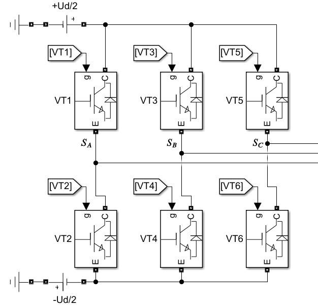
</figure>

PWM逆变器有8种工作状态，其基本电压空间矢量为

|| $$ S_A $$ | $$ S_B $$ | $$ S_C $$ | $$ \boldsymbol{u_s} $$ |
|-|-|-|-|-|
| $$ \boldsymbol{u_0} $$ | $$ 0 $$ | $$ 0 $$ | $$ 0 $$ | $$ 0 $$ |
| $$ \boldsymbol{u_1} $$ | $$ 1 $$ | $$ 0 $$ | $$ 0 $$ | $$ \sqrt{\frac{2}{3}}U_d\angle0\degree $$ |
| $$ \boldsymbol{u_2} $$ | $$ 1 $$ | $$ 1 $$ | $$ 0 $$ | $$ \sqrt{\frac{2}{3}}U_d\angle60\degree $$ |
| $$ \boldsymbol{u_3} $$ | $$ 0 $$ | $$ 1 $$ | $$ 0 $$ | $$ \sqrt{\frac{2}{3}}U_d\angle120\degree $$ |
| $$ \boldsymbol{u_4} $$ | $$ 0 $$ | $$ 1 $$ | $$ 1 $$ | $$ \sqrt{\frac{2}{3}}U_d\angle180\degree $$ |
| $$ \boldsymbol{u_5} $$ | $$ 0 $$ | $$ 0 $$ | $$ 1 $$ | $$ \sqrt{\frac{2}{3}}U_d\angle240\degree $$ |
| $$ \boldsymbol{u_6} $$ | $$ 1 $$ | $$ 0 $$ | $$ 1 $$ | $$ \sqrt{\frac{2}{3}}U_d\angle300\degree $$ |
| $$ \boldsymbol{u_7} $$ | $$ 1 $$ | $$ 1 $$ | $$ 1 $$ | $$ 0 $$ |

看似毫无规律，实际上这8个是按照角度逆时针排列下去的，按照矢量去反过来去找开通关断的状态，理解这个事情就好。

<figure>
    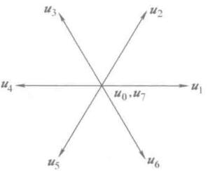
</figure>

现在有了最基本的元素了，接下来就是考虑如何通过最基本的元素组合出我们的目标。


## 参考资料

gif动图，[如何理解三相电机的合成旋转磁场？ - 知乎](https://www.zhihu.com/question/53063221)，[@超神约](https://www.zhihu.com/people/chao-shen-xiao-tan)

