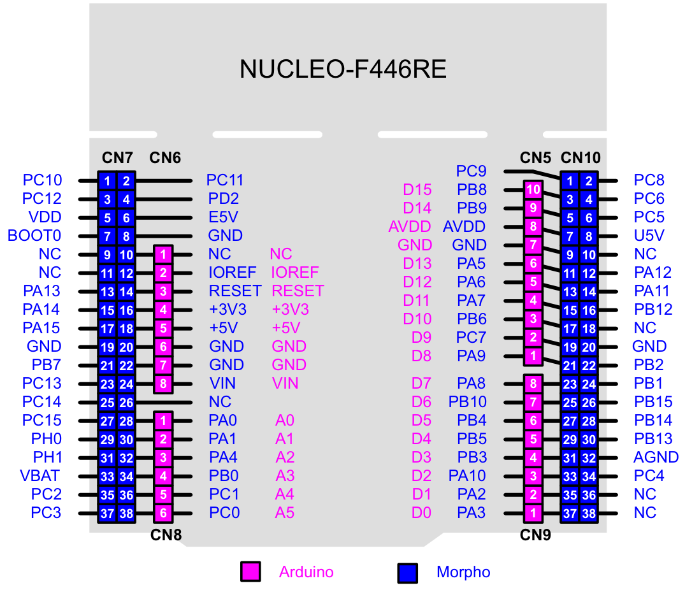
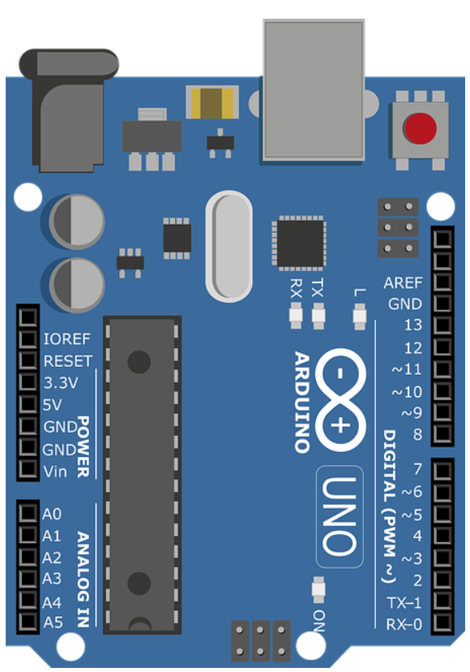
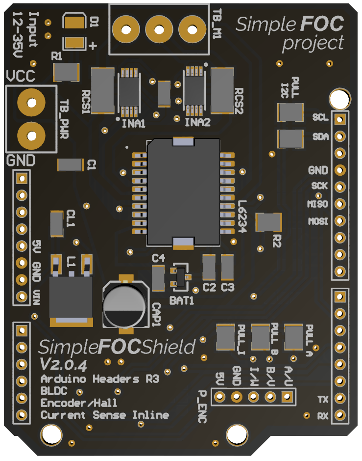
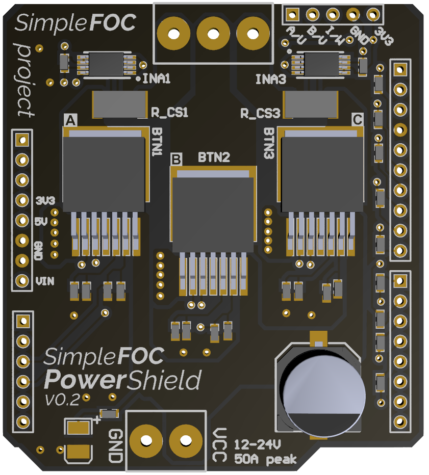
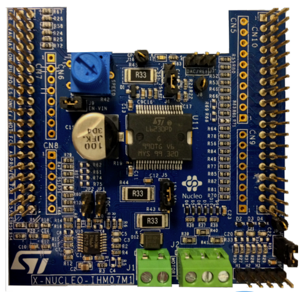

# 硬件

## 主控板

STM32 Nucleo-F446RE

- [NUCLEO-F446RE 产品概述](https://www.st.com/zh/evaluation-tools/nucleo-f446re.html)
- [设计文件下载](https://www.st.com/zh/evaluation-tools/nucleo-f446re.html#cad-resources)
- [Nucleo用户手册](https://www.st.com/resource/en/user_manual/um1724-stm32-nucleo64-boards-mb1136-stmicroelectronics.pdf)

在用户手册里，给出了这块主控板的引脚图。

蓝色为ST morpho extension header

品红为ARDUINO® connector

这些接口本质上就是把引脚按照约定排好，不同模块之间遵守这些约定，使得模块可以堆叠，大大加快开发进度，很有意思。这个思路也可以在公司的产品开发中学习。

<figure>
    
</figure>

对比一下ARDUINO的开发板

<figure>
    
</figure>

完全可以使用性能更高的STM32代替。

## 功率板

这些功率板样子区别挺大，但是本质上都是6管逆变电路，有的是6个分离MOS管，有的是2个MOS管封装成一片（BTN芯片），也有6个MOS管封装成一片的方案。

有意思的是ST的控制板支持Arduino的模块，ST的功率板也支持Arduino的控制板，所以约定一个通用接口还是很方便的，就像搭积木一样搭出一个复杂电子系统。

SimpleFOC的低成本驱动方案：

<figure>
    
    <figcaption>小功率驱动板</figcaption>
</figure>

SimpleFOC的大功率电机驱动方案：

<figure>
    
    <figcaption>大功率驱动板</figcaption>
</figure>

ST公司的中小功率电机驱动方案

<figure>
    
    <figcaption>小功率驱动板</figcaption>
</figure>

这些功率板样子区别挺大，但是本质上都是6管逆变电路，有的是6个分离MOS管，有的是2个MOS管封装成一片（BTN芯片），也有6个MOS管封装成一片的方案。

有意思的是ST的控制板支持Arduino的模块，ST的功率板也支持Arduino的控制板，所以约定一个通用接口还是很方便的，就像搭积木一样搭出一个复杂电子系统。

功率板只是完成对主板板输出的PWM信号的放大，因此无所谓用什么板。初学可以直接使用开源的驱动板，到后面应用于大功率电机时自己设计也可以。

### L6234 小功率板

- [Arduino-SimpleFOCShield](https://github.com/simplefoc/Arduino-SimpleFOCShield)

SimpleFOC的低成本驱动方案：

<figure>
    
    <figcaption>小功率驱动板</figcaption>
</figure>

### BTN 大功率方案

SimpleFOC的大功率电机驱动方案：

<figure>
    
    <figcaption>大功率驱动板</figcaption>
</figure>

### L6230 方案

ST公司的中小功率电机驱动方案

<figure>
    
    <figcaption>小功率驱动板</figcaption>
</figure>

## 转子位置传感器

有好几种可以用

### ABI编码器

正交编码器，直接输出编码信号，由MCU硬件解码。

测转速。

### 磁传感器

SPI通信和IIC通信都有，传感器内部已经做了一些初步运算。

输出转角信息

也有输出模拟信号的，用模拟信号指代转角。

AS5600

### 霍尔传感器

工控最常见的，检测转子位置的传感器。

## 硬件连接

