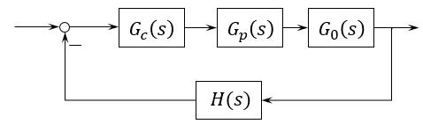

# 电机与电机控制

**这个笔记本将要整理的内容：**
- [ ] 直流电机控制
  - [ ] 直流电机模型
  - [x] 转速开环，转速闭环
  - [x] 转速、电流双闭环控制

- [ ] 异步电机控制
  - [ ] 异步电机模型
  - [x] 基于稳态模型调速
  - [ ] 基于动态模型调速
    - [x] FOC控制：基本思想，数学基础，仿真
    - [ ] DTC控制

- [ ] 永磁同步电机控制

## 前言：电机控制系统

电机控制技术以电机作为研究对象，涉及到了控制理论、信号检测与处理、电力电子技术、MATLAB仿真、单片机软硬件开发等内容，综合性很强，而且这些知识难度都不低。所以想彻底搞明白电机控制系统的原理还是需要花点时间的。

现在也有很多MCU厂家提供了开源的电机控制库，硬件照猫画虎，软件调用接口也可以很快的让电机动起来，但是如果想追求更高的控制性能，就要去修改开源库的底层代码了，还是需要明白背后的原理的。

按照自动控制原理的典型控制结构来看，电机控制控制系统大概是这么个样子：

<figure>
    
</figure>

其中 $$ G_0(s) $$ 作为被控对象，包含了电机本体和负载。电机有最简单的有刷直流电机、异步电机，以及现在更常见同步电机（包含了BLDC）。

 $$ G_p(s) $$ 是功率放大器件，电机驱动板的功率部分。上古时期用晶闸管，现在用MOSFET、IGBT了，开关频率更高，用PWM控制更方便。

 $$ G_c(s) $$ 是“控制器”，这个是控制理论里面的“控制器”，也就是控制算法。对于数字控制系统，这个东西属于软件，摸不到实体的，运行在MCU里面。工业上更多的把包含了MCU和功率部分在内的一整块板叫作控制器。

 $$ H(s) $$ 是传感器，这个图极度简化了，实际上有电流传感器、速度传感器、角度传感器。如果使用无感控制的方法，实际上是状态观测器充当这一部分。传感器输出有模拟量也有数字量，控制系统对反馈通道的扰动无抑制能力，所以传感器的精度必须足够高。

这个控制框图并不是和电机控制系统的每个实体一一对应的，他是一种物理系统的数学表达，为了使用强有力的理论手段抽象成这个样子。

## 电机控制的历史

19实际中叶就有了直流电机控制系统，1950年前，世界上的电机控制系统大多数都是不可调速的交流电机，少部分高性能的系统使用了直流电机。

1950年后，随着电力电子技术和电子技术、芯片技术的发展，交流电机出现在了高性能调速系统里。

近十年二十年更多，交流调速系统几乎取代了直流调速系统。这几年逐步走进生活，比如戴森的吹风机，好多洗衣机，一些电动玩具车使用的都是BLDC。以及新能源汽车使用的PMSM。

直流电动机的数学模型简单，转矩控制很容易。电枢电流和励磁电流天然是解耦的，早些年晶闸管应用于直流电机控制。

交流电机（尤其是感应电机）结构简单，但是动态数学模型巨复杂，非线性多变量强耦合。早期交流电机控制是基于稳态模型的，基于稳态模型的设计的控制器对于动态性能肯定很无力。

1970年，德国工程师F.Blaschke提出“感应电机磁场定向控制原理”，美国P.C. Custman和A.A.Clark提出“定子电压坐标变换控制”，这都是矢量控制的基本设想。

1980年，德国W. Leonhard教授用微机实现矢量控制系统数字化，经过不断改进，形成了现在通用的高性能矢量控制系统。1985年，德国鲁尔大学Depenbrock教授提出直接转矩控制，1987年推广到弱磁调速范围。

同步电机的转速于电源频率一致，有很多优点。但是存在启动困难与失步的问题。电子电子变频技术的发展，解决了这两大难题，**永磁同步电机**和**直流无刷电机**等新型同步电机的问世，使得电机控制技术又有了新飞跃。

高性能电机控制系统需要转速闭环控制，但是有事情没法装，于是有了无速度传感器控制的调速系统。其基本方法是实时监测定子电压和电流，再依据电动机模型或合适的算法进行转速估算，用估算值进行反馈控制。因此估算精度是无速度传感器控制的核心问题。

矢量控制系统数字化到今年40年。这个时间差不多就是一个新技术从诞生到商业化成熟的时间。

## 电机控制的根本问题

**电机控制**，或者是书的名字**运动控制**，核心在控制运动，在控制一个东西移动。

一个东西的运动，无非就是位置、速度、加速度，速度和位置是表面现象，最根本是因为加速度导致了速度和位置的变化，或者说是因为有力的变化，使得一个物体有了速度和位置的变化。力和加速度差了个系数而已

 $$  F=ma  $$ 

有了力，随着时间向前，速度、位置就会变化。数学上就是对加速度的的积分获得速度，对速度积分获得位置。力是一切的原因。

在电机这个物理系统上，也是这么回事

 $$  J\ddot\theta = T  $$ 

 $$  \dot\theta = \int_0^t \ddot\theta \rm{d}t  $$ 

 $$  \theta = \int_0^t \dot\theta \rm{d}t  $$ 

运动学关系为转动，合力提供角加速度，角加速度决定角速度和角度。更完整的表达

 $$  J\ddot\theta = T_e -T_L - D\dot\theta - K\theta  $$ 

这里的合力考虑的更加细致了，有负载转矩、阻尼转矩、扭转弹性转矩。

要想控制电机的角加速度，唯一的途径就是控制电机的电磁转矩 $$ T_e $$ ，因此**电机控制的根本问题是电磁转矩的控制**。

上面这个方程还有个必然存在的不可控的扰动输入，负载转矩。负载转矩的特性直接影响控制系统方案设计和动态性能，这里也列出几个常见的负载转矩类型

- 恒定转矩负载
>位能性恒转矩负载，由重力产生。反抗性恒转矩，数值不变，方向和转速相反。

- 恒定功率负载
>转矩和转速是反比例。

- 风机、泵类
> $$  T_L \propto \omega^2 $$ 

## 电机控制的基本想法

直流电机控制起来比较容易，运动的根本原因是有力的作用，直流电机的转矩和电流是等效的，$$ T_e = C_t \varPhi I $$ 控制好了电枢电流，就能很好的控制电机的运动。

## 参考资料

- 电力拖动自动控制系统：运动控制系统（第5版）/阮毅, 杨影, 陈伯时编著
- 电机学（第3版）/阎治安, 苏少平, 崔新艺编著
- 电力电子技术（第5版）/王兆安, 刘进军主编
- 自动控制原理（第7版）/胡寿松主编

