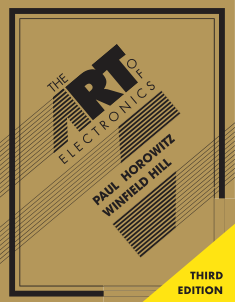
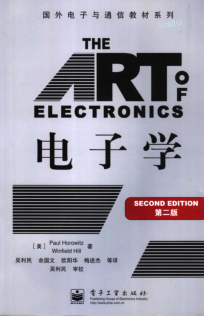
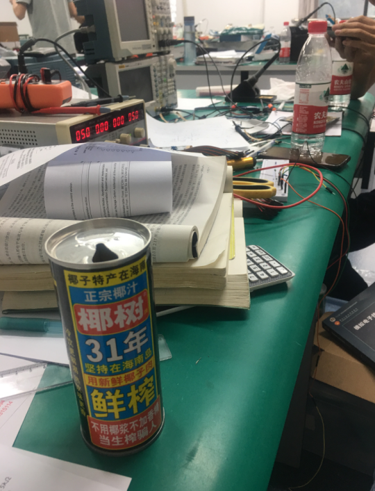
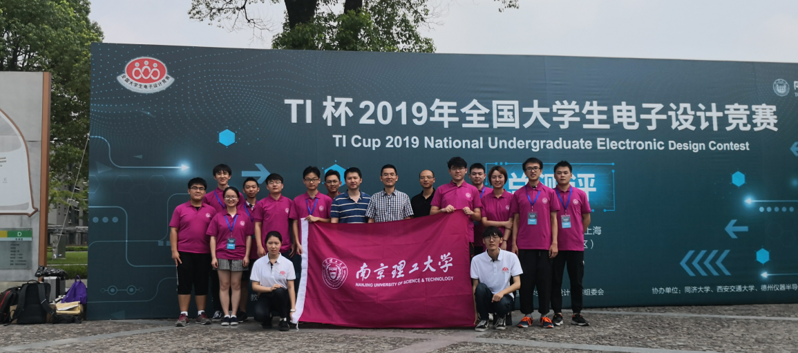
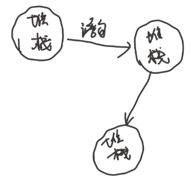
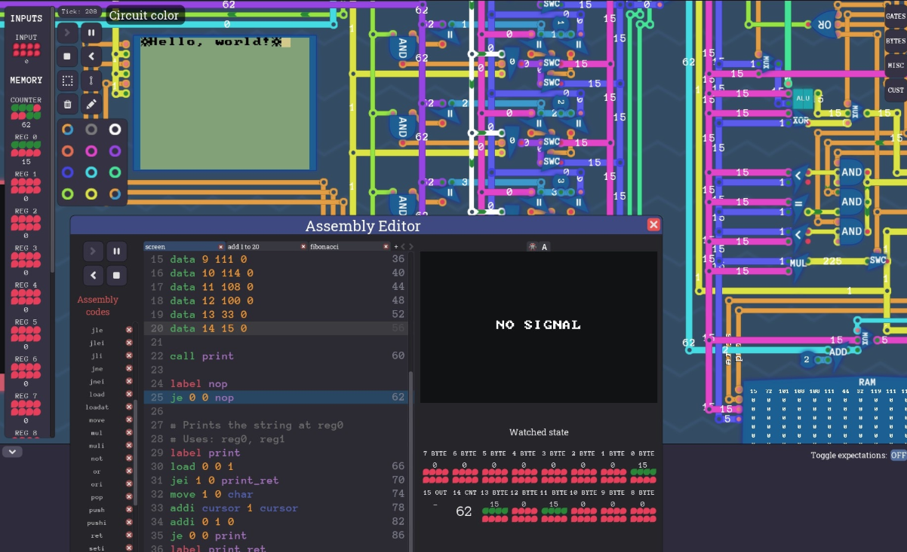
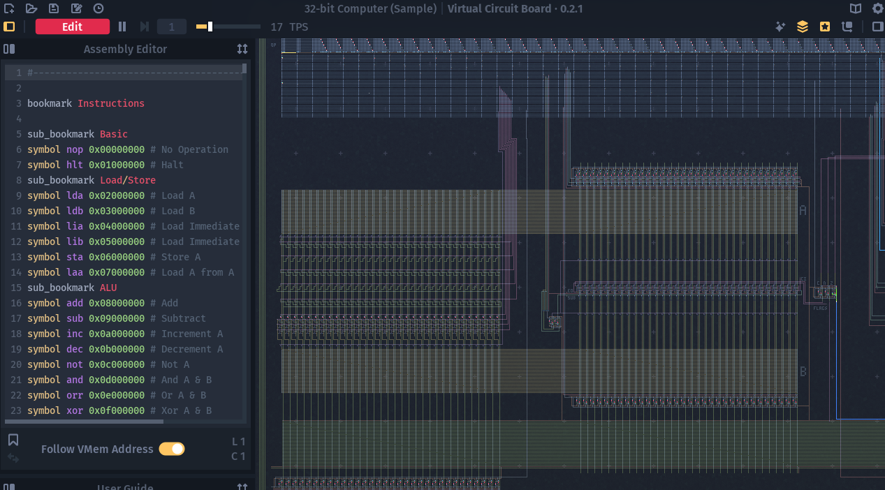
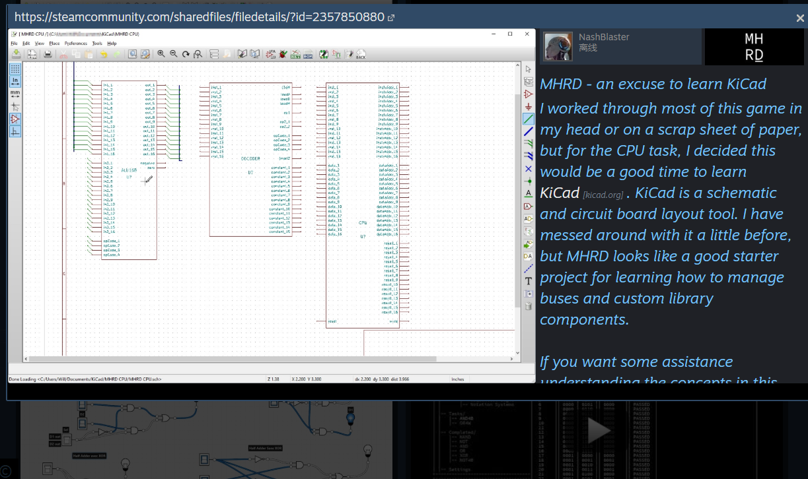
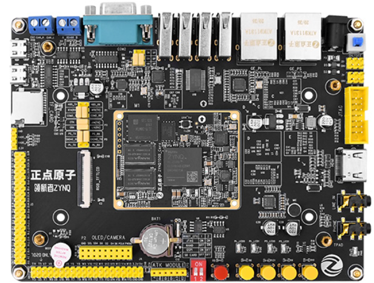

*感谢访问我的学习笔记,感谢朋友们的star。*

*如果是在 GitHub 看到这些内容，那么可以前往[独立网页](https://xym.work/electronics/)获得更好的浏览体验。*

*如果觉得我的笔记内容对您有帮助，那我会感到非常开心。*

最重要的

**如果我在内容上有理解错误，或者表达不严谨、符号不规范的地方，还请不吝指正。**


我的邮箱：[*m@njust.edu.cn*]()

或者扫描右侧二维码添加我的微信交流

---

**这个笔记本将要整理的内容：**
- [ ] 1.基本元件与电路基本定理(电路分析初步)
  - [ ] 电路模型、纯电阻电路、电路定理
  - [ ] 储能元件一阶二阶电路瞬态分析*(二阶控制系统实例)
  - [ ] *交流电路*、*正弦稳态电路*、*三相电路*
  - [ ] 半导体器件：二极管、晶体管、场效应管
- [ ] 2.模拟电路基础*
  - [ ] 小信号放大：晶体管放大、场效应管放大、集成运放放大
  - [ ] 自动控制的思想：频率响应、信号放大中的反馈(自控精髓，模电核心，也是控制系统的实例)
  - [ ] 实用电路：信号运算、波形发生、信号转换、功率放大、直流电源
- [ ] 3.数字电路
    - [ ] 基础知识：数制码制和布尔代数、逻辑门
    - [ ] 组合逻辑电路分析和设计方法(模块化与分层设计在硬件上的可视化)
      - [ ] 常用模块：编码器、译码器、加法器
      - [ ] 存储电路：锁存器、触发器、寄存器、存储器
    - [ ] 时序逻辑电路分析和设计方法(程序也是状态机)
      - [ ] 常用模块：移位寄存器、计数器、脉冲发生
- [ ] 4.数字和模拟(I/O接口后面的东西)
  - [ ] 数字电路里的模拟因素：门电路实现、CMOS和TTL、传输线问题
  - [ ] 模拟与数字的转换(物理世界与计算机的桥梁)
  - [ ] 常见模数混合电路：施密特触发、单稳态、多谐震荡、555定时器、锁相环、伪随机比特
- [ ] 5.电机与电机控制
  - [ ] 数字电路里的模拟因素：门电路实现、CMOS和TTL、传输线问题
  - [ ] 模拟与数字的转换(物理世界与计算机的桥梁)
  - [ ] 常见模数混合电路：施密特触发、单稳态、多谐震荡、555定时器、锁相环、伪随机比特


---

## 简单介绍

```note
修改记录：
- 2023-02-05 增加了一些插图，数字电路部分结合了一些计算机知识学习的思路。
- 2024-02-02 把电机与电机控制的内容也整合到了这个笔记中。
```
这个笔记本的结构基本上参考了 The Art of Electronics 这本书，内容上参考了电类专业的经典教材。

<figure>
  
  <figcaption>图1 英文原版最新为第三版</figcaption>
</figure>

<figure>
  
  <figcaption>图2 中文翻译版最新为第二版</figcaption>
</figure>


整理这个笔记实际上也是我自己建立整个电子学体系的过程，本科的一门一门独立课程像是一块块砖，现在我拿这些砖参考着 The Art of Electronics 这座大厦的蓝图，盖一栋属于自己楼。

**电路分析**这门课建立起对电的直觉，**模拟电子技术**是电子学里闪闪发光的部分，**数字电子技术**的主线内容是封装好的逻辑电路，弱化了电路的属性。这三部分理解透彻以后，再学其他电类的课程或者计算机硬件相关的课程也会轻松许多。

电路分析(或者就叫电路)是本科低年级开设的课程，学完基础数学物理课程后的第一门专业基础课。对于电类的同学来说，也是建立“电”的基本概念基本思维和电的直觉的一门课，所以包含的内容很广泛。最开始的内容是是衔接高中的欧姆定律、电阻电路分析，后面引出了基于基尔霍夫定律(“路”是对“场”的简化，电机电磁场的磁路)的四大分析方法以及电路定理。电路分析里的运算放大器相关的内容是模拟电路的一个铺垫，或者说初次露脸，使得在模拟电路中见到这个东西不会显得太难接受，当然比如“虚短”、“虚断”等分析方法是同样适用的。一二阶电路是自动控制原理的一个实例(类和对象)，是将来对电路这个系统进行控制的直觉的来源，**响应**这个词在这里就已经有了。实际上，状态方程在这里也出现了(邱关源5版)，只不过标了*，这可是现代控制理论里面一个作为基石的概念。后面的正弦电路分析、三相电路是电机、电力系统等课程的基础(电力系统我不是很了解，虽然我是电气专业，但是学的一塌糊涂)。

模拟电路的书还是挺厚的，其中最核心的两个事情：**放大**和**反馈**。小信号的放大是模拟电路里面要解决的首要问题，最基础的有三极管、场效应管单管放大电路，对于一级放大倍数不够用还有多级放大电路，为了解决温漂等问题改进出差分放大电路，分立元件往往容易出问题搭建起来复杂，于是把改进的放大电路封装成了模块(集成运放)。**为了让放大倍数更加稳定，受外界干扰更小，就引进了反馈**，反馈使得电路的放大倍数*几乎*只由反馈回路的参数决定。在分析反馈之前，模电教材插入了一章频率响应，这也是不得已而为之，频率分析是自动控制原理里面的一个重要分析手段，用来分析引入负反馈的闭环控制系统，所以了解频率响应之后才好研究电路里面的反馈，用在频域里研究反馈系统的稳定性、稳态性能(放大倍数)。模拟电路确实不容易学明白，因为模拟电路不仅仅是在讲电路，难在**反馈**的思想和方法。反馈可是自动化专业要花至少 1 学年去领会的东西。我本科是电气工程专业，模拟电路课程开在自动控制原理前面，当时的模电是咬着牙学完的，现在熟悉了自动控制原理的一些思想回头来看模拟电路，还是能发现到模拟电路里处处体现渗透着自动控制原理的思维方法。比如说用深度负反馈去减弱非线性因素的影响的输出控制思路，可以很容易在模拟电路里面找到实例。至此模电的理论部分就结束了，剩下的都是应用了。基于叠加原理的运算电路与波形处理，以及信号能量比较大的情况下(功率放大)的一些细节问题。还有和自控结合也紧密的一个应用，直流电源，其本质是在用输出电压做反馈去自动调节串入回路的电阻使得输出电压跟随给定值而不受负载的影响。模拟电路里的知识最重要用到电路设计上去，实践也很重要，比如说搭个信号处理电路或者使用软件仿真各种波形，在学校里可以去参加电子设计竞赛提升自己的实践能力。

<figure>
  
  <figcaption>图3 2019年电子设计竞赛综合测评，在 6 个小时内使用74LS00 和 LM324 以及无源器件设计电路产生 3 种信号：方波、窄脉冲、正弦波，并且可以调整信号频率。</figcaption>
</figure>

<figure>
  
  <figcaption>图4 测评时不可以带手机但是可以带参考书，所以即使不懂原理也可以照着参考电路实现出来😂，这也是这门学科工程性的一个体现，结果让人满意就行。图为测评电路板上交后等待打分时拍摄。</figcaption>
</figure>

<figure>
  
  <figcaption>图5 综合测评成绩+初测成绩靠前的队伍(应该是2%的比例)可以去参加总测评，2019年全国电子设计竞赛总测评在上海的同济大学。图为我们在测评结束后的合照。</figcaption>
</figure>

数字电路主线内容的学习并不需要模拟电路的基础(个人观点)，简单的了解放大器件，明白我们需要晶体管工作在截止或者饱和区以后实际上就不影响后续挺有意思的内容的展开了。甚至不了解放大元件，将逻辑门作为学习起点也完全不影响主线内容的进行(逻辑门是封装好的模拟电路，对外展示为输入输出引脚)。模块化，分层设计常用在软件工程的设计上，大规模的数字电路设计中会深刻而直接的体现出这种思想，而且这种设计思想在硬件上是可视化的，一个简单的例子是从逻辑门到半加器、全加器、多 bit 加法器一步步封装，每一层只考虑一个简单的问题，设计好后作为模块为上层提供输入输出接口，完成更复杂的功能。模拟电路设计也会有这种思想，但是这种想法在数字电路里更加“显然”。这部分内容是计算机硬件课程学习的前置内容，学完这部分实际上已经有实现一个简单 CPU 的潜力了。

<figure>
  
  <figcaption>图6 计算机、软件工程的同学会以逻辑门为基础学习数字电路，数字电路这门课的一个重大启发是 状态机 的思想。数字电路是个状态机，CPU是数字电路，那么CPU或者说计算机也是个状态机，只不过状态很多。C 程序也是个状态机，其状态为堆和栈的数据；汇编程序也是个状态机，状态为寄存器数据和物理内存里的数据；当前状态确定，下一个时钟周期到来时的状态就已经确定了。参考南京大学操作系统课，有更详细深入的介绍。这个思想可以更容易、更深入的帮助我们理解操作系统里的许多概念。</figcaption>
</figure>

<figure>
  
  <figcaption>图7 数字电路是为深入学习计算机准备的一门课，CPU 本身就是个巨大的数字电路，steam上有许多相关主题游戏，比如 Tuning Complete，每一关都是一个小任务，最后实现一个简单的 CPU。这还勉强可以算是个“游戏”，😂。</figcaption>
</figure>

<figure>
  
  <figcaption>图8 更过分的一个游戏是 Virtual Circuit Board ，搭好电路开始运行的按钮竟然是 Simulate ，因此这个东西更像是一个数字电路仿真软件。里面有个例程是 32bit computer，我们可以直接看到 ALU，各种总线，寄存器，可以单步运行，甚至还可以设计自己的指令集，为机器码定义自己的汇编符号。</figcaption>
</figure>

<figure>
  
  <figcaption>图9 还有最过分的游戏 MHRD，它操作起来也像bash，不需要鼠标，逻辑关系用类似 VHDL 或者 verlog 的语言来描述，但是要更容易一点，社区中心更是有玩家用这个软件来学 KiCad，Kicad是一个开源的EDA软件，国外用的人很多，😂。属于是上班带薪摸鱼，下班无偿加班了。</figcaption>
</figure>

<figure>
  
  <figcaption>图10 如果玩过上面这几个游戏，事已至此，不如直接玩一玩 FPGA，不追求实现多复杂的算法，就是简单的做一个硬件电路，或者实现一个简单的 CPU 会更有感觉。verilog 和 C 的语法很像，学习成本也不会很高。此外也能找到许多玩家用 74 逻辑门手工搭CPU的视频，也有人在 Minecraft 玩红石电路，包括前面的游戏，都有具体的逻辑门实现，但数字电路的关键知识点都是相同的，当然如果真的想试试自己搭一个CPU，还稍稍需要一些计算机组成原理的知识。</figcaption>
</figure>

实用电子系统几乎都是模拟+数字，因此也有必要了解一下模数之间的联系以及信号转换，这部分内容可以归类到检测技术或者传感器技术，离工业应用比较近，如果做嵌入式开发可以了解一下这部分内容。

除了处理信息的电路，还有处理功率的电路，功率电路在原理上和模拟电路有相通的地方，但也有自己的一些成体系的理论和技术，其中有随着电机控制一通发展起来的电力电子技术，这一整套设备里拿掉作为负载的电机，剩下的功率变换部分便是电力电子技术关注的内容。负载不仅仅可以有电机，任何用电设备都可以作为负载，从这个角度讲，拿掉电机剩下的部分是个电源，这就是开关电源技术侧重的内容。

电力电子、电机、电机控制个人认为这已经是电子学进阶了，电机控制技术和电力电子技术相辅相成，共同发展，模拟电路与数字电路处理信号，电力电子和开关电源在处理功率。实际上模拟电路里已经有了电源的东西了(线性电源)，这两类电源都用**负反馈**的方式来提高性能，也就是说自动控制原理是也是前置内容，尤其在开关电源设计里面，经典控制理论运用的出神入化。这里也附上我的自动控制原理笔记：[应用数学：控制理论](https://xym.work/control-theory)。


## 参考资料

- [The Art of Electronics - Paul Horowitz, Winfield Hill](https://sg1lib.org/book/2621378/9bb6fa)
- [电路: 修订第5版 - 邱关源](https://sg1lib.org/book/11426662/ceb7fd)
- [模拟电子技术基础 第5版 - 清华大学电子学教研组编；童诗白，华成英原主编](https://sg1lib.org/book/16599034/bb8c3f)
- [数字电子技术基础 - 闫石](https://sg1lib.org/book/14037968/797f47)

