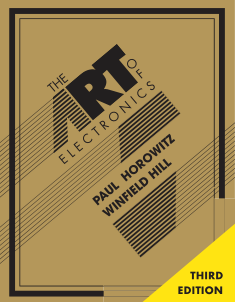
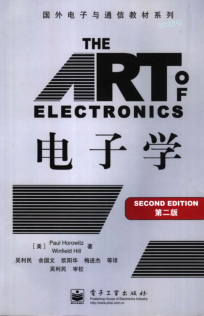
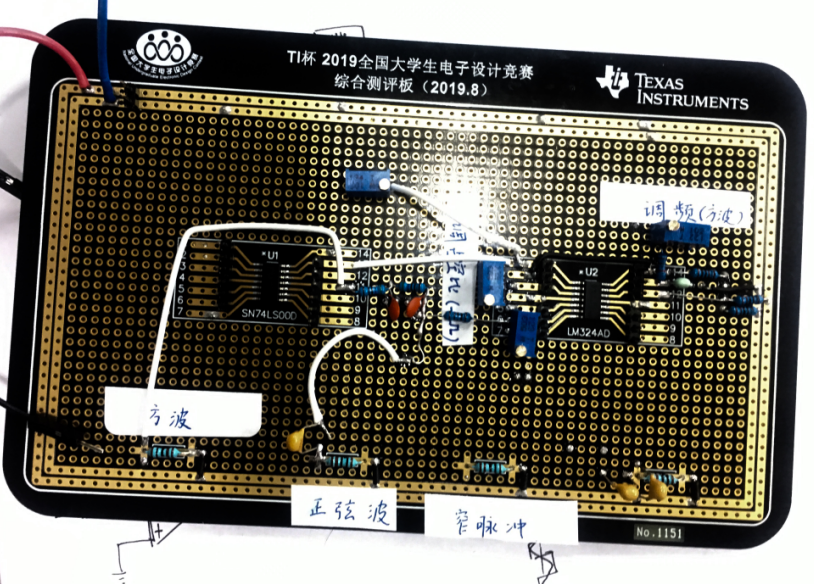
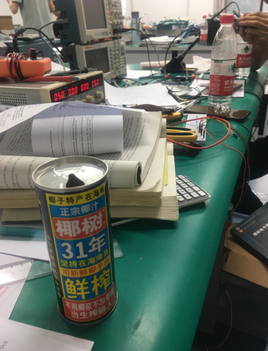
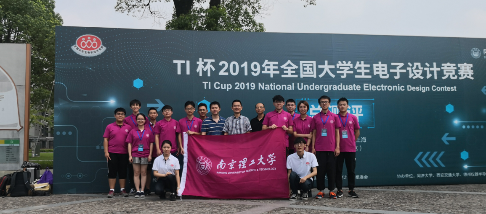
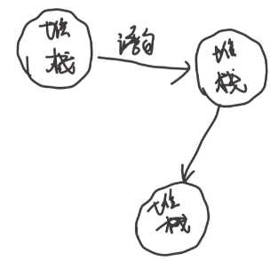
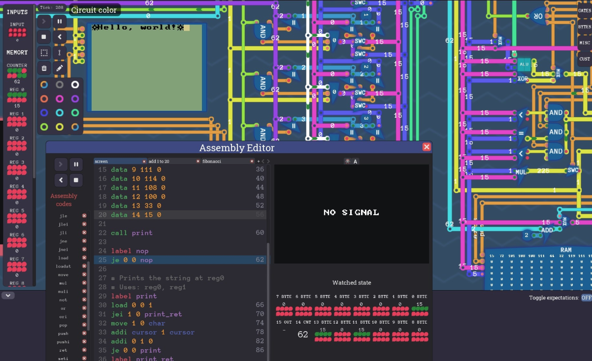
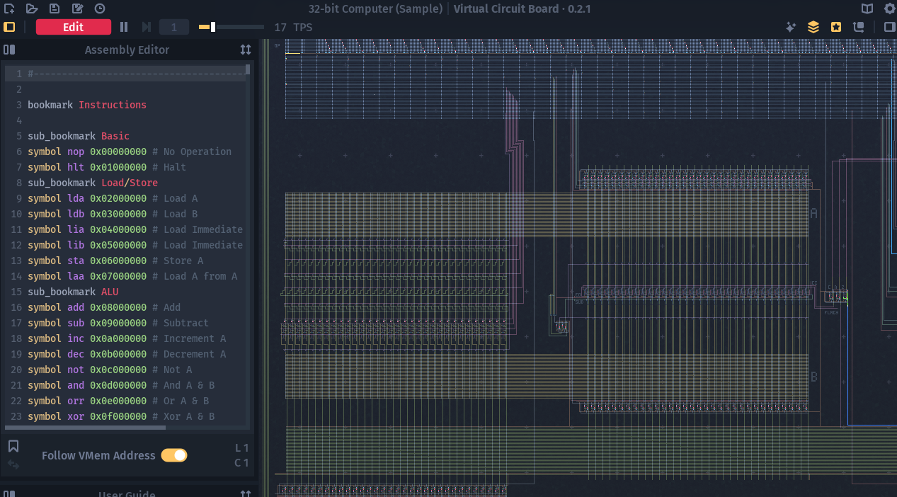
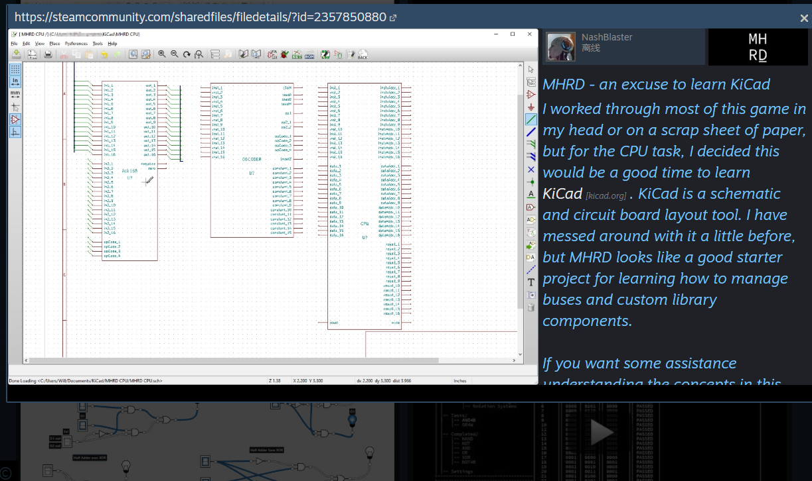
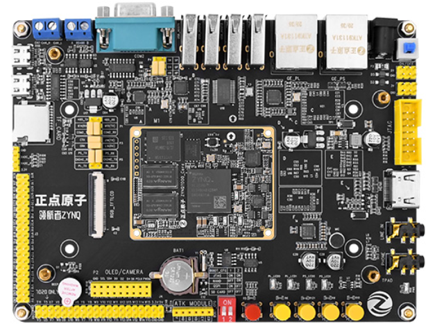

# 电子学与电机控制

*感谢访问我的学习笔记。*

*如果是在 GitHub 看到这些内容，可以前往[独立网页](https://electronics.xym.work)获得更好的浏览体验。*

*如果觉得我的笔记内容对您有帮助，那我会感到非常开心。*

最重要的**如果我在内容上有理解错误，或者表达不严谨，还请不吝指正。**

我的联系方式(微信/QQ)请查看[个人主页](https://xym.work)，欢迎朋友们互相交流、一起学习。

---

这个笔记是一份关于**电子学与电机控制**的学习整理。

出发点不是简单重复教材的章节顺序，而是想从工程实践的角度，把本科阶段分散学习的几门课程重新串起来：

从电路分析建立对“电”的基本直觉，到模拟电子技术理解信号放大与反馈，再到数字电子技术理解逻辑、模块化和状态机，最后延伸到模数接口、电力电子以及电机控制等更贴近实际系统的问题。

对我来说，整理这个笔记的过程，本身也是重新建立电子学整体认识的过程。本科阶段一门门独立的课程更像是一块块砖，而现在，我希望参考经典教材的框架，把这些砖重新组织起来，逐步搭出一套属于自己的电子学体系。

这个笔记本的结构基本上参考了 The Art of Electronics 这本书，内容上参考了电类专业的经典教材。结合控制、嵌入式、计算机系统等视角，理解电子学在真实系统中的位置。

<figure>
  
  <figcaption>图1 英文原版最新为第三版</figcaption>
</figure>

<figure>
  
  <figcaption>图2 中文翻译版最新为第二版</figcaption>
</figure>

因此，这既是一份学习笔记，也是一份带有个人理解的知识整理。如果你关心的不只是“这一章考什么”，而是“这些内容在系统里到底起什么作用”，那么这份笔记也许会对你有帮助。

整理这些内容，对我来说并不只是复习某门课程，而是在重新回答一些更基础的问题比如：
- 电路分析在整个电子学体系里处于什么位置？
- 模拟电路最核心的问题到底是什么？
- 数字电路和计算机系统之间应该如何联系起来理解？
- 模拟世界与数字世界之间的边界在哪里？
- 电机控制、电力电子和控制理论又是如何连接起来的？

这些问题未必都能在一门课里讲清楚，但它们对于建立完整的工程直觉很重要。有生之年，我会也会沿着这个方向，慢慢补充和整理下去。

**这个笔记本将要整理的内容：**
- [ ] 1.基本元件与电路基本定理(电路分析初步)
  - [ ] 电路模型、纯电阻电路、电路定理
  - [ ] 储能元件一阶二阶电路瞬态分析*(二阶控制系统实例)
  - [ ] *交流电路*、*正弦稳态电路*、*三相电路*
  - [ ] 半导体器件：二极管、晶体管、场效应管
- [ ] 2.模拟电路基础*
  - [ ] 小信号放大：晶体管放大、场效应管放大、集成运放放大
  - [ ] 自动控制的思想：频率响应、信号放大中的反馈(自控精髓，模电核心，也是控制系统的实例)
  - [ ] 实用电路：信号运算、波形发生、信号转换、功率放大、直流电源
- [ ] 3.数字电路
    - [ ] 基础知识：数制码制和布尔代数、逻辑门
    - [ ] 组合逻辑电路分析和设计方法(模块化与分层设计在硬件上的可视化)
      - [ ] 常用模块：编码器、译码器、加法器
      - [ ] 存储电路：锁存器、触发器、寄存器、存储器
    - [ ] 时序逻辑电路分析和设计方法(程序也是状态机)
      - [ ] 常用模块：移位寄存器、计数器、脉冲发生
- [ ] 4.数字和模拟(I/O接口后面的东西)
  - [ ] 数字电路里的模拟因素：门电路实现、CMOS 和 TTL、传输线问题
  - [ ] 模拟与数字的转换(物理世界与计算机的桥梁)
  - [ ] 常见模数混合电路：施密特触发、单稳态、多谐震荡、555定时器、锁相环、伪随机比特
- [ ] 5.电机与电机控制
  - [ ] 直流电机控制：电机特性、开环控制、转速闭环、转速电流双闭环
  - [ ] 交流电机控制，异步电机、同步电机 FOC 控制

---

## 修改记录

- 2023-02-05 增加了一些插图，数字电路部分结合了一些计算机知识学习的思路。
- 2024-02-02 把电机与电机控制的内容也整合到了这个笔记中。
- 2024-06-06 整体迁移到 gitbook 平台，整合了电机控制的内容。
- 2026-03-11 gpt 辅助整理，补充首页关于完善传感器、电机控制的内容。

## 为什么这么整理？

电子学最有意思的地方就在于：它既不是纯粹的物理，也不是纯粹的数学，更不是脱离现实的抽象系统。

它始终站在“真实世界”和“工程实现”的交界处，一头连着器件、电路、信号、功率，一头连着控制、计算机、嵌入式系统与实际产品。

电子学在本科阶段被拆成一门门独立的课程：电路分析、模拟电路、数字电路、电机、电力电子、信号与系统、自动控制原理……

每门课都各讲各的，学的时候会觉得内容很多，但学完以后未必能自然地把它们连接起来。

## 1.电路分析：建立对“电”的直觉

电路分析这门课建立起对电的直觉。它是学完基础数学、物理之后进入专业课体系时最先接触的一门基础课，对于电类专业的同学来说，也是建立“电”的基本概念、基本思维和基本直觉的一门课，所以包含的内容很广。

最开始的内容是是衔接高中的欧姆定律、电阻电路分析，后面引出了基于基尔霍夫定律(“路”是对“场”的简化，电机电磁场也用磁路去简化分析)的四大分析方法以及电路定理。从这里开始，“电路”作为一个工程模型(前提，集中参数or集总参数，是口音的问题？)逐渐被建立起来：我们不再直接面对复杂的电磁场，而是通过元件、节点、支路、回路这些抽象去分析问题。

电路分析里的运算放大器相关的内容是模拟电路的一个铺垫，或者说初次露脸，使得在模拟电路中见到这个东西不会显得太难接受，当然比如“虚短”、“虚断”等分析方法是同样适用的。

一二阶电路是自动控制原理的一个非常好的实例(类和对象)，是将来对电路这个系统进行控制的直觉的来源。

**响应**这个词在这里就已经有了。系统的动态特性、过渡过程、稳态过程这些概念，也已经在电路里具体地呈现出来。甚至状态方程这种后来在现代控制理论里非常核心的概念，在一些电路教材中也已经出现了(邱关源5版)，只是当时往往未必能意识到这是干什么的。

后面的正弦稳态电路分析、三相电路，又进一步把内容引向电机、电力系统等更大规模的工程对象。所以电路分析看起来像一门“入门课”，其实它在整个电子学体系里是非常基础的一层：它建立的是一种面对电系统时的语言和直觉。

## 2.模拟电路：放大与反馈

模拟电子技术是电子学里非常核心的一部分。

模拟电路的教材还是挺厚的，但我自己看下来，最最最最核心的思想上的东西其实可以概括成两个词：**放大**和**反馈**。其他的都是具体应用。

小信号放大是模拟电路首先要解决的问题。

最基础的是三极管、场效应管单管放大电路；如果一级放大倍数不够用，就会引出多级放大；为了改善温漂、提高稳定性，又会有差分放大等结构；分立元件实现复杂又容易受影响，于是后来进一步把这些改进后的结构封装成模块，这就是集成运放。

模拟电路真正困难、也真正精彩的地方，在于**反馈**。

**为了让放大倍数更加稳定，受外界干扰更小，就引进了反馈**，深度反馈使得电路的放大倍数*几乎*只由反馈回路的参数决定。而一旦开始研究反馈，模拟电路就不再只是“器件怎么接”，而开始进入一种更接近自动控制的思考方式：系统如何稳定、频率特性如何、闭环以后性能如何变化、为什么深度负反馈可以削弱非线性因素的影响……

所以我一直觉得，模拟电路难学，并不仅仅是因为公式多、器件多，而是因为它其实已经在具体电路里体现出了一整套反馈系统的思想。如果没有对反馈这个概念形成真正的理解，模电会显得很零碎；一旦理解了反馈，很多原来看似杂乱的内容就会被一条主线串起来。

从这个角度看，模拟电路和自动控制原理其实并不是彼此无关的两门课。很多在控制理论中需要花很长时间去领会的思想，在模拟电路里都能找到非常具体的工程实例。

比如用负反馈去减弱非线性因素的影响的输出控制思路是自动控制中对非线性系统改善的思路，再比如直流电源(LDO，线性稳压，如 AMS1117)，从控制的视角去看，其本质是在用输出电压做反馈去自动调节串入回路的晶体管的电阻使得输出电压跟随给定值而不受负载的影响，说白了就是可调电阻串联分压，所以 LDO 的问题是发热。

模电后面的那些内容，比如信号运算、波形处理、功率放大、直流电源等，本质上更多是在前面理论基础上的应用。

所以对我来说，模拟电路最重要的是要真正理解：电子系统是如何通过反馈，去对抗器件的不完美和环境的不确定性的。

模拟电路里的知识最终还是要用到电路设计上去，考试应付一下得了，最重要的是实践，比如说搭个信号处理电路或者使用软件仿真各种波形(一般培养计划里都会安排这样的训练)，在课外可以去参加电子设计竞赛提升自己的实践能力。

<figure>
  
  <figcaption>图3 我参加了 2019 年电子设计竞赛，综合测评的要求是在 6 个小时内使用 74LS00 和 LM324 以及无源器件设计电路产生 3 种信号：方波、窄脉冲、正弦波，并且可以调整信号频率。</figcaption>
</figure>

<figure>
  
  <figcaption>图4 测评时不可以带手机但是可以带参考书，所以即使不懂原理不懂公式不会也可以照着参考电路实现出来😂，这也是这门学科工程性的一个体现，结果让人满意就行。图为测评电路板上交后等待打分时拍摄。</figcaption>
</figure>

<figure>
  
  <figcaption>图5 综合测评成绩+初测成绩靠前的队伍(应该是2%的比例)可以去参加总测评，2019 年全国电子设计竞赛总测评在上海的同济大学。图为我们在测评结束后的合照。</figcaption>
</figure>

## 3.数字电路：模块化、分层设计与状态机

数字电路主线内容的学习并不需要任何模拟电路的基础(个人观点)，简单的了解放大器件，明白我们需要晶体管工作在截止或者饱和区以后实际上就不影响后续挺有意思的内容的展开了。甚至不了解放大元件，将逻辑门作为学习起点也完全不影响主线内容的进行。知道数字电路实际上是把复杂的模拟行为封装成“高低电平”“逻辑 0/1”的接口，这就已经足够开始进入它最主要的内容了。

数字电路最有意思的地方之一，是它把**模块化**和**分层设计**这种思想表现得非常直接。软件工程里也经常强调模块化和分层，但在数字电路里，这种东西是可视化的，是可以一层层“搭”出来的。

比如 steam 游戏 Turing Complete 的关卡的设计：
- 从逻辑门开始
- 再到半加器、全加器
- 再到多 bit 加法器
- 再到寄存器、计数器、状态机
- 最后进一步拼成 ALU、控制器、总线乃至简单 CPU
- 设计汇编指令
- 使用汇编写代码做控制

这一层层封装的过程，本身就是一种很清楚的工程训练：每一层只解决一个相对简单的问题，设计好以后向上提供输入输出接口，再由上层组合出更复杂的功能。模拟电路设计也会有这种思想，但是这种想法在数字电路里更加“显然”。这部分内容是计算机硬件课程学习的前置内容，学完这部分实际上已经有实现一个简单 CPU 的潜力了。

数字电路的另外一个非常重要的启发，是状态机的思想。

数字电路本身就是状态机；CPU 是数字电路，所以 CPU 也是状态机；从某种抽象意义上说，程序也是状态机：当前状态确定、输入确定，下一个时刻的状态演化就被确定了，所以一个程序无外部输入的话，不管执行多少遍结果都是一致的。

这个思想很有力量，因为它会把很多原本分散在不同学科里的内容连接起来。数字电路、CPU、汇编程序、C 程序、操作系统中的状态变化，都可以从“状态如何定义、状态如何转移”这个角度去看。

所以我一直觉得，数字电路不只是计算机硬件课程的前置内容，它还提供了一种很基础的系统理解方式。如果把这部分学明白，再去看计算机组成原理、操作系统，很多东西会更容易进入脑子里。

<figure>
  
  <figcaption>图6 计算机、软件工程的同学会以逻辑门为基础学习数字电路。C 程序也是个状态机，其状态为堆和栈的数据；汇编程序也是个状态机，状态为寄存器数据和物理内存里的数据；当前状态确定，下一个时钟周期到来时的状态就已经确定了。参考南京大学操作系统课。</figcaption>
</figure>

<figure>
  
  <figcaption>图7 CPU 本身就是个巨大的数字电路，steam上有许多相关主题游戏，比如 Tuning Complete，每一关都是一个小任务，最后实现一个简单的 CPU。这还勉强可以算是个“游戏”，😂。</figcaption>
</figure>

<figure>
  
  <figcaption>图8 更过分的一个游戏是 Virtual Circuit Board ，搭好电路开始运行的按钮竟然是 Simulate ，因此这个东西更像是一个数字电路仿真软件。里面有个例程是 32bit computer，我们可以直接看到 ALU，各种总线，寄存器，可以单步运行，甚至还可以设计自己的指令集，为机器码定义自己的汇编符号。</figcaption>
</figure>

<figure>
  
  <figcaption>图9 还有最过分的游戏 MHRD，它操作起来也像bash，不需要鼠标，逻辑关系用类似 VHDL 或者 verilog 的语言来描述，但是要更容易一点，社区中心更是有玩家用这个软件来学 KiCad，Kicad是一个开源的EDA软件，国外用的人很多，😂。属于是上班带薪摸鱼，下班无偿加班了。</figcaption>
</figure>

<figure>
  
  <figcaption>图10 如果玩过上面这几个游戏，事已至此，不如直接玩一玩 FPGA，不追求实现多复杂的算法，就是简单的做一个硬件电路，或者实现一个简单的 CPU 会更有感觉。verilog 和 C 的语法很像，学习成本也不会很高。此外也能找到许多玩家用 74 逻辑门手工搭 CPU 的视频，也有人在 Minecraft 玩红石电路，形式不同但数字电路的关键知识点都是相同的，当然如果真的想试试自己搭一个CPU，还稍稍需要一些计算机组成原理的知识。</figcaption>
</figure>

## 4.数字与模拟：物理世界与计算机之间的桥梁

声、光、温度、湿度、速度、角度，以及更一般的空间状态，本来都不是计算机天然能够直接处理的对象。

它们首先是现实世界中的连续物理量，而计算机系统内部真正能够处理的，则是离散的数字信号。

于是这里就出现了一层非常关键的桥梁：

如何把物理世界中的量转换成计算机可感知、可处理的形式；又如何把计算机中的结果重新作用到现实世界中。

前一部分对应的是感知，例如传感器、检测电路、信号调理、模数转换；

后一部分对应的是执行，例如扬声器、灯光、继电器、阀门、电机、舵机，以及更一般的各类执行器。

从这个角度看，模数转换并不只是一个孤立的知识点，而是现实世界进入数字系统的入口。同样，数模转换、驱动电路、功率接口，也是在让数字系统真正对外部世界产生影响。

在实际工程中，我们往往不会自己去设计最底层的传感器结构，而是直接使用封装好的器件、模块或总线接口。一个温湿度传感器、一个编码器、一个 IMU，甚至一个带协议的工业设备，对软件开发者来说常常已经是一个黑盒：它暴露出来的是 UART、I2C、SPI、RS485、CAN 或以太网接口，以及一套寄存器定义或通信协议。于是，“接入物理量”这件事，在工程实现上经常被进一步抽象成了“对接接口和协议”。

但这种抽象并不意味着底层问题不存在。很多表面上看像是“软件没写对”“协议没对上”的问题，继续往下追，最后常常还是会落回这一层：引脚上到底看到了什么电平？边沿是否足够干净？采样电路有没有把模拟问题处理好？接口两侧对高低电平、时序和噪声裕量的理解是否一致？

再往上走，一个物联网系统或嵌入式控制系统，本质上往往就是：系统读取环境状态，依据感知结果和内部规则作出判断，再触发执行器改变外部状态。

从这个意义上说，它仍然延续着数字系统里的状态机思想：状态被感知，条件触发判断，系统发生状态转移，并通过输出作用于现实世界。比如“检测到有人到家，于是全屋灯亮起”，本质上就是一次由输入条件驱动的状态变化。

而当系统进一步进入高速采样、闭环调节和运动控制之后，这一层又会继续向控制理论、采样定理和离散系统分析延伸。这时候问题已经不只是“能不能读到数据、能不能发出控制命令”，而是“采样是否合理、控制是否稳定、离散实现是否可靠”。

所以我会把这一部分理解为：

**数字系统如何真正接触物理世界。**

## 5.电机、电力电子与控制：电子学向功率系统的延伸

如果说前面的传感器、接口电路、数字系统解决的是“如何感知世界、理解世界”，那么到了电机与驱动这一部分，问题就变成了：

**计算机系统如何真正推动一个物体运动起来。**

从这个角度看，电机是现代工程系统里最重要的一类执行器之一。

无论是工业设备、自动化产线、机械臂，还是移动机器人、人形机器人，很多“会动”的系统，最终都要依靠电机来完成动作。

一个机械臂的多个关节，背后对应的是多个电机；一个移动机器人完成定位、建图、路径规划、避障之后，最终仍然要把结果变成底盘上各个电机的速度或转矩指令；一个人形机器人看起来“聪明”的行为，落到执行层，也仍然是各个关节电机在合适时刻输出合适的力矩。

所以从系统实现的角度看，很多算法、感知、规划和调度，最后都在为同一件事服务：根据传感器输入和系统目标，计算出合适的执行量，并通过电机输出合适的转矩。(一个从传感器进到电机出的大一统视角)

为什么这里一直强调的是**转矩控制**？

“运动控制”这个名字，表面上是在控制位置、速度和轨迹；但如果继续往物理本质追，就会发现运动的根源并不是位置和速度本身，而是力。

对于平动系统，有：

$$  F = ma  $$ 

力决定加速度，加速度随时间积分得到速度，速度再积分得到位置。

也就是说，位置和速度是运动过程中的表现，而力才是造成运动变化的根本原因。

对转动系统，完全对应地有：

$$  J\ddot\theta = T  $$ 

$$  \dot\theta = \int_0^t \ddot\theta \rm{d}t  $$ 

$$  \theta = \int_0^t \dot\theta \rm{d}t  $$ 

角加速度决定角速度，角速度决定角位置，因此对电机这类旋转系统来说，真正直接决定运动变化的量，不是角度，也不是转速，而是转矩。

更完整一些，机械系统常写成：

$$  J\ddot\theta = T_e -T_L - D\dot\theta - K\theta  $$ 

这个式子说明得很清楚：要改变系统的运动状态，最终能够主动施加和调节的，关键就是电机提供的电磁转矩。

所以可以说：电机控制在表面上是在控制位置和速度，在本质上是在控制电磁转矩。

位置控制、速度控制，并不是绕开了转矩，而是在更高层通过反馈结构间接地安排“系统此刻应该输出多大的转矩”。

从控制结构上看：位置、速度，最后仍然落到转矩。

很多经典运动控制系统会出现多层闭环结构。最外层是位置环，决定系统应该达到哪里。中间是速度环，决定系统应该以多快的速度运动。最内层是电流环或转矩环，决定系统当前实际输出多少驱动力

从物理因果关系上，真正能直接改变运动状态的是力或转矩；而在电机系统里，最接近这个物理量的可控对象就是电流，更准确地说是与转矩对应的那部分电流。

所以位置和速度虽然是更直观、更常用的控制目标，但真正的“根”仍然在内层的转矩控制。

直流电机是最容易看清“电流—转矩”关系的例子。在直流电机中，电磁转矩与电枢电流只差了个系数。这意味着，只要把电枢电流控制好，也就基本控制住了电机输出的转矩。因此直流电机控制的经典结构里，最内层往往是电流闭环，外面再套上速度环，必要时再加位置环。

几个环的作用：
- 电流环负责快速调节转矩
- 速度环负责稳定调节转速
- 位置环负责完成更高层的运动目标

电机控制是控制理论在真实物理系统中的一个非常典型、非常完整的落地场景。

一个倒立摆控制的的例子。肯定有一个合适的控制输入，使系统能够稳定在直立平衡点附近；如何根据当前状态实时算出那个输入。这个控制输入最终就又会落实到合适的电机转矩。(从进到出的大一统例子)

对于交流电机与 PMSM，本质没有变，只是控制方法更复杂了。

PMSM（永磁同步电机）本身的电磁关系更复杂了，不能再像直流电机那样直接把“电流”简单看成一个标量来控制。借助坐标变换，把三相电流转换到更便于分析和控制的坐标系中。FOC（磁场定向控制）的核心思想，就是把电流分解成：励磁分量和转矩分量。id = 0 的控制策略让电流主要用于产生转矩。

这种控制策略背后的出发点仍是把与转矩相关的那部分电流控制好，从而把电磁转矩控制好。

所以从直流电机到交流电机，从电流闭环到 FOC，看起来数学形式和工程实现差别很大，但如果抓住“电机控制的根本是转矩控制”这条主线，很多方法就会更容易串起来。

从“信号控制”走向“功率控制”这就进入了电力电子，电机控制并不在“算出控制量”这里结束。对于 PMSM 这类系统，即使控制算法已经算出了 PWM 占空比，这时解决的仍然主要是信号层的问题，系统知道“应该怎样驱动”。

但真正让电机转起来，还需要解决另一个同样关键的问题：这些控制信号如何通过功率电路，变成能够驱动电机的电压、电流和能量流动。

这就自然衔接到了电力电子。

功率电路和模拟电路在许多基本原理上是相通的，但关注重点不同。模拟电路更强调信号的放大、运算与处理；电力电子更强调功率的变换、效率、开关行为、热设计、器件应力和实际驱动能力。

从这个角度看，电力电子研究的是：如何高效、可靠地把电能按期望的形式送到负载上。

如果负载是电机，它服务于电机驱动与运动控制；如果把电机拿掉，只保留供电与变换部分，那么很多内容就更接近开关电源技术。

所以这部分内容，实际上是电子学从“信号系统”继续向“功率系统”延伸后的自然结果。

如果把整套系统从上往下看，会发现这里几乎处处都有反馈的影子：
- 感知提供状态信息
- 控制器根据目标和状态生成控制量
- 驱动电路把控制量变成功率输出
- 电机输出转矩，改变系统运动状态
- 新的状态再被感知，进入下一轮闭环

因此，电机、电力电子与控制并不是一个孤立章节，
而是电子学、控制理论、嵌入式系统和机器人系统在现实世界中的一个汇合点。

## 一些补充

2026-03-11

### 仓库历史

如果你看到这里，非常感谢。也想借这个机会，补充一点这个仓库本身的来历，以及它为什么会是现在这个样子。

这个仓库建立于 2021 年。

最开始其实没有想那么多，只是在研究 GitHub Pages，想试着做一个别人可以访问的网页。网页搭起来以后，总得放点东西进去，于是就顺手把它当成了一个类似在线笔记本的地方：学到什么，就写一点什么，主要是给自己看。

因为是自己看的，我也是想写点写点，爱怎么搞怎么搞。那会儿不会有人来问为什么点开看不到 😂，没有逐字斟酌的思考负担。

后来到了 2022 年，准备考研复试时，我借这个机会重新整理了一遍控制和电子相关的内容。当时主要做了两件事：
- 整理了一份相对完整的目录框架
- 补充了一些对本科阶段相关课程的整体理解，也就是现在首页上这部分偏总结性的内容

所以如果你现在看这个笔记，会发现它“目录看起来很完整，首页内容很多”，但点进去未必都有展开内容。框架先搭起来了，很多具体内容还没有来得及继续往下写。

实际上，我整理了 3 条线的笔记：控制与机器人、电子与电机、计算机与嵌入式系统开发。但读研期间，电子相关内容其实已经放下了不少；控制的部分也更多是零散地记一些、想起什么写一点。

到了 2024 年，为了找工作，走大厂路径，学计算机，操作系统，计算机网络，刷 leetcode，再加上学校阶段时间相对自由，所以计算机与嵌入式那部分后来反而整理得更完整一些。

也正因为如此，这个电子学笔记就变成了一个有点特别的存在：它并不是一个已经写完的“完整教程”，更像是一份带着个人学习痕迹的框架和总结。

有点意外的是，这个仓库后来陆续收到了不少 star。

我想，GitHub 上最不缺的大概就是计算机方向的学习资源，而电子学相关的系统整理相对少一些。我想来 github 找电子学习资源的大家都是比较有想法的人吧。

所以这个仓库虽然很多细节还没有真正展开，但仅靠首页这些总结性内容和整体框架，居然也被不少人看到、收藏，甚至有人专门来加我，问为什么点进去看不到具体内容。

答案其实也很简单：

因为很多内容确实还没写。😂

但换个角度看，这也说明了一件我自己挺开心的事：即使只是这些框架和总结性的思考，也确实给一些人提供了启发。

后来来找我交流的人里，有不少是电类专业的本科同学。和他们聊天的时候，我也会回想起自己本科阶段学这些课时的状态：很多时候就是在做题、看视频、查资料，但并不真正知道一门课到底想解决什么问题，它在整个体系中的位置是什么，最核心的东西又是什么。

比如模拟电路，当时会去看 B 站上的看华成英；电磁场看马西奎。

花了很多时间之后，才慢慢理解：原来一门课真正重要的东西，也许在理解之后几句话就能说清楚；但在一开始学习的时候，往往完全不知道自己到底在学什么。

所以这个页面里的很多内容，本质上更像是我对自己过去学习过程的一种回看和总结。如果有人只是看了首页这些内容，就能对“这门课是干什么的”“它和别的课有什么关系”多一点整体感觉，我会很开心。

### 关于后面是否会更新？

应该还是会的。

这些内容对我来说并不是一次性写完就结束的东西，而更像是会随着理解变化而不断更新的笔记。

当我进入新的阶段，或者对某些问题有了新的理解、新的联系、新的表达方式时，大概率还是会继续补充一些东西。

不过，更新的重点未必一定是把目录下的每一个小节都补成完整细节。因为在具体知识点的讲解上，网上已经有很多非常好的课程、教材和老师，他们通常会讲得比我更系统、更准确。

所以我更愿意把这个仓库继续当成一个：用来整理框架、提炼关键词、记录理解过程、串联不同课程之间关系的地方。

在 AI 时代下，如果这里给出的关键词、框架和理解路径，能够帮你更快地抓住重点，再配合课程、教材，或者直接去和 GPT 讨论具体问题，那我觉得这个仓库的作用其实已经实现了一大半。

甚至可以把这里的内容整个复制下来，拿去问 GPT “有人这样理解，我认为他的理解有问题，我的理解是xxxx，这些理解对不对”，本身也是一种不错的用法。

以后也许我会把控制、电子、嵌入式这些内容再进一步打通，整理成更统一的一套东西；但这件事会长成什么样子，我自己现在也还没有完全想清楚。

### 最后的一点说明

如果你之前加过我，但我没有及时通过，非常抱歉😂😂😂。

这不是因为不想交流。更多时候只是因为我不太擅长主动和别人开启聊天：好友请求我其实很早就看到了，但会犹豫第一句话该怎么说，结果有些请求就在犹豫中失效了。

所以如果出现过这种情况，确实很抱歉。

## 参考资料

- [The Art of Electronics - Paul Horowitz, Winfield Hill](https://sg1lib.org/book/2621378/9bb6fa)
- [电路: 修订第5版 - 邱关源](https://sg1lib.org/book/11426662/ceb7fd)
- [模拟电子技术基础 第5版 - 清华大学电子学教研组编；童诗白，华成英原主编](https://sg1lib.org/book/16599034/bb8c3f)
- [数字电子技术基础 - 闫石](https://sg1lib.org/book/14037968/797f47)

