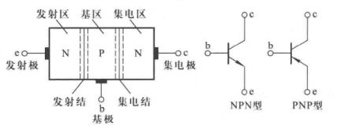
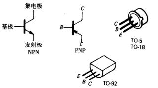
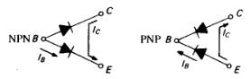
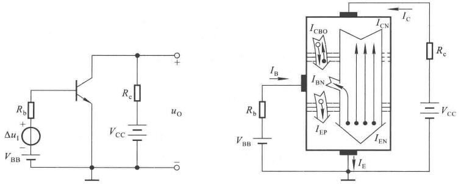
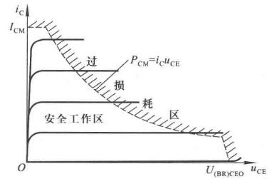

# 晶体管

## 晶体三极管

晶体三极管、双极型晶体管、半导体三极管，一个东西。

一个硅片上造出三个区域，形成两个PN结，由NPN型和PNP型。引出来的三个脚分别为集电极、基极、发射极

    

    

晶体管是放大电路的核心元件，他能控制能量转换，将微小变化不失真的放大。

和前面二极管在稳点工作点附近的分析的这种感觉有点像，在三极管工作在有直流偏置的小信号放大状态时，认为是一个直流型号叠加一个交流信号。

三极管可以放大的机理应该属于半导体物理的范围，这里只关注外特性倒是问题也不大，和二极管一样，只是拿来使用。

对于一个NPN管，工作在放大时，需要满足的条件：
- 集电极电位高于发射极
- be正偏，bc反偏

    

PN结是个二极管，因此拿到一个晶体管，可以使用万用表测测三个脚，根据电阻数值可以判断管的类型。

基本共射放大电路的三极管放大原理图

    

从外部看有

$$ I_E = I_C + I_B $$

做一些定义：$$ \bar{\beta} = \frac{I_C}{I_B} $$为直流电流放大系数，$$ \beta = \frac{\Delta i_C}{\Delta i_B} $$为交流电流放大倍数。

穿透电流和集电极反向电流有个小关系

$$ I_{CEO} = (1 + \bar{\beta} ) I_{CBO} $$

即使B开路，CE也有电流，这是三极管质量好坏的重要参数。

## 三极管输入输出特性

输入特性，$$ u_{CE} $$为常数

$$ i_B = f(u_{BE}) $$

    

如果$$ U_{CE} = 0 $$，输入特性和二极管一样的，相当于两个二极管并联了。

随着$$ U_{CE} $$增大，曲线右移，得到同样的$$ i_B $$，$$ u_{BE} $$要增加。

随着$$ U_{CE} $$增大到一定程度，曲线不右移了。

对于小功率管，可以使用$$ U_{CE} > 1 $$的一条输入特性代替所有的输入特性，但是要明白做了个近似。

输出特性，$$ I_B $$为常数

$$ i_C = f(u_{CE}) $$

    

平行于横轴的这块区域，是个受控电流源。模拟电路哟啊千方百计的让工作区域不要在饱和区和截止区。

根据这个图$$ \beta = \frac{\Delta i_C}{\Delta i_B} $$不是常量。

在理想条件下$$ \beta $$处处相等，会有$$ \beta = \bar{\beta} $$。

在截止区，$$ u_{BE} < U_{on} $$

放大区，$$ u_{BE} \ge U_{on} $$，$$ i_C = \beta i_B $$

饱和区，$$ u_{BE} \ge U_{on} $$，$$ u_{CE} < u_{BE} $$

## 主要参数

直流参数，$$ I_{CEO}, I_{CBO} $$

$$ \bar\beta = \frac{I_C - I_{CEO} }{ I_B } $$

$$ \bar\alpha = \frac{I_C}{ I_E } $$

交流参数

$$ \beta = \frac{\Delta i_C}{ \Delta i_B } $$

$$ \alpha = \frac{\Delta i_C}{ \Delta i_E } $$

使得$$ \beta = 1 $$的信号频率$$ f_T  $$

极限参数

最大集电极电流$$ I_{CM} $$

最大集电极耗散功率$$ P_{CM} $$

ce击穿电压$$ U_{(BR)CEO} $$

在各种极限参数的限制下，晶体管的安全工作区是有范围的

    

