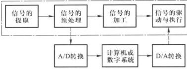

# 模拟电路基础

- 半导体器件和基本放大电路
- 多级放大电路与集成运放
- 频率响应与反馈
- 信号运算与波形发生
- 功率放大和线性稳压电源

## 模拟电路教材的研究内容

模拟电路在研究小信号的放大。

电信号，指随时间而变化的电压或电流，数学上可以描述成$$ u = f(t) $$或$$ i = f(t) $$。

电子电路里信号可以分成模拟信号和数字信号。模拟信号在时间和幅值上都是连续的，数字信号在时间和数值上均离散。

大多数传感器将物理量转化为模拟信号，现代电路系统虽然核心都是CPU，但是最前面的输入端或者最后面的输出还是需要模拟信号处理的，这就是AD和DA。

    

《模拟电子技术基础》这本书里，更关注虚线框里的内容，目前的实用系统常常是两种信号都存在的**模拟-数字混合系统**。

一些电路系统中典型的模拟电路
- 放大电路：信号电压、电流、功率的放大
- 滤波电路：信号提取、变换、抗干扰
- 运算电路：信号加减乘除、微积分、对指数运算
- 信号转换：I-V转换、V-I转换、交直转换、直交转换、压频转换等
- 信号发生：正弦波、矩形波、三角波、锯齿波等
- 直流电源：线性电源

**放大**是对模拟信号最基本的处理，上面的电路里都含有放大电路，因此放大电路是构成模拟电路的最基本电路。

为了更稳定的放大，在模拟电路里也能看到自动控制原理的影子。

## 模电为什么难学？

来自知乎[@w浩森(Engineering Enthusiast / PhD@EE)](https://www.zhihu.com/people/empty)的回答：[为什么模电这么难学？](https://www.zhihu.com/question/279354736)。

在高等教育体系中，模电是涉及半导体方向的第一门工程类课程，是一门技术类的启蒙教材。他不同于电路（Circuit），电路是基于普通物理基础的电气入门课程，诞生于第二次工业革命，从摩擦起电到伏特电池，奥斯特，法拉第，安培，麦克斯韦等一大批物理学家构建了物理的一个全新分支：电磁学，与传统的牛顿力学和开尔文热力学并肩存在。所以电路很大程度上是物理学的延申，学起来逻辑性强，有数学定理可以依靠。高中都设置有物理课程，所以到了大学学电路就很容易。  
模拟电子学（Analog Electronics）是一门**纯技术**类学科，是伴随半导体技术而诞生的。其中的已知电路，拓扑，应用手段都是纯技术，更多的是一种**工作笔记汇总**。其中记录的是20世纪这100年中被人类发明的一系列的模拟电子技术成果。 

我们回头来看模电的历史，大概能明白模电到底是什么，谁发明的，现在怎么样了，哪些人还在用。

模电最早不是为了做半导体，不是为了做二极管、三极管，不是为了做放大器，亦不是为了做音响功放、电报电话。模电诞生的初衷是为了直接做计算机。1930年，MIT诞生了世界上第一台通用模拟计算机，主要工作是求解6阶微分方程。这台计算机甚至和电都没有关系，是一个纯机械的求解方法。因为世界生产力发展迅猛，人类对于计算能力的渴望增长飞快。到了第二次世界大战开始后，计算能力甚至开始影响到了战争发展。1940年，贝尔实验室研发出了第一台M-9模电计算机，而且一上来就直接放在战斗机上，通过雷达数据在线计算敌机轨迹，形成一套自动机炮火瞄系统，美军战机射杀敌机的耗弹量下降了10倍，也就是说射杀精度上升了10倍，一台计算机就可以匹敌一个王牌飞行员，计算的威力实打实的让所有人开始重视。欧洲战局中，美国开始占领制空权，到了1944年，终于终止了德国V1火箭对伦敦的继续空袭，这其中M-9模算功高至伟。在M-9计算机中的核心元件便是带负反馈的真空管放大器。两个天才Randall Ragazzini和Russell历史性发明了运算放大器（operational amplifier），并同时基于运放构造了积分、求反、加减法电路。他们在论文中写道：“把放大器的输出端反过来连到输入端后竟然可以进行电压的数学运算了···”。1952年，从战争中走出来的大明星，运算放大器，终于走向民用。George A. Philbrick 引入第一个商业化的运算放大器 K2-W。+/-300 V供电，+/- 50 V压摆，可以带50K欧负载，售价22美元。由此我们可以看到，这时候的模电，主要是为了搭建运算电路，执行加减乘除，积分微分，求反求倒。这就是各位课本里各个章节的由来。

那么为了能算的更快，更准，运放的性能就会被各大科技公司拿出来攻关克难。这时候，米勒效应的问题出现了，振荡问题出现了，那么人们通过科学知识逐步的找出了物理模型并系统的研究怎样避免这些问题出现。这时候运放还都是真空管，因为半导体还没有商业化。1962年，一个叫 Bob Widlar的小伙刚刚从美国中部科罗拉多大学本科毕业了。他在一家研究机构工作，他在电路设计方面天赋异禀，直接吸引了给他们供货的一家供应商的注意。尽管挖客户跳槽是商业忌讳，但这家供应商还是想方设法挖到Widlar并让他负责一款新产品的研发。1964年，Widlar不负众望，主导研发的产品面世了，这便是大名鼎鼎的µA702，世界上第一款基于半导体的运算放大器，从此世界进入了一个新时代。这个时代叫做“超大规模集成电路”，而这个挖墙脚的公司叫做“仙童半导体”。和K2-W一样，uA702也采用了两级电压放大，于是也面临一个难题：如何在不牺牲增益（Gain）的情况下将一个差分（Differential signal）信号转换成单端信号（Single-ended signal）。这个问题很难，因为会损失一半的信号。而之前K2-W就直接不要了这一半信号。我们的天才Widlar创造了又一个跨时代的发明：电流镜（current-mirror ）。他用了9个NPN型的三极管，搭建了一个我们后人都无法理解他怎么搭出来的电路，他把信号成功的向上抬高了一半，从而避免了失真。这就是各位书上电流镜的由来。

那么Widlar的这种把几个三极管集成在一个器件中的行为被后人称为：“模拟芯片设计”（Analog IC Design）。而这时，神的故事才刚刚开始。Widlar在搞定完运放之后，顺手搞了专门用于比较功能的运放710和711，比较时间缩短至40ns，将当时其他基于普通云放的带宽扩展了十倍。而这种专门用来比较的运放被称为比较器。这就是各位书上比较器那一章的由来。之后又搞了uA726，将温漂变态的压到了0.2µV/°C，满足了军品的温度参数（-55°C to +125°C）。这就是各位温漂那一节的由来。为什么这时候计算机需求这么大？因为美苏冷战开始了，地球人对于军事和航空航天产业的升级迅速铺开。国家每年将GDP的百分之几十用在了科技创新上，半导体产业进入了举国体制。1965年，Widlar要求仙童加工资被拒绝，于是带着同事Talbert离职，进入美国国家半导体公司。跳槽之后的第一款产品是LM100/101A。Wildar想，电流镜能做信号运算，也同样能做功率控制，于是用同样的思路做成了这款基于运放原理的稳压器（Regulator）。这就是大家书上直流稳压电源那一章的由来，也是线性稳压器件的开始。

现在的LM317就是这个系列的曾曾曾孙子。这款器件最大的特色是，无论负载怎么变，输出电压稳稳的定格在一个常值，这对于电源的发展无疑做出了巨大贡献。Widlar的线性稳压思路同时诞生了另一个产品：电压基准芯片。在模拟电路中，电压需要一个绝对准确的标准作为参考电压（Reference voltage），比如5V就应该是5V，如果实际变成了5.01V，那么最后的计算结果就跑偏了，相当于计算机的浮点精度。而Widlar的稳压思路大大提升了整个模电的参考电压精度标准。这就是各位书上电压基准那一章的由来。

那么怎么把一个电压基准就死死的钉在一个值呢？Widlar想到了二极管的导通电压是0.6V，很固定。但这个导通电压会随着电流和温度的变化而变化，高达0.3%/°C。如果能对这个电压做一个2mV每摄氏度的补偿将是极好的。于是Widlar基于电流镜的经验，设计出了CTAT（负温漂系数电路），从物理原理上证明了输出电压可以和温度无关。电压准确度被精确钉在了5mV以内，即千分之一。同时期，其他厂家在技术方面也是百花齐放。比如就职于Signetics的Hans Camenzind。他是专门做锁相环（PLL）的，特别希望得到一种可控频率的器件。不为别的，就是为了自己用方便。于是他做出了一种可调频率器件，命名为555振荡器。

任何一个电学专业的学生都听过用过这个器件，因为555是35年来全球最畅销的IC，每年全球销售10亿只。再比如Bill Hewlett和Dave Packard。别人用运放是为了防止振荡，他们一开始也是，结果他们接线接错了，做成了正反馈，电路振个不停。两人一合计，算了，咱们就专门做振荡器吧。于是开了公司，公司名就用两人名字缩写好了。而这些就是各位书本上“信号转换和发生电路”那一章的由来。

那个公司名的缩写是HP，中文名是惠普。而他们公司的那条街后来变成了一个地名，叫做硅谷。此时，模电的章节基本上就攒全了。那么基于这些技术的各类产品开始出现，比如无线电呀，比如音响啊，比如电视机啊，电话啊。后来，到了1970年代，MOSFET的成熟使得集成电路的维度和速度得到进一步的提升，世界开始了数字化进程，数字电子技术开始进入了世界舞台。一度曾经辉煌的模拟电子技术开始卸任舞台C位。可以看出，半导体的发展就是人类对于算力的不断追求后做出的选择。那么模拟电子技术现在已经不是主力了，更多的是服务于数字电子技术，成为了外围。所以美国教材这边，模电中三极管（BJT）的比例已经很小了，一带而过。更多的篇幅用来讲解MOSFET，而咱们国家模电教材基本上还是没变过，国内半导体产业也还没真正起来，所以各位学起来就有两个问题：1. 这是啥？2. 我学他干啥？模电教学不光是一个教育问题，更是一个商业问题。本文中大部分内容来自于斯坦福大学集成电路中心的Thomas H. Lee教授的这篇文章：Tales of the Continuum: A Subsampled History of Analog Circuits，作为一个见证硅谷和世界科技发展的老先生，他的见解是客观生动的。文章最后他还对Widlar的私生活进行了介绍，非常有趣。可以说Widlar以一己之力写了模电教材的大部分章节，被后人誉为“模拟电子之父”。

