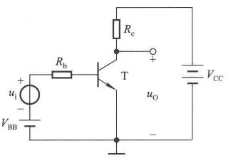
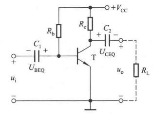
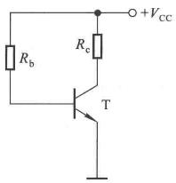
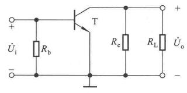
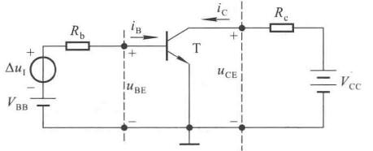
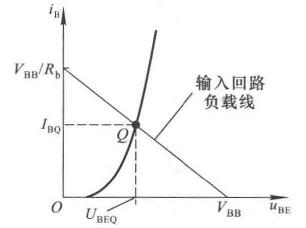

# 晶体管放大电路

## 基本共射放大电路

### 工作原理

工作原理使用基本共射放大电路来分析。

<center>
    
</center>

这是个原理性质的电路，因为输入和输出有一个共用端，因此叫作基本共射电路。

从输入回路来看，$$ V_{BB} $$是要让这个回路导通，$$ R_b $$也是必要的，如果没了，三极管会烧掉。相当于直接给二极管加了个电源。

输出回路，$$ V_{CC} $$使得BC有个正确的偏置，也是负载的能源。$$ R_C $$里流过的电流就是集电极电流，起到了电流电压转换作用，将$$ \Delta i_C $$转化为$$ \Delta u_{CE} $$。


最前面的信号是变化的电压$$ \Delta u_i $$，导致$$ \Delta i_b $$变化，使得$$ \Delta i_c $$变化，通过电阻后，最终$$ \Delta u_o $$变化。


静态工作点的必要性。

当信号为0时，流过的电流就是静态工作点。在放大电路里由静态工作点，而且要认为的设计这个工作点。

为何放大交流量还要个直流量呢？即在信号为0时，也要有合适的直流电压，交流小信号直接作用与三极管，可能都不够PN结的开通电压的，小信号可能也就几个毫伏，从这个点考虑，需要直流偏置。使得在有动态输入的时候管子始终工作在放大状态。

静态工作点的位置几乎影响着所有的动态参数，虽然被放大的是交流量。

波形分析，不再强调了，认为是中频小信号。有了直流偏置以后，动态信号是驮载再直流量上的。

<center>
    
</center>

按照这种接法的输出信号是反相的，如果输入信号增大，那么CE电压会减小，输入信号过大，输出小不下来了，这就意味着管子饱和了。饱和意味着$$ i_b $$可以增大，但是$$ i_c $$不能再大了，由于是反相的，所以饱和失真是底部失真。

截止失真是输出电流小不下去了，输出电压接近$$ V_{cc} $$了，截止失真，顶部失真。

饱和失真是输入没有失真，输出出问题；截止失真输入回路就失真了。

失真这个问题要搞清楚，将来调试电路的时候也有个入手的地方，要想让输出不失真，要保证晶体管始终工作在放大区。

因此放大电路的组成原则：
- 静态工作点合适，即电源和两个电阻合适（合适的参数）
- 动态信号能够作用于晶体管输入回路
- 实用放大电路要求共地、直流电源种类少、负载上无直流分量


```note
一个电源意味着一套电路。输出有直流量，因此这是个原理电路，非实用电路。
```
### 两个实用放大电路

上面这个原理性的电路，没法直接用，其存在的问题是两种电源且信号源和放大电路不共地，因此稍微处理一下。一种实用放大电路是**直接耦合共射放大电路**，耦合就是连接的意思，直接耦合放大电路就是直接连起来。

<center>
    
</center>

这时候分析这个电路的静态工作点，输入信号为0，相当于短路。

静态时，$$ U_{BEQ} = U_{R_{b1}} $$

动态时，be间电压是$$ u_1 $$和电阻$$ R_{b1} $$上电压之和。


还有另外一种耦合方式，**阻容耦合**放大电路

<center>
    
</center>

对于耦合电容$$ C_1,C_2 $$，应该要比较大，使得在通频带里的交流信号通过电容和导线一样。

静态时，两个电容是有电压的，$$ C_1 $$两端是BE电压，$$C_2$$两端是CE电压。其静态工作电压$$ U_{BEQ} =  U_{C1}  $$，$$ U_{CEQ} = U_{C2} $$。

动态时，信号相当于没有损失的直接加载BE上，$$ u_{BE} = u_I + U_{BEQ} $$，这个驮载就体现出来了。输出端，输出量时CE减去一个电容上的不变量，因此输出是一个完全的交流量。

因此这个耦合电容的作用是隔直通交。这个电路特别好，在集成运放出现前，这个电路是用的最广泛的一个放大电路。

```note
现在有三个电路了。一个是原理电路，两个实用电路：直接耦合、阻容耦合。

直接耦合是用个电阻串在输入和晶体管之间，这个电阻影响着动态也影响着静态。

阻容耦合，比较好，解决了前面的问题，但是也有自己的问题。电容在频率比较低的时候，容抗就很大了。

```

## 放大电路分析方法(以共射为例电路求解)

放大电路的分析方法就是求解静态工作点和动态放大倍数的方法。


### 直流通路和交流通路

为什么会有这个问题呢？放大电路里直流和交流是共存的，又有电容、电感存在，因此交流和直流信号流过的路是不一样的，因此就分开来去看，这也是模拟电路里的一种分析方法。

引入直流通路和交流通路的额概念。

直流通路解决静态工作点的问题，分析时的原则
- 让信号源为0但是保留内阻
- 电容开路
- 电感短路

交流通路解决信号的问题
- 大电容短路
- 直流电源为0，也相当于短路（理想电源无内阻）

对于最基本的放大电路

<center>
    
</center>

直流通路 

<center>
    
</center>

$$ I_{BQ} = \frac{V_{BB} - U_{BEQ}}{ R_b } $$

$$ I_{CQ} = \beta I_{BQ} $$

$$ U_{CEQ} = V_{CC} - I_{CQ}R_e $$

输入特性曲线折线化处理了。

交流通路的处理：

<center>
    
</center>

直流电源为0，相当于短路处理了，要在直流偏置合适以后再分析交流。


**对于阻容耦合电路**

<center>
    
</center>

直流通路电容开路处理

<center>
    
</center>

$$ I_{BQ} = \frac{V_{CC} - U_{BEQ} }{ R_b } $$

$$ I_{CQ} = \beta I_{BQ} $$

$$ U_{CEQ} = V_{CC} - I_{CQ}R_c $$

甚至可以直接这么算$$ I_{BQ} \approx \frac{V_{CC} }{ R_b } $$，$$ V_{CC} $$比较大的时候，这个误差是可以接受的。

交流通路

<center>
    
</center>


使用直流通路可以估算静态稳定点的具体值。

一般来说，放大电路的$$ I_b $$为微安级别，$$ I_c $$大概是毫安级别。


### 图解法

把原来的电路变成图解法比较容易的形式，把管子明显的露出来。

<center>
    
</center>

使用图解法需要实测晶体管的输入、输出特性。

对于输入侧

$$ u_{BE} = V_{BB} - i_B R_b $$

晶体管的输入特性和输入回路的负载线有个交点：

<center>
    
</center>

对于输出，有

$$ u_{CE} = V_{CC} - i_{C} R_{c} $$

<center>
    
</center>

这个东西在数学上的本质和一个二元方程组的图解法差不多。

对于动态放大倍数的分析，有

$$ u_{BE} = V_{BB} - i_B R_b + \Delta u_I $$

相当于输入有个小平移，这一步一步就对应到输出上去了。

<center>
    
</center>

给定$$ \Delta u_I \to \Delta i_C \to \Delta u_{CE} \to A_u  $$

图解法并不是个好方法，但是研究放大过程，更能深入理解放大电路输入如何作用，输出怎么回事。

此外，用图解法研究失真也很不错。

截止分析

<center>
    
</center>

截止失真输出是正弦，在输出端因为二极管不导通了，输入波底部失真，在输出的时候，IV转换反相了，故**截止失真首先在输入回路产生，输出顶部失真。**

因此消除截止失真，要往上抬Q点。

改电源是可以的，但是比较愚蠢。减小$$R_b$$不行。

对于饱和失真

<center>
    
</center>

Q随着负载线向左上方运动，进入饱和区了，CE电压再也上不去了，输出电压再也下不去了，**因此饱和失真出现在输出侧，输出信号底部失真。**


## 放大电路的静态工作点


## 晶体管单管放大的三种接法


