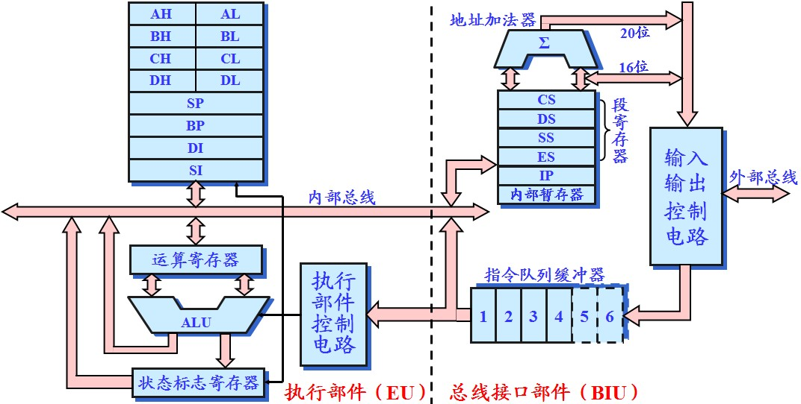
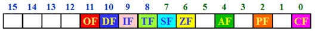
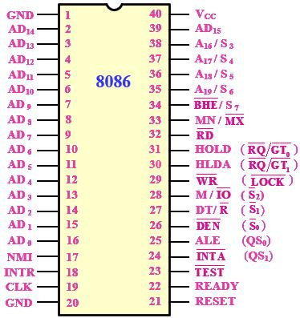
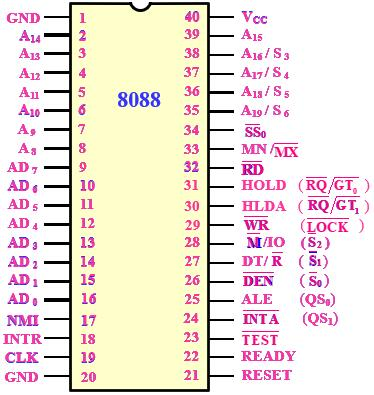

# 8086/8088CPU计算机系统

>万年第一章，计算机概述。前面计算机原理已经和清楚了，这里把最核心的拿出来再说说。

1971年，第一个微处理器Intel 4004；1978年，推出了16位微处理器8086，次年推出了8088。这一章首先介绍了计算机组成和基本工作原理，然后从内部结构和电路结构两个方面介绍了8086/8088CPU。内部结构是从程序员角度来看处理器结构，这一部分还介绍了寄存器作用、存储器组织方式。电路结构从芯片级别介绍8086/8088CPU，包括工作模式、引脚功能。最后分析了了典型工作时序。

## 系统组成与基本工作原理

- 微型计算机的组成

（一台计算机）由**微处理器（CPU）、存储器、总线、输入设备、输出设备**五大部分组成。

总线是连接多个功能部件或多个装置的一组公共信号线。总线按照功能分为**地址总线、数据总线、控制总线**。

- 微型计算机工作原理

**程序存储**和**程序控制**的概念（冯·诺依曼概念）：*程序存储*是指将事先编制好由指令序列组成的程序存放到存储器中；*程序控制*是指逐条地从存储器中取出指令并完成指令所指定的操作。

执行每一条指令，都包括**取指、译码、执行**三个基本步骤。计算机工作的过程就是不断的取指、译码、执行的过程。

## 系统的存储器组织方式

8086/8088CPU对外地址20位，内部寄存器都是16位，存储器组采用分段结构，将1MB存储空织间分成许多逻辑段，每个逻辑段有64KB存储空间，一个存储单元除具有一个唯一的物理地址外，还具有多个逻辑地址。例如，程序执行地址表示方式为CS:IP（物理地址=段基地址：段内地址），以启动地址为例，运算方式为`物理地址 = (CS × 16) + IP`。

>数据存储补充：8086系统中，多字节数据存放为低址低位、高址高位。用低地址表达数据地址。在“地址对齐”的情况下，可以获得较高的存取速度。地址对齐：字（2Byte）安排在偶地址（xxx0B）、双字（4Byte）安排在模4地址（xx00B）。

## 8086/8088CPU编程结构

### 编程结构

    

编程结构（功能结构）由**执行部件(Execution Unit)**和**总线接口部件(Bus Interface Unit)**组成。

执行部件包括**ALU、通用寄存器、状态寄存器**等，主要负责指令的执行与算术运算、逻辑运算。

总线接口部件包括**段寄存器、地址加法器、指令指针、指令队列缓冲器、输入输出控制电路**。BIU主要负责与存储器、IO接口数据传输。

二者协同工作（不同步），在EU执行指令时，BIU取得下一条或几条指令放入指令队列，EU执行完前一条指令后从指令队列取出下一条指令执行，提高了CPU效率。

>BIU中的指令队列：8086为6字节，空两字节填满。8088为4字节，空一字节填满。

### 寄存器

数据寄存器：AX，BX，CX，DX
段寄存器：CS、DS、SS、ES
指针寄存器：BP，SP，IP
变址寄存器：SI，DI
标志寄存器：

    

- 6个状态标志位与3个控制标志位。
    - CF（Carry）：进位标志。加法最高位进位或减法最高位出现借位CF=1。
    - PF（Parity）：奇偶标志位。结果的低8位中1个数为偶数PF=1。
    - AF（Auxiliary）：半进位标志位。结果的低4位产生借位或进位。
    - ZF（Zero）：运算结果为0，ZF=1。
    - SF（Sign）：带符号数为负，SF=1。
    - TF（Trap）：单步执行标志位。TF=1单步指令执行。
    - IF（Interrupt）：中断允许标志位。IF=1响应可屏蔽中断。（STI，CTI指令可以设置）
    - DF（Direction）：方向标志位。DF=1数据串指令递减处理。（STD，CTD）
    - OF（Overflow）：带符号数算术运算结果超出带符号数能表达的范围

## 8086/8088CPU电路结构

### 引脚功能（配合典型工作时序理解）

    
    

引脚功能这里对主要的做个介绍，对照着典型时序图深入理解
- $$\color{#ff00ff} NMI$$ 非屏蔽中断输入信号。正跳变触发。
- $$\color{#ff00ff} INTR = 1$$ 时，响应中断。
- $$\color{#ff00ff} HOLD$$ 总线请求保持申请总线到占用总线期间始终保持HOLD高电平有
- $$\color{#ff00ff} HOLDA$$总线保持响应表示CPU已响应总线请求并已将总线释放
- $$\color{#ff00ff} DT/R$$数据发送/接收表明当前总线上数据的流向
- $$\color{#ff00ff} DEN$$数据允许，有效时当前数据总线上正在传送数据，可利用他来控制对数据总线的驱动。
- $$\color{#ff00ff} READY = 0$$通过该信号达到快速的CPU与慢速的存储器之间的同步，T3插入等待周期。使用协处理器8087时，该引脚和WAIT指令，可使8088与8087的操作保持同步
- $$RESET$$热启动维持4个周期，冷启动开机维持50
- $$\color{#ff00ff} A_{19}/S_{6} - A_{16}/S_{3}$$：访问存储器时，T1为$$\color{#ff00ff} A_{19} - A_{16}$$，访问外设T1为低电平无效。

8086/8088CPU引脚分时复用，因此需要根据控制信号对地址锁存，数据缓冲，常用的一些芯片：
- 三态门数据缓冲器：74LS244（单向）；74LS245（双向）；8286（双向）；
- D触发器（地址锁存）：74LS273（异步清零）；74LS373（带缓冲三态锁存）；8282（带缓冲三态锁存）；
 
### 工作模式

8086/8088有最小模式和最大模式。在最小模式下$$\color{#ff00ff} {MN}/\overline{MX} = 1$$，控制总线信号直接由CPU引脚发出，系统中存储器容量较小，外设端口较少，系统总线控制逻辑较简单；在最大模式下$$\color{#ff00ff} {MN}/\overline{MX} = 0$$，控制总线信号需要经过总线控制器转换后形成，可以构成更大规模的系统，存储器容量较大，外设端口也多。

IBM5150地址锁存使用74LS373，总线控制器8288；时钟信号发生器8284A。

数据缓冲74LS245，书上用8286；书上用的8282；
   
8086是一个真16位CPU，内外数据总线都是16位$$ {AD}_{15} - AD_0 $$，一个总线周期可以读一个字节，也可以读一个字。BHE为高字节允许，仅在T_1时出现，需要和数据一起锁存。8086系统可以使用该信号将存储器分为奇偶两个存储体，偶存储体的数据送至D_7~D_0，奇存储体的数据送至D_15~D_8。
 
## 8086/8088CPU最小模式典型工作时序

在了解电路层次上的系统构成后再分析典型工作时序，先要熟悉周期的概念，然后结合引脚功能和最小模式进一步深入理解CPU的工作原理。

周期与时序的概念

计算机的每一个操作都是由时钟信号$CLK$来触发的，脉冲方波信号是计算机运行的最小节拍。三个层次的周期：时钟周期（Clock Cycle）、总线周期（BUS Cycle）、指令周期（Instruction Cycle）。

时钟周期又称T状态，基本总线周期有4个T状态，一指令周期由几个总线周期构成。
典型时序：存储器与I/O端口读写操作（输入输出）、中断响应、系统复位（启动）、总线占用。（按照4个学习，存储器与IO操作可拆开算2个或4个总共5个或7个）。

### 存储器与IO读写时序
   
分析要点：从T1~T4的顺序，按照时序图从上到下。
T1状态，M/IO指示读存储器/IO端口，A19-A0地址线送出地址信号，ALE送出地址锁存信号，其他引脚送出相应信号。（送地址信号）
T2状态，A19~A16送出状态，AD7~AD0浮空（输出时送数据），RD/WR状态，DEN有效。（送控制信号）
T3状态：数据读入AD7~AD0，若T3前检测到READY=0插入Tw，
T4状态：CPU采样数据线，其他引脚信号失效。

### 中断响应时序
 
分析要点：①中断产生的条件，②描述时序图，③两次信号的含义。
①当有外部中断源发出中断请求时（NMI 或 INTR），CPU在执行完当前指令之后，进入中断响应周期。可屏蔽中断IF = 1 时中断才会得到响应。
②中断响应周期有两个总线周期组成。每个中断响应周期各发出一个INTA中断响应信号。
③第一个INTA信号通知申请中断的外设CPU准备响应中断。第二个INTA信号后，外设把中断类型码送给CPU（通过低8位数据线）。CPU根据此类型码来得到中断向量，以便得到中断服务程序的入口地址。

### 系统复位（启动）时序
 
分析要点：①复位条件，②时序描述，③复位结果（各寄存器、引脚状态）。
①外部复位信号有效，RESET出现上升沿，CPU停止工作直到信号变低。RESET保持至少4个周期，上电复位保持至少50us。
②时钟CLK的上升沿同步外部复位信号到内部复位。总线浮空，控制信号先变高（无效状态）再浮空。
③复位后，除CS=FFFFH，其他寄存器都是0，指令队列空。

### 总线保持（总线占用）时序
 
